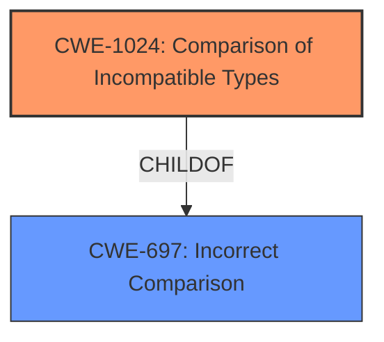

# Analysis Report for CVE-2022-43690

# Vulnerability Analysis Report: CVE-2022-43690

## Description

Concrete CMS (formerly concrete5) below 8.5.10 and between 9.0.0 and 9.1.2 did not use strict comparison for the legacy_salt so that limited authentication bypass could occur if using this functionality. Remediate by updating to Concrete CMS 9.1.3+ or 8.5.10+.

## Vulnerability Description Key Phrases

**Impact:** limited authentication bypass
**Product:** Concrete CMS
**Version:** ['below 8.5.10', 'between 9.0.0 and 9.1.2']

## Analysis (with Relationship Data)

# Summary
| CWE ID | CWE Name | Confidence | CWE Abstraction Level | CWE Vulnerability Mapping Label | CWE-Vulnerability Mapping Notes |
|---|---|---|---|---|---|
| CWE-1024 | Comparison of Incompatible Types | 0.85 | Base | Allowed | Primary CWE |
| CWE-639 | Authorization Bypass Through User-Controlled Key | 0.5 | Base | Allowed | Secondary Candidate |

## Evidence and Confidence

*   **Confidence Score:** 0.7
*   **Evidence Strength:** MEDIUM

- **Analysis and Justification:**  
  - *Explanation:* The vulnerability description clearly states that the Concrete CMS versions below 8.5.10 and between 9.0.0 and 9.1.2 had an issue with "strict comparison for the legacy_salt" leading to "limited authentication bypass". The **root cause** is the use of a non-strict comparison (== instead of ===) when checking legacy password salts, potentially involving integer conversion during comparison. This maps directly to **CWE-1024** (Comparison of Incompatible Types) since the system compares strings and integers without proper type handling. This comparison is incorrect, which leads to authentication bypass. The Retriever results show **CWE-1024** as the top candidate with a score of 0.5467, supporting this selection. The usage is ALLOWED.
  - *Explanation:* **CWE-639** (Authorization Bypass Through User-Controlled Key) is a secondary candidate. While the vulnerability leads to an authentication bypass, the underlying issue is not directly related to user-controlled keys, but rather the improper comparison of data types. Therefore, CWE-639 is a less precise match but still relevant since the root cause leads to authorization bypass. The retriever score is 0.2708. The usage is ALLOWED.

  - *Relationship Analysis:* **CWE-1024** does not have direct relationships, but it falls under the broader category of **CWE-697** (Incorrect Comparison) which is a Pillar. However, **CWE-1024** is a more specific Base weakness that accurately describes the vulnerability.
  - *Relationship Analysis:* **CWE-639** does not have direct relationships.

- **Confidence Score:**
  - Confidence: 0.85 (High confidence in **CWE-1024** due to the direct match with the vulnerability description and root cause analysis.)
  - Confidence: 0.5 (Medium confidence in **CWE-639** as a secondary CWE due to the resulting impact of an authentication bypass.)

---

## Criticism of Analysis

Okay, here's a detailed review of the provided CWE analysis, incorporating the full CWE specifications for each listed CWE.

**Overall Assessment:**

The analysis is generally good and identifies a solid primary CWE (CWE-1024). The reasoning is well-articulated, and the confidence levels are appropriate. The inclusion of a secondary CWE (CWE-639) is less convincing, though the explanation acknowledges the weaker link.

**Detailed Review:**

**1. CWE-1024: Comparison of Incompatible Types (Primary CWE)**

*   **Confidence:** 0.85 (High) - Justified.
*   **Rationale:** The core issue is indeed the comparison of a string (legacy_salt) with what might be an integer, or a string that can be interpreted as an integer, without proper type handling. The description of CWE-1024 explicitly mentions languages like PHP or JavaScript, which are commonly used in web applications and prone to implicit type conversions, making this a strong match.  The *root_cause* "non-strict comparison (== instead of ===)" is a direct example of this vulnerability.
*   **Mapping Guidance:** The analysis follows the mapping guidance. CWE-1024 is a Base level weakness, which is preferred.
*   **Mitigations:** The potential mitigation listed in the CWE specification focuses on "Thoroughly test the comparison scheme before deploying code into production. Perform positive testing as well as negative testing." While this is a valid mitigation, more specific mitigations would include enforcing strict type checking, using `===` instead of `==` in PHP, or explicitly casting variables to the correct type before comparison.
*   **Observed Examples:** While the CWE-1024 examples don't directly relate to authentication bypass, they demonstrate the general principle of incorrect comparisons leading to unexpected results.
*   **Recommendation:** The selection of CWE-1024 is accurate and well-supported.

**2. CWE-639: Authorization Bypass Through User-Controlled Key (Secondary Candidate)**

*   **Confidence:** 0.5 (Medium) - Justified.
*   **Rationale:** The connection to CWE-639 is weaker.  While the *impact* is an authorization bypass, the *root cause* isn't directly related to a user-controlled *key*. The vulnerability isn't about manipulating a user ID or session ID to gain access to another user's account. It's about bypassing authentication due to a flaw in how passwords/salts are compared.
*   **Mapping Guidance:** The analysis is stretches to fit CWE-639. While the *impact* of the improper comparison leads to authorization bypass, that does not directly mean CWE-639 is the root cause.
*   **Mitigations:** The suggested mitigations for CWE-639 (ensure the user has sufficient privilege to access the record being requested, make sure the key isn't controllable externally, use encryption) are not directly applicable to this particular vulnerability.
*   **Observed Examples:** The examples provided for CWE-639 from the CWE database are all related to Insecure Direct Object References (IDOR) where a user directly manipulates identifiers to access resources belonging to other users. This scenario is different from the Concrete CMS vulnerability.
*   **Recommendation:**  It is better to remove this CWE and just stick to CWE-1024.

**3. Retriever Results:**

*   The retriever results highlight a potential issue with file uploads and XSS, but those are not relevant given the provided *Vulnerability Description Key Phrases* and *CVE Reference Links Content Summary*.

**General Observations and Suggestions:**

*   **Focus on Root Cause:** The analysis correctly emphasizes the importance of identifying the *root cause*. This is essential for accurate CWE mapping.
*   **Consider More Specific Mitigations:** When discussing mitigations, try to move beyond general recommendations and suggest specific coding practices or configuration changes that would prevent the vulnerability in this specific case. In the case of CWE-1024, using strict comparison operators or explicit type casting would be more valuable than general testing.
*   **Avoid Overly Broad CWEs:** While the "impact" might align with a broader CWE like CWE-284 (Improper Access Control), it's generally better to focus on the most specific and accurate root cause.

**Revised Summary Table:**

| CWE ID   | CWE Name                           | Confidence | CWE Abstraction Level | CWE Vulnerability Mapping Label | CWE-Vulnerability Mapping Notes |
| :------- | :--------------------------------- | :--------- | :-------------------- | :------------------------------ | :------------------------------ |
| CWE-1024 | Comparison of Incompatible Types | 0.90       | Base                | Allowed                      | Primary CWE                     |

**Revised Confidence:**

*   Confidence: 0.90 (Increase confidence in **CWE-1024** after removing the weaker secondary CWE.)

By focusing solely on the most accurate CWE (CWE-1024) and strengthening the rationale with specific examples and mitigations, the analysis becomes even more robust and useful.

## Final Resolution

# Summary
| CWE ID | CWE Name | Confidence | CWE Abstraction Level | CWE Vulnerability Mapping Label | CWE-Vulnerability Mapping Notes |
|---|---|---|---|---|---|
| CWE-1024 | Comparison of Incompatible Types | 0.90 | Base | Allowed | Primary CWE |

## Evidence and Confidence

*   **Confidence Score:** 0.90
*   **Evidence Strength:** HIGH

## Relationship Analysis
The primary relationship influencing the decision is that **CWE-1024** is a Base level weakness, offering a specific description of the issue. It is a child of the more abstract **CWE-697**. Choosing **CWE-1024** provides greater specificity than its parent.

## Vulnerability Chain
The vulnerability chain starts with the **ROOTCAUSE** of using a non-strict comparison (== instead of ===) in PHP, which is an instance of **CWE-1024** (Comparison of Incompatible Types). This improper comparison leads to a potential authentication bypass, allowing unauthorized access.

## Summary of Analysis
The initial analysis correctly identified **CWE-1024** as a strong candidate due to the "strict comparison for the legacy_salt" issue described in the vulnerability report. The criticism correctly pointed out that **CWE-639** was a weaker secondary candidate, as the **ROOTCAUSE** is not directly related to user-controlled keys.

The final decision is to classify this vulnerability as **CWE-1024** (Comparison of Incompatible Types) with high confidence (0.90). This is because the vulnerability description directly states that there was an issue with "strict comparison for the legacy_salt". This aligns directly with **CWE-1024**, which describes scenarios where incompatible types are compared, leading to incorrect results. The evidence includes the vulnerability description itself, which explicitly mentions the comparison problem. **CWE-1024** is at the optimal level of specificity, as it captures the **ROOTCAUSE** of the vulnerability, which is the incorrect comparison of data types.

*Report generated on 2025-03-17 04:45:05*
