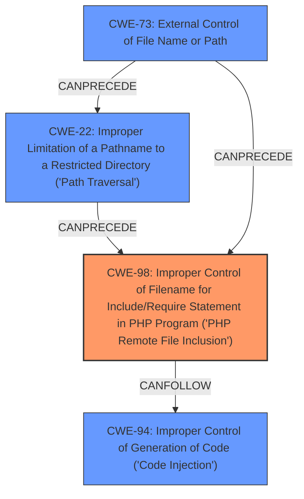

# Final Resolution for CVE-2022-47945

# Summary
| CWE ID | CWE Name | Confidence | CWE Abstraction Level | CWE Vulnerability Mapping Label | CWE-Vulnerability Mapping Notes |
| :-------- | :------------------------------------------------------------------------------------------------------------- | :--------- | :---------------------- | :------------------------------ | :-------------------------------- |
| CWE-98 | Improper Control of Filename for Include/Require Statement in PHP Program ('PHP Remote File Inclusion') | 0.95 | Variant | Allowed | Acceptable-Use |
| CWE-22 | Improper Limitation of a Pathname to a Restricted Directory ('Path Traversal') | 0.90 | Base | Allowed | Acceptable-Use |
| CWE-73 | External Control of File Name or Path | 0.70 | Base | Allowed | Acceptable-Use |
| CWE-94 | Improper Control of Generation of Code ('Code Injection') | 0.60 | Base | Allowed-with-Review | Allowed-with-Review |

## Evidence and Confidence

*   **Confidence Score:** 0.90
*   **Evidence Strength:** HIGH

## Relationship Analysis
The primary vulnerability is **CWE-98 (Improper Control of Filename for Include/Require Statement in PHP Program)**, a Variant-level weakness, because the `lang` parameter directly controls the file included in the PHP application. **CWE-22 (Improper Limitation of a Pathname to a Restricted Directory)** is also present because the attacker uses directory traversal to access files outside the intended directory. **CWE-73 (External Control of File Name or Path)** further describes how user input influences file system operations and can be a root cause of **CWE-98**. Finally, **CWE-94 (Improper Control of Generation of Code)** arises from the successful inclusion of `pearcmd.php`, which leads to code execution.

## Vulnerability Chain
The vulnerability chain starts with user-supplied input to the `lang` parameter.
1.  **Root Cause:** The application fails to adequately sanitize the `lang` parameter (**CWE-73**).
2.  This allows an attacker to control the filename used in an include/require statement (**CWE-98**).
3.  The attacker leverages this control to perform path traversal (**CWE-22**).
4.  By including a file like `pearcmd.php`, the attacker achieves arbitrary code execution (**CWE-94**).
    -   Prerequisite: `lang_switch_on=true` must be enabled.
    -   Consequence: Arbitrary operating system commands can be executed.

## Summary of Analysis
Based on the vulnerability description, the primary **WEAKNESS** is **CWE-98 (Improper Control of Filename for Include/Require Statement in PHP Program ('PHP Remote File Inclusion'))**. The description explicitly mentions "local file inclusion via the `lang` parameter" which aligns perfectly with **CWE-98**. The ability to include `pearcmd.php` further confirms this, as it demonstrates **improper control of filenames** leading to code execution. The evidence is strong, justifying a confidence score of 0.95.

The criticism correctly pointed out the overlap between **CWE-98** and **CWE-22**, as well as the relationship to **CWE-73**. The inclusion of **CWE-22 (Improper Limitation of a Pathname to a Restricted Directory ('Path Traversal'))** is justified because the attacker leverages directory traversal using `../` sequences. This is a direct consequence of **insufficient sanitization**, as stated in the content summary: "insufficient sanitization of user-provided input, enabling directory traversal using sequences like `../`". The confidence score is increased to 0.90.

The addition of **CWE-73 (External Control of File Name or Path)** highlights the **ROOTCAUSE**: user-controlled input directly influencing file system operations. The `lang` parameter controls the filename, making **CWE-73** a necessary precursor to **CWE-98**. The confidence here is a bit lower, 0.70, as its role is more foundational.

Finally, **CWE-94 (Improper Control of Generation of Code ('Code Injection'))** is included because the successful inclusion of `pearcmd.php` results in code execution. However, this is a consequence of the file inclusion, not the primary weakness. Confidence here is at 0.60.

The relationships between these CWEs demonstrate a clear attack chain: **CWE-73** allows the attacker to control the filename (**CWE-98**), which leads to directory traversal (**CWE-22**) and ultimately code execution (**CWE-94**).

The selection of these CWEs at the Base and Variant levels provides optimal specificity. Higher-level CWEs like **CWE-668** or **CWE-706** would be too abstract and less informative.