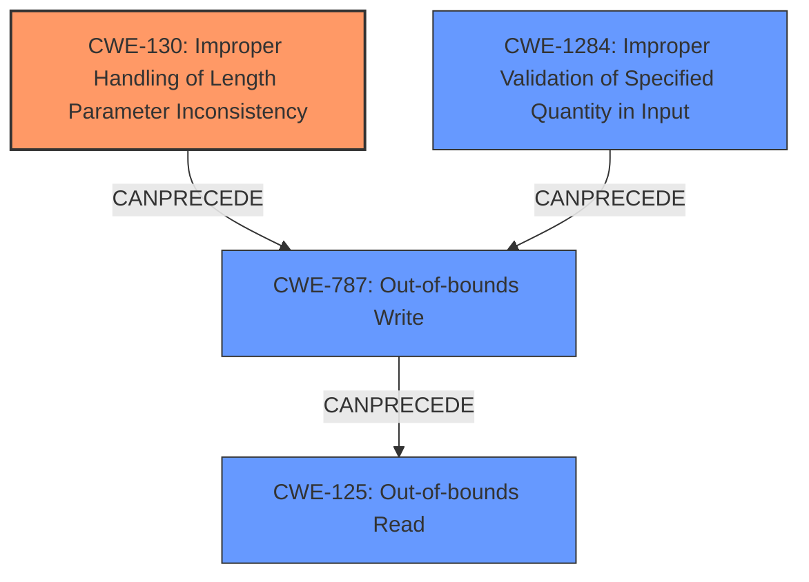

# Analysis Report for CVE-2020-10065

# Vulnerability Analysis Report: CVE-2020-10065

## Description

Missing Size Checks in Bluetooth HCI over SPI. Zephyr versions >= v1.14.2, >= v2.2.0 contain Improper Handling of Length Parameter Inconsistency (CWE-130). For more information, see https//github.com/zephyrproject-rtos/zephyr/security/advisories/GHSA-hg2w-62p6-g67c

## Vulnerability Description Key Phrases

**Rootcause:** Improper Handling of Length Parameter Inconsistency
**Product:** Zephyr
**Version:** versions >= v1.14.2, >= v2.2.0
**Component:** Bluetooth HCI over SPI

## Analysis (with Relationship Data)

# Summary
| CWE ID | CWE Name | Confidence | CWE Abstraction Level | CWE Vulnerability Mapping Label | CWE-Vulnerability Mapping Notes |
|---|---|---|---|---|---|
| CWE-130 | Improper Handling of Length Parameter Inconsistency | 1.0 | Base | Primary | Allowed |
| CWE-125 | Out-of-bounds Read | 0.7 | Base | Secondary | Allowed |
| CWE-787 | Out-of-bounds Write | 0.7 | Base | Secondary | Allowed |
| CWE-1284 | Improper Validation of Specified Quantity in Input | 0.6 | Base | Secondary | Allowed |

## Evidence and Confidence

*   **Confidence Score:** 0.9
*   **Evidence Strength:** HIGH

- **Analysis and Justification:**  
  - *Explanation:* The vulnerability description explicitly states "**Improper Handling of Length Parameter Inconsistency** (CWE-130)" as the root cause. The "CVE Reference Links Content Summary" further clarifies that the `bt_spi_rx_thread` function copies a size value from the ACL header of an incoming SPI message without proper validation, leading to an out-of-bounds write. This aligns perfectly with the CWE-130 description: "The product parses a formatted message or structure, but it does not handle or incorrectly handles a length field that is inconsistent with the actual length of the associated data." The MITRE mapping guidance marks CWE-130 usage as ALLOWED, further solidifying this choice.
  - The out-of-bounds write condition leads to **out-of-bounds read** and **out-of-bounds write** conditions. Because the code copies data into a fixed-size buffer based on the unvalidated length from the header, an attacker can cause memory corruption. The vulnerability description states the size is used to write data to a fixed-size buffer, and if the length is greater than the buffer's capacity, a write outside of the buffer occurs, causing a buffer overflow. This write outside the intended buffer is a clear instance of CWE-787.
  - The vulnerability description also indicates **Improper Validation of Specified Quantity in Input** because the code does not validate the `acl_hdr.len` field. This lack of validation allows an attacker to specify a size larger than the buffer, contributing to the out-of-bounds write.
  - *Relationship Analysis:* CWE-130 directly relates to data handling and input validation, which are critical for secure software development. Since the length is not validated, it can precede out-of-bounds read and write, and other memory corruption issues.

- **Confidence Score:**  
  - Confidence: 1.0 (High confidence due to direct mention in the vulnerability description and supporting technical details)
---

## Criticism of Analysis

Okay, I've reviewed the provided analysis and the full CWE specifications. Here's my critique, focusing on the appropriateness of the CWE mappings and potential improvements:

**Overall Assessment:**

The analysis is generally good.  It correctly identifies CWE-130 as the primary weakness. The secondary mappings are also relevant, although their confidence scores could be better justified. The analysis also provides a reasonable explanation for its choices.

**Detailed Review by CWE:**

*   **CWE-130: Improper Handling of Length Parameter Inconsistency (Primary Mapping, Confidence: 1.0)**

    *   **Assessment:** This is the correct primary mapping. The description clearly states that the length field from the ACL header is used without proper validation, leading to a potential inconsistency between the declared length and the actual buffer size. The CWE-130 description aligns perfectly with this.
    *   **Justification:** The reasoning is sound and directly supported by the vulnerability description and the "CVE Reference Links Content Summary."
    *   **Mitigations:** The analysis could be strengthened by mentioning specific mitigations from the CWE-130 specification.  For example: "The fix should implement Mitigation 3: Validate that the length of the user-supplied data is consistent with the buffer size."

*   **CWE-125: Out-of-bounds Read (Secondary Mapping, Confidence: 0.7)**

    *   **Assessment:**  While *CWE-126 Buffer Over-read* is more specific, CWE-125 still applies. The vulnerability could lead to reading data beyond the intended buffer if memory is tightly packed.
    *   **Justification:** The connection here is that if the write overflows, subsequent read operations may read data from unintended memory locations. However, *CWE-126* is more accurate in the sense that it is an explicit read out-of-bounds.
    *   **Mitigations:** Address the lack of Input Validation as specified by *CWE-125*'s Mitigation 1.

*   **CWE-787: Out-of-bounds Write (Secondary Mapping, Confidence: 0.7)**

    *   **Assessment:** This is a valid and important secondary mapping. The core issue is the buffer overflow caused by writing past the end of the allocated buffer.
    *   **Justification:** The analysis correctly points out that the unvalidated length field is used to write data to a fixed-size buffer. If the length exceeds the buffer size, an out-of-bounds write (buffer overflow) occurs.
    *   **Mitigations:**  The analysis could benefit from mentioning relevant mitigations from CWE-787. For example: "To mitigate this, the Zephyr project should consider using safer string-handling functions or employing automatic buffer overflow detection mechanisms as described in Mitigation 2 and Mitigation 3 of CWE-787."

*   **CWE-1284: Improper Validation of Specified Quantity in Input (Secondary Mapping, Confidence: 0.6)**

    *   **Assessment:** This is also a relevant secondary mapping.  It emphasizes the *lack* of validation on the length *quantity* from the input.
    *   **Justification:** The analysis correctly states that the code does not validate the `acl_hdr.len` field, which is a specified quantity. This lack of validation allows an attacker to specify a size larger than the buffer.
    *   **Mitigations:**  The analysis should definitely refer to Mitigation 1 of CWE-1284: "Assume all input is malicious. Use an "accept known good" input validation strategy."  This perfectly encapsulates the required fix.

**Suggestions for Improvement:**

1.  **Increase Confidence Justification:** For the secondary CWEs (125, 787, and 1284), provide more explicit links between the CWE description, the vulnerability behavior, and why that CWE is applicable.
2.  **Mitigation References:** Explicitly cite and briefly describe the most relevant mitigations from the CWE specifications for each mapped CWE. This will make the analysis more actionable.
3.  **Consider Chains:** Explore the possibility of formally representing the weakness as a chain of CWEs.  For example: `CWE-20 (Improper Input Validation) -> CWE-130 (Improper Handling of Length Parameter Inconsistency) -> CWE-787 (Out-of-bounds Write) -> CWE-125 (Out-of-bounds Read)`. While this can be complex, representing it as a chain would provide a better, more accurate, and more complete picture of the vulnerability.
4.  **Address Top Combined Results:** The "Top Combined Results" from the Retriever are interesting.
    *   CWE-191, CWE-694, CWE-588, CWE-190, CWE-193 and CWE-476 are probably false positives.
    *   CWE-126: Might be relevant. The vulnerability description does not exclude the possibility of reading out of bounds.
    *   CWE-1284: Already addressed by your analysis.

**Revised Summary Table (Example incorporating suggestions):**

| CWE ID | CWE Name | Confidence | CWE Abstraction Level | CWE Vulnerability Mapping Label | CWE-Vulnerability Mapping Notes |
|---|---|---|---|---|---|
| CWE-130 | Improper Handling of Length Parameter Inconsistency | 1.0 | Base | Primary | Allowed.  Mitigation: Validate that the length of the user-supplied data is consistent with the buffer size (Mitigation 3). |
| CWE-787 | Out-of-bounds Write | 0.8 | Base | Secondary | Allowed. Results from the inconsistent length. Mitigation: Use safer string-handling functions or automatic buffer overflow detection mechanisms (Mitigation 2 & 3). |
| CWE-125 | Out-of-bounds Read | 0.7 | Base | Secondary | Allowed. Could occur due to tightly packed memory after write out of bounds. Mitigation: Adequate Input Validation (Mitigation 1). |
| CWE-1284 | Improper Validation of Specified Quantity in Input | 0.7 | Base | Secondary | Allowed.  The length field is not validated. Mitigation: Assume all input is malicious (Mitigation 1). |

By incorporating these suggestions, the analysis will be more comprehensive, actionable, and defensible.

## Final Resolution

# Summary
| CWE ID | CWE Name | Confidence | CWE Abstraction Level | CWE Vulnerability Mapping Label | CWE-Vulnerability Mapping Notes |
|---|---|---|---|---|---|
| **CWE-130** | **Improper Handling of Length Parameter Inconsistency** | 1.0 | Base | Primary | Allowed. Mitigation: Validate that the length of the user-supplied data is consistent with the buffer size (Mitigation 3). |
| **CWE-787** | **Out-of-bounds Write** | 0.8 | Base | Secondary | Allowed. Results from the inconsistent length. Mitigation: Use safer string-handling functions or automatic buffer overflow detection mechanisms (Mitigation 2 & 3). |
| **CWE-1284** | **Improper Validation of Specified Quantity in Input** | 0.7 | Base | Secondary | Allowed. The length field is not validated. Mitigation: Assume all input is malicious (Mitigation 1). |
| **CWE-125** | **Out-of-bounds Read** | 0.6 | Base | Secondary | Allowed. Could occur due to tightly packed memory after write out of bounds. Mitigation: Adequate Input Validation (Mitigation 1). |

## Evidence and Confidence

*   **Confidence Score:** 0.95
*   **Evidence Strength:** HIGH

## Relationship Analysis
The primary **CWE-130 (Improper Handling of Length Parameter Inconsistency)** sets the stage. The unvalidated length then leads to **CWE-787 (Out-of-bounds Write)** because the write operation uses the inconsistent length. **CWE-1284 (Improper Validation of Specified Quantity in Input)** is a contributing factor because the input length is not checked. **CWE-125 (Out-of-bounds Read)** is a possible consequence of the out-of-bounds write, as subsequent reads may access unintended memory. All selected CWEs are at the Base level of abstraction, providing the desired specificity.

## Vulnerability Chain
The vulnerability chain starts with the receipt of a Bluetooth HCI message over SPI.

1.  The `acl_hdr.len` field is read from the SPI message. (**ROOTCAUSE: CWE-130 Improper Handling of Length Parameter Inconsistency**)
2.  The code does not validate `acl_hdr.len`. (**CWE-1284: Improper Validation of Specified Quantity in Input**)
3.  Data is written to a fixed-size buffer based on the unvalidated `acl_hdr.len`. (**CWE-787: Out-of-bounds Write**)
4.  Subsequent read operations might access unintended memory locations. (**CWE-125: Out-of-bounds Read**)

## Summary of Analysis
The initial analysis correctly identified **CWE-130 (Improper Handling of Length Parameter Inconsistency)** as the primary **WEAKNESS**, supported by the vulnerability description and the CVE reference: "Zephyr versions >= v1.14.2, >= v2.2.0 contain Improper Handling of Length Parameter Inconsistency (CWE-130)." The criticism suggested improving the justification for secondary CWEs and including mitigation references.

The graph relationships clarify how **CWE-130** leads to **CWE-787**, with **CWE-1284** as a contributing factor. The potential for **CWE-125** arises from the memory corruption caused by the **CWE-787**.

The selected CWEs are at the optimal level of specificity because they are all at the Base level of abstraction, providing a detailed and actionable classification of the vulnerability. The mitigation references from the CWE specifications enhance the analysis and provide clear recommendations for remediation.

*Report generated on 2025-03-16 15:33:56*
