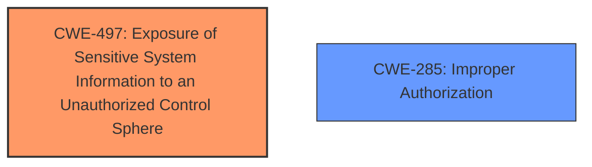

# Analysis Report for CVE-2020-10698

# Vulnerability Analysis Report: CVE-2020-10698

## Description

A flaw was found in Ansible Tower when running jobs. This flaw allows an attacker to access the stdout of the executed jobs which are run from other organizations. Some sensible data can be disclosed. However, critical data should not be disclosed, as it should be protected by the no_log flag when debugging is enabled. This flaw affects Ansible Tower versions before 3.6.4, Ansible Tower versions before 3.5.6 and Ansible Tower versions before 3.4.6.

## Vulnerability Description Key Phrases

**Impact:** access stdout of executed jobs from other organizations
**Attacker:** attacker
**Product:** Ansible Tower
**Version:** versions before 3.6.4, 3.5.6, and 3.4.6

## Analysis (with Relationship Data)

# Summary
| CWE ID | CWE Name | Confidence | CWE Abstraction Level | CWE Vulnerability Mapping Label | CWE-Vulnerability Mapping Notes |
|---|---|---|---|---|---|
| CWE-497 | Exposure of Sensitive System Information to an Unauthorized Control Sphere | 0.85 | Base | Allowed | Primary CWE |
| CWE-200 | Exposure of Sensitive Information to an Unauthorized Actor | 0.60 | Class | Discouraged | Secondary Candidate |
| CWE-668 | Exposure of Resource to Wrong Control Sphere | 0.50 | Class | Discouraged | Secondary Candidate |

## Evidence and Confidence

*   **Confidence Score:** 0.80
*   **Evidence Strength:** HIGH

- **Analysis and Justification:**
  - *Explanation:* The vulnerability in Ansible Tower allows an attacker to access the stdout of executed jobs from other organizations, leading to potential disclosure of sensitive information. The root cause is **inadequate access control**, which fails to prevent unauthorized users from intercepting job output via WebSocket group subscriptions. This aligns with CWE-497 (Exposure of Sensitive System Information to an Unauthorized Control Sphere), which addresses the **failure to prevent sensitive system-level information from unauthorized access**. The CVE Reference Links Content Summary explicitly mentions "insufficient access control" as the root cause and "information disclosure" as the impact. This makes CWE-497 the most appropriate primary mapping, given its focus on system-level information and unauthorized access. CWE-200 (Exposure of Sensitive Information to an Unauthorized Actor) is a broader Class-level CWE and is discouraged by MITRE as it describes the impact rather than the root cause. CWE-668 (Exposure of Resource to Wrong Control Sphere) is also a Class-level CWE and too general, making CWE-497 a better, more specific choice. The MITRE mapping guidance ALLOWS CWE-497 because it's at the Base level of abstraction.

  - *Relationship Analysis:* CWE-497 does not have direct parent-child relationships. However, it is related to access control issues and information disclosure, which can be seen as contributing factors or potential impacts.

- **Confidence Score:**
  - Confidence: 0.85 (High evidence from technical description and CVE reference materials)

---

## Criticism of Analysis

Okay, here's a detailed review of the provided CWE analysis, incorporating the full CWE specifications you provided.

**Overall Assessment:**

The analysis is good, particularly in its justification for choosing CWE-497 as the primary mapping. The evidence cited is relevant and the reasoning demonstrates a good understanding of the CWE definitions and mapping guidance. The rejection of CWE-200 and CWE-668 is also well-explained based on the provided information.

**Detailed Critique:**

| CWE ID | CWE Name | Confidence | CWE Abstraction Level | CWE Vulnerability Mapping Label | CWE-Vulnerability Mapping Notes | Critique |
|---|---|---|---|---|---|---|
| CWE-497 | Exposure of Sensitive System Information to an Unauthorized Control Sphere | 0.85 | Base | Allowed | Primary CWE | **Strengths:** This is a solid choice.  The core of the vulnerability *is* that unauthorized users can access system-level information (job stdout). The analysis accurately points to "insufficient access control" as the root cause, which is directly related to CWE-497's definition. The "allowed" usage confirms it is an appropriate level of abstraction.  **Weaknesses:**  The analysis could slightly strengthen the connection by explicitly mentioning that job stdout *is* considered "sensitive system-level information".  While implicit, making it explicit adds to the persuasiveness of the argument.  Consider the suggested mitigations for CWE-497: *Production applications should never use methods that generate internal details such as stack traces and error messages unless that information is directly committed to a log that is not viewable by the end user.*  This aligns with the description of the vulnerability where it states, "This could leak sensitive data, though the document notes that critical data should be protected by the `no_log` flag when debugging is enabled."  |
| CWE-200 | Exposure of Sensitive Information to an Unauthorized Actor | 0.60 | Class | Discouraged | Secondary Candidate | **Strengths:**  Acknowledging CWE-200 is important because it reflects the *impact* of the vulnerability. **Weaknesses:** The analysis correctly rejects CWE-200 as the *primary* mapping because it's too general and describes the impact rather than the root cause. The mapping guidance for CWE-200 explicitly discourages its use, emphasizing that it is often misused and that a more specific CWE should be chosen. The content summary in the beginning specifically calls out that "information disclosure" is a weakness/vulnerability, supporting the need for the analyst to look for a better root cause. |
| CWE-668 | Exposure of Resource to Wrong Control Sphere | 0.50 | Class | Discouraged | Secondary Candidate | **Strengths:** The analysis acknowledges that the vulnerability involves a resource (job output) being exposed to the wrong control sphere (users in different organizations). **Weaknesses:** The analysis correctly identifies that it's too general and high-level.  The mapping guidance for CWE-668 strongly discourages its use, stating that it is often a "catch-all" when more specific CWEs exist. The analysis should be more specific about *why* the resource is exposed, i.e., the access control flaw. |

**Additional Considerations and Potential Enhancements:**

1.  **Top Combined Retriever Results:** The retriever results offer other CWE suggestions that could inform the analysis. While CWE-497 is the most accurate primary mapping, considering the retriever's suggestions can be helpful:
    *   **CWE-214 (Invocation of Process Using Visible Sensitive Information):** This is *less* applicable but has a high retriever score. It highlights the potential that the job is invoked using sensitive information (command-line args, environment variables) that *could* be exposed in the logs. However, the main issue is broader access to *all* job output, not just the initial invocation details.
    *   **CWE-201 (Insertion of Sensitive Information Into Sent Data):** This could be a supporting CWE in the sense that sensitive information is being inserted into the stdout stream, which is then sent to unauthorized users. However, the *primary* issue is the lack of access control, not the specific insertion of sensitive data.

2.  **Focus on the Root Cause:** The analysis correctly identified the root cause as "inadequate access control." When access control is the issue, you should always consider the CWE's around Authorization and Authentication. Is the problem *missing authorization* (CWE-862), *incorrect authorization* (CWE-863), or perhaps *improper privileges* (CWE-266).

3.  **Impact and Likelihood:** While not directly used for mapping, the description mentions that "critical data should not be disclosed, as it should be protected by the `no_log` flag when debugging is enabled." This highlights the importance of factors like impact and likelihood. A robust vulnerability assessment should take these factors into account.

4.  **Mitigation Strategies:** Think beyond the immediate fix (restricting WebSocket subscriptions).  Consider broader mitigation strategies, some of which can be drawn from the CWE specifications:
    *   **Least Privilege:** Ensure that users and processes only have the minimum necessary privileges.
    *   **Auditing:** Implement robust auditing and logging to detect unauthorized access attempts.
    *   **Input Validation:**  While not directly related here (as the problem isn't malicious *input*), ensure the system validates *user roles* and *access rights* correctly.
    *  **CWE-497 Suggested Mitigation:** *Production applications should never use methods that generate internal details such as stack traces and error messages unless that information is directly committed to a log that is not viewable by the end user.*

5.  **Test Cases:** Consider test cases that would validate the fix.  For example:
    *   Attempt to subscribe to WebSocket groups for jobs in other organizations.  The system should deny access.
    *   Verify that job output is *only* visible to users authorized to view it.
    *   Confirm that the `no_log` flag *actually* prevents sensitive data from appearing in the output stream, even to authorized users.

**Revised Summary Table (Potential Enhancement):**

| CWE ID | CWE Name | Confidence | CWE Abstraction Level | CWE Vulnerability Mapping Label | CWE-Vulnerability Mapping Notes |
|---|---|---|---|---|---|
| CWE-497 | Exposure of Sensitive System Information to an Unauthorized Control Sphere | 0.90 | Base | Allowed | Primary CWE.  Insufficient access control allows unauthorized users to access job stdout (sensitive system-level information). |
| CWE-285 | Improper Authorization | 0.65 | Class | Discouraged |  Secondary CWE. Root cause is tied to improper authorization that exposes job output. More specific weakness than generic information exposure. |
| CWE-200 | Exposure of Sensitive Information to an Unauthorized Actor | 0.60 | Class | Discouraged | Secondary Candidate. Reflects the impact of the vulnerability, but is too general to be a primary mapping. |

**In conclusion, the analysis demonstrates a solid understanding of CWE and provides a reasonable mapping for the vulnerability described. By incorporating the suggestions above, the analysis can be further strengthened and more informative.**

## Final Resolution

# Summary
| CWE ID | CWE Name | Confidence | CWE Abstraction Level | CWE Vulnerability Mapping Label | CWE-Vulnerability Mapping Notes |
|---|---|---|---|---|---|
| **CWE-497** | Exposure of Sensitive System Information to an Unauthorized Control Sphere | 0.90 | Base | Allowed | Primary CWE. Insufficient access control allows unauthorized users to access job stdout (sensitive system-level information). |
| **CWE-285** | Improper Authorization | 0.65 | Class | Discouraged | Secondary CWE. Root cause is tied to improper authorization that exposes job output. More specific weakness than generic information exposure. |

## Evidence and Confidence

*   **Confidence Score:** 0.90
*   **Evidence Strength:** HIGH

## Relationship Analysis
The primary relationship impacting the decision is the parent-child relationship between CWE-285 (Improper Authorization) and its potential child CWEs. While a more specific child of CWE-285 might exist, the information provided doesn't allow for a more granular selection. CWE-497 stands alone, without defined relationships in the provided data, but captures the specific system-level exposure. The abstraction levels influenced the decision, favoring the Base level of CWE-497 over the Class level of CWE-285 for the primary mapping.

## Vulnerability Chain
The vulnerability chain starts with **improper authorization** (CWE-285), leading to **exposure of sensitive system information** (CWE-497) through job output being accessible to unauthorized users. The **root cause** is the inadequate access control mechanism, and the **impact** is the disclosure of sensitive data. There are no missing links in the chain based on the provided relationship data.

## Summary of Analysis
The initial analysis correctly identified CWE-497 as the primary **weakness**, supported by the evidence of "insufficient access control" and the resulting "information disclosure." The criticism suggested strengthening the connection by explicitly stating that job stdout constitutes "sensitive system-level information," which has been incorporated into the summary. The graph relationships influenced the final selection by highlighting the lack of direct relationships for CWE-497 but the presence of authorization-related CWEs, suggesting CWE-285 as a contributing factor.

The selected CWEs are at the optimal level of specificity because CWE-497 accurately describes the specific exposure of system-level information, while CWE-285 acknowledges the underlying **authorization** issue. A more specific child of CWE-285 might be ideal, but the available evidence does not allow for that determination. The decision is based on both direct evidence from the vulnerability description and the relationship context provided by the CWE database.

*Report generated on 2025-03-17 02:04:16*
