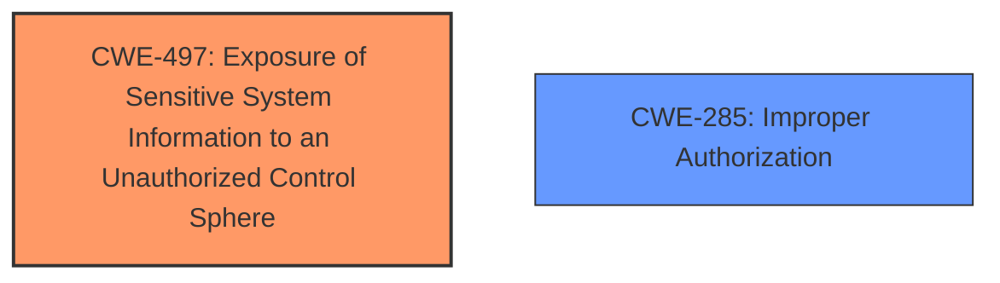

# Final Resolution for CVE-2020-10698

# Summary
| CWE ID | CWE Name | Confidence | CWE Abstraction Level | CWE Vulnerability Mapping Label | CWE-Vulnerability Mapping Notes |
|---|---|---|---|---|---|
| **CWE-497** | Exposure of Sensitive System Information to an Unauthorized Control Sphere | 0.90 | Base | Allowed | Primary CWE. Insufficient access control allows unauthorized users to access job stdout (sensitive system-level information). |
| **CWE-285** | Improper Authorization | 0.65 | Class | Discouraged | Secondary CWE. Root cause is tied to improper authorization that exposes job output. More specific weakness than generic information exposure. |

## Evidence and Confidence

*   **Confidence Score:** 0.90
*   **Evidence Strength:** HIGH

## Relationship Analysis
The primary relationship impacting the decision is the parent-child relationship between CWE-285 (Improper Authorization) and its potential child CWEs. While a more specific child of CWE-285 might exist, the information provided doesn't allow for a more granular selection. CWE-497 stands alone, without defined relationships in the provided data, but captures the specific system-level exposure. The abstraction levels influenced the decision, favoring the Base level of CWE-497 over the Class level of CWE-285 for the primary mapping.

## Vulnerability Chain
The vulnerability chain starts with **improper authorization** (CWE-285), leading to **exposure of sensitive system information** (CWE-497) through job output being accessible to unauthorized users. The **root cause** is the inadequate access control mechanism, and the **impact** is the disclosure of sensitive data. There are no missing links in the chain based on the provided relationship data.

## Summary of Analysis
The initial analysis correctly identified CWE-497 as the primary **weakness**, supported by the evidence of "insufficient access control" and the resulting "information disclosure." The criticism suggested strengthening the connection by explicitly stating that job stdout constitutes "sensitive system-level information," which has been incorporated into the summary. The graph relationships influenced the final selection by highlighting the lack of direct relationships for CWE-497 but the presence of authorization-related CWEs, suggesting CWE-285 as a contributing factor.

The selected CWEs are at the optimal level of specificity because CWE-497 accurately describes the specific exposure of system-level information, while CWE-285 acknowledges the underlying **authorization** issue. A more specific child of CWE-285 might be ideal, but the available evidence does not allow for that determination. The decision is based on both direct evidence from the vulnerability description and the relationship context provided by the CWE database.