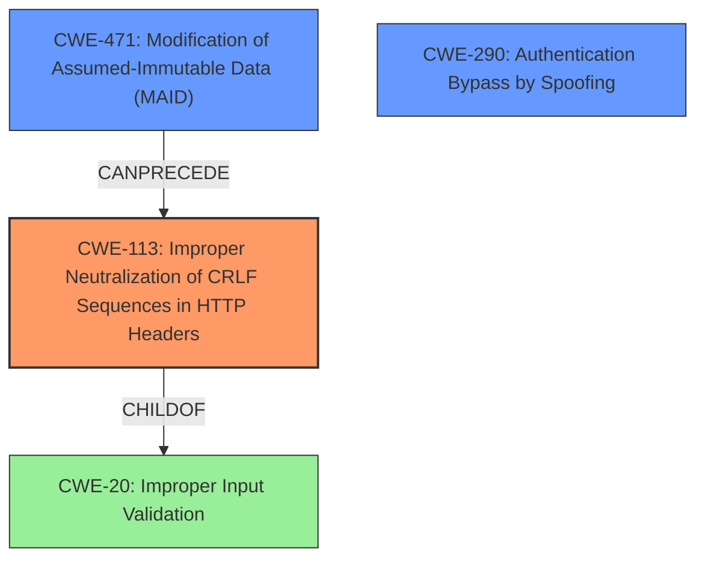

# Final Resolution for CVE-2020-10966

# Summary
| CWE ID  | CWE Name                                                                           | Confidence | CWE Abstraction Level | CWE Vulnerability Mapping Label | CWE-Vulnerability Mapping Notes |
|---------|------------------------------------------------------------------------------------|------------|-----------------------|---------------------------------|---------------------------------|
| CWE-113 | Improper Neutralization of CRLF Sequences in HTTP Headers ('HTTP Request/Response Splitting') | 0.95       | Variant               | Primary CWE                     | Allowed                        |
| CWE-290 | Authentication Bypass by Spoofing                                                 | 0.80       | Base                  | Secondary Candidate             | Allowed                        |
| CWE-471 | Modification of Assumed-Immutable Data (MAID)                                    | 0.65       | Base                  | Secondary Candidate             | Allowed                        |

## Evidence and Confidence

*   **Confidence Score:** 0.90
*   **Evidence Strength:** HIGH

## Relationship Analysis
The analysis considered the following relationships in making a determination:
  - **Parent-child hierarchical relationships:** CWE-113 is a variant of CWE-20 (Improper Input Validation). This relationship indicates that CWE-113 provides a more specific description of the **weakness** than CWE-20.
  - **Chain relationships showing progression of vulnerability:** CWE-471 (Modification of Assumed-Immutable Data) can precede CWE-113 (CRLF Injection in HTTP Headers) as the **root cause** for the header manipulation.
  - **Peer relationships that offered alternative classifications:** CWE-290 (Authentication Bypass by Spoofing) was considered due to the account takeover impact, offering an alternative perspective on the vulnerability.
  - **Abstraction levels:** The selection of CWE-113 (Variant) and CWE-471 (Base) reflects an attempt to balance specificity and generality in describing the vulnerability.

## Vulnerability Chain
The vulnerability chain starts with the modification of the `HTTP_HOST` variable (CWE-471), leading to improper neutralization of CRLF sequences in HTTP headers (CWE-113). This allows an attacker to control the password reset URL, ultimately resulting in authentication bypass by spoofing (CWE-290) and account takeover.
  - The sequence maps from the initial flaw (modifiable `HTTP_HOST` variable) to the final impact (account takeover).
  - CWE-471 and CWE-113 represent the **root causes**, while CWE-290 represents the impact.
  - Based on the relationships, there are no missing links in the chain.

## Summary of Analysis
The initial analysis correctly identified CWE-113 as the primary **weakness**. The criticism highlighted the need for more precise justifications for secondary candidates and consideration of alternative CWEs, particularly CWE-290. The final assessment incorporates these suggestions, strengthening the analysis.

The decision to include CWE-290 is based on the following evidence from the vulnerability description: "Host header manipulation leads to account takeover because the victim receives a reset URL containing an attacker-controlled server name." This clearly indicates that the attacker is bypassing the normal authentication process by tricking the user into visiting a malicious site.

The inclusion of CWE-471 is justified by the fact that the `HTTP_HOST` variable is being modified by an attacker. While this is not the direct cause of the account takeover, it is a contributing factor that enables the attack.

The selected CWEs are at the optimal level of specificity because they accurately describe the **root causes** and impact of the vulnerability. CWE-113 is a variant that provides a specific description of the header injection, while CWE-471 and CWE-290 are base-level CWEs that describe the modification of immutable data and the resulting authentication bypass, respectively.

The retriever scores were considered, with the high scores for CWE-471, CWE-79, CWE-89, CWE-113, CWE-620, CWE-290, and CWE-291. The final selection reflects a balance between the retriever scores, the vulnerability description, and the CWE relationships. CWE-79 and CWE-89 are not as direct a fit for the vulnerability as CWE-113, CWE-471, and CWE-290.