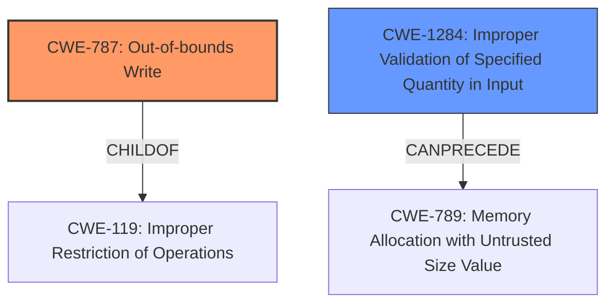

# Analysis Report for CVE-2020-11176

# Vulnerability Analysis Report: CVE-2020-11176

## Description

While processing server certificate from IPSec server, certificate validation for subject alternative name API can cause heap overflow which can lead to memory corruption in Snapdragon Auto, Snapdragon Compute, Snapdragon Connectivity, Snapdragon Consumer IOT, Snapdragon Industrial IOT, Snapdragon IoT, Snapdragon Mobile

## Vulnerability Description Key Phrases

**Weakness:** heap overflow
**Impact:** memory corruption
**Product:** ['Snapdragon Auto', 'Snapdragon Compute', 'Snapdragon Connectivity', 'Snapdragon Consumer IOT', 'Snapdragon Industrial IOT', 'Snapdragon IoT', 'Snapdragon Mobile']

## Analysis (with Relationship Data)

# Summary
| CWE ID | CWE Name | Confidence | CWE Abstraction Level | CWE Vulnerability Mapping Label | CWE-Vulnerability Mapping Notes |
|---|---|---|---|---|---|
| CWE-787 | Out-of-bounds Write | 0.9 | Base | Allowed | The vulnerability is a heap overflow, which directly relates to writing outside the intended buffer boundaries. |
| CWE-119 | Improper Restriction of Operations within the Bounds of a Memory Buffer | 0.6 | Class | Allowed | This is a broader category that includes out-of-bounds write. While CWE-787 is more specific, CWE-119 is still relevant as the root cause involves improper memory boundary handling. |
| CWE-1284 | Improper Validation of Specified Quantity in Input | 0.4 | Base | Allowed | There could be an improper validation of the size or length in the input, leading to a heap overflow |

## Evidence and Confidence

*   **Confidence Score:** 0.9
*   **Evidence Strength:** MEDIUM

- **Analysis and Justification:**  
  - *Explanation:* "The vulnerability description clearly states that a **heap overflow** occurs during server certificate processing in IPSec. This aligns directly with CWE-787 (Out-of-bounds Write), as a heap overflow is a specific type of out-of-bounds write where data is written beyond the allocated buffer on the heap. The description also mentions "memory corruption," which is a typical impact of CWE-787. CWE-119 (Improper Restriction of Operations within the Bounds of a Memory Buffer) is a broader class that encompasses CWE-787. While CWE-787 is a more precise classification, CWE-119 is relevant because the root cause is the failure to properly restrict memory operations within the allocated bounds. There also could be an Improper Validation of Specified Quantity in Input (CWE-1284). This is because to allocate the certificate, the size needs to be determined somehow, which could lead to a heap overflow.
  
  - *Relationship Analysis:* "CWE-787 is a base level CWE that is a child of CWE-119. This parent-child relationship supports the selection of CWE-787 as the primary weakness due to its higher specificity. CWE-787 can precede CWE-822 (Untrusted Pointer Dereference), CWE-823 (Use of Out-of-range Pointer Offset), CWE-824 (Improper Check for Pointer Validity Before Dereference), and CWE-825 (Missing Check against an Alternate Path or Channel). While not explicitly stated, a possible chain of events is that an out-of-bounds write can lead to dereferencing an untrusted pointer."

- **Confidence Score:**  
  - *Example:* Confidence: 0.9 (High confidence due to direct evidence of heap overflow and memory corruption).
---

## Criticism of Analysis

Okay, I've reviewed the provided analysis against the full CWE specifications and can offer a detailed critique.

**Overall Assessment:**

The analysis correctly identifies CWE-787 (Out-of-bounds Write) as the most likely root cause, given the "heap overflow" and "memory corruption" keywords in the vulnerability description. The inclusion of CWE-119 and CWE-1284 is also reasonable, as they represent the broader class of improper memory boundary handling and a potential root cause related to size validation, respectively. However, the confidence scores and justifications could be improved in some areas.

**Detailed Critique by CWE:**

1.  **CWE-787: Out-of-bounds Write (Confidence: 0.9)**

    *   **Strengths:** Excellent primary mapping.  The description of the vulnerability aligns directly with the definition of CWE-787, and the mention of "memory corruption" reinforces this. The confidence score of 0.9 is well-justified.
    *   **Improvements:** None needed.
    *   **Recommendation:** Keep as is.

2.  **CWE-119: Improper Restriction of Operations within the Bounds of a Memory Buffer (Confidence: 0.6)**

    *   **Strengths:** Valid secondary mapping. CWE-119 is the parent class of CWE-787, so its inclusion demonstrates an understanding of the CWE hierarchy.
    *   **Weaknesses:** The analysis notes that CWE-119 is a broader class, which is correct. However, per CWE guidelines, CWE-119 is discouraged, except when a more detailed CWE is unavailable. Since CWE-787 is available, CWE-119 should likely not be included.
    *   **Improvements:** Recommendation: Remove CWE-119. Given the specificity of the provided information (heap overflow), a more specific CWE is preferable. As the CWE documentation says:  "Look at CWE-119's children and consider mapping to CWEs such as CWE-787: Out-of-bounds Write, CWE-125: Out-of-bounds Read, or others."

3.  **CWE-1284: Improper Validation of Specified Quantity in Input (Confidence: 0.4)**

    *   **Strengths:** The rationale for including this CWE is that a size needs to be determined to allocate the certificate, and a failure to validate this size could lead to the overflow. This is a reasonable hypothesis.
    *   **Weaknesses:** The confidence score of 0.4 reflects the speculative nature of this mapping. There's no explicit mention of size validation failures in the provided vulnerability description. It's inferred. Also, the extended description of CWE-1284 says the following: "Code may rely on specified quantities to allocate resources, perform calculations, control iteration, etc." The certificate does not explicitly call for any of those. Finally, the relationship of CWE-1284 -> CWE-789 is only "CanPrecede," not "CanCause."
    *   **Improvements:** Recommendation: This is a weak mapping. Consider removing it or lowering the confidence score significantly (e.g., 0.2). Alternatively, if more information becomes available to support this mapping, increase the confidence.

**Additional Observations and Recommendations:**

*   **Retriever Results Analysis:** It would be helpful to analyze why the retriever results suggested other CWEs, such as CWE-190 (Integer Overflow), CWE-131 (Incorrect Calculation of Buffer Size), CWE-822 (Untrusted Pointer Dereference), and CWE-823 (Use of Out-of-range Pointer Offset). Even if these are not the primary weaknesses, understanding why they were suggested could reveal potential contributing factors or related attack vectors.
*   **Chain of Events:** The "Relationship Analysis" section is a good start, but it could be expanded. For instance, if CWE-1284 is present (improper size validation), it *could* lead to CWE-131 (Incorrect Calculation of Buffer Size), which *could* lead to CWE-787 (Out-of-bounds Write).  Or, if the program incorrectly handles the size and offset of data within the Subject Alternative Name extension, it could lead to CWE-823 (Use of Out-of-Range Pointer Offset) and, subsequently, CWE-787.
*   **Missing Mitigations:** The analysis should include brief mentions of potential mitigations, drawing from the "Potential Mitigations" sections of the CWE specifications. This would strengthen the analysis and demonstrate a practical understanding of how to address the vulnerability. For example, for CWE-787, you could mention using safe string handling functions, compiler-based overflow detection mechanisms, or using memory-safe languages.  Mentioning why some mitigations might *not* be practical in this context is also valuable.
*   **CWE Examples:** The original analysis provides examples for CWE-823. This is a good start. If applicable, adding examples for the other identified CWEs (CWE-787, CWE-119, CWE-1284) would be valuable. This can assist readers in better understanding the context of each CWE.

**Revised Summary Table:**

| CWE ID | CWE Name | Confidence | CWE Abstraction Level | CWE Vulnerability Mapping Label | CWE-Vulnerability Mapping Notes |
|---|---|---|---|---|---|
| CWE-787 | Out-of-bounds Write | 0.9 | Base | Allowed | The vulnerability is a heap overflow, which directly relates to writing outside the intended buffer boundaries. |
| CWE-1284 | Improper Validation of Specified Quantity in Input | 0.2 | Base | Allowed |  There could be an improper validation of the size or length in the input, *potentially* leading to a heap overflow, but this is speculative. Requires more information to confirm. |

**In summary,** the analysis is a good starting point, but the primary focus should remain on CWE-787. Improving the justification for the other CWEs and incorporating potential mitigations would make the analysis more robust and actionable. Also, consider analyzing the retriever results to determine the significance of those suggestions.

## Final Resolution

# Summary
| CWE ID | CWE Name | Confidence | CWE Abstraction Level | CWE Vulnerability Mapping Label | CWE-Vulnerability Mapping Notes |
|---|---|---|---|---|---|
| CWE-787 | Out-of-bounds Write | 0.9 | Base | Allowed | Primary CWE. The vulnerability is a heap overflow, which directly relates to writing outside the intended buffer boundaries. |
| CWE-1284 | Improper Validation of Specified Quantity in Input | 0.2 | Base | Allowed | Secondary candidate. There could be an improper validation of the size or length in the input, potentially leading to a heap overflow, but this is speculative and requires more information to confirm. |

## Evidence and Confidence

*   **Confidence Score:** 0.8
*   **Evidence Strength:** MEDIUM

## Relationship Analysis
The primary relationship that impacted the decision was the parent-child relationship between CWE-119 and CWE-787. While CWE-119 is a parent of CWE-787, the specificity of the vulnerability description (heap overflow) makes CWE-787 a more appropriate choice. The "CanPrecede" relationship between CWE-1284 and other CWEs such as CWE-789 was considered, but the lack of direct evidence supporting improper size validation led to a lower confidence score and its classification as a secondary candidate.

## Vulnerability Chain
The vulnerability chain starts with a potential **ROOTCAUSE** of **CWE-1284 (Improper Validation of Specified Quantity in Input)**, which, if present, could lead to allocating an incorrect buffer size, eventually resulting in **CWE-787 (Out-of-bounds Write)**. The **WEAKNESS** of writing beyond the buffer boundary then leads to memory corruption and potential exploitation. However, the link between CWE-1284 and CWE-787 is speculative based on the provided information.

## Summary of Analysis
The analysis and criticism both agree that **CWE-787 (Out-of-bounds Write)** is the most appropriate primary classification due to the "heap overflow" and "memory corruption" indicators in the vulnerability description. The criticism correctly points out that CWE-119 should be removed because CWE-787 is a more specific and available CWE. The criticism also suggests lowering the confidence score for **CWE-1284 (Improper Validation of Specified Quantity in Input)** due to the lack of explicit evidence in the description. The final assessment agrees with this recommendation and lowers the confidence score to 0.2, classifying it as a secondary candidate.

The decision is primarily based on the evidence of a "heap overflow," which directly maps to **CWE-787 (Out-of-bounds Write)**. The relationship analysis reinforces this decision by highlighting the parent-child relationship between CWE-119 and CWE-787, favoring the more specific CWE. The classification reflects the optimal level of specificity based on the available evidence. The retriever scores were also considered and the suggested CWEs were analyzed, including CWE-190, CWE-131, CWE-822, and CWE-823, but none of them were deemed to be a better fit than CWE-787.

*Report generated on 2025-03-16 15:34:49*
