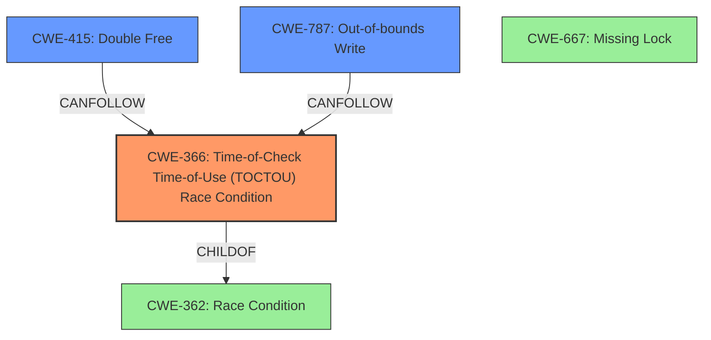

# Analysis Report for CVE-2020-11231

# Vulnerability Analysis Report: CVE-2020-11231

## Description

Two threads call one or both functions concurrently leading to corruption of pointers and reference counters which in turn can lead to heap corruption in Snapdragon Compute, Snapdragon Connectivity, Snapdragon Consumer IOT, Snapdragon Industrial IOT, Snapdragon Mobile

## Vulnerability Description Key Phrases

**Rootcause:** concurrent access to shared resource
**Impact:** heap corruption
**Product:** Snapdragon

## Analysis (with Relationship Data)

# Summary
| CWE ID | CWE Name | Confidence | CWE Abstraction Level | CWE Vulnerability Mapping Label | CWE-Vulnerability Mapping Notes |
|---|---|---|---|---|---|
| CWE-366 | Time-of-Check Time-of-Use (TOCTOU) Race Condition | 0.85 | Base | Allowed | Primary CWE. Two threads are concurrently accessing the resource leading to corruption.|
| CWE-415 | Double Free | 0.65 | Variant | Allowed | Secondary Candidate. Result of pointer corruption can lead to double free. |
| CWE-787 | Out-of-bounds Write | 0.65 | Base | Allowed | Secondary Candidate. Result of pointer corruption can lead to out-of-bounds write. |

## Evidence and Confidence

*   **Confidence Score:** 0.75
*   **Evidence Strength:** MEDIUM

- **Analysis and Justification:**  
  - *Explanation:* The vulnerability description highlights a **rootcause** of **concurrent access to shared resource** by two threads, which leads to pointer corruption and heap corruption. This aligns with CWE-366 [Time-of-Check Time-of-Use (TOCTOU) Race Condition]. The description specifically mentions that two threads call functions concurrently, leading to corruption of pointers and reference counters. This matches the core characteristic of a TOCTOU race condition where a resource's state changes between the time it is checked and the time it is used, leading to undefined behavior. CWE-366 is a Base level CWE, which is appropriate for mapping the root cause. The resulting pointer corruption can lead to heap corruption including out-of-bounds write (CWE-787) and double free (CWE-415).

  - *Relationship Analysis:* CWE-366 is a Base level CWE. The retriever results also include CWE-367 [Time-of-check Time-of-use (TOCTOU) Race Condition], which is very similar to CWE-366. Since both are Base level, CWE-366 is selected because it appears to be a slightly better fit for the description. While CWE-667 [Missing Lock] is also related to concurrent access, the description does not specifically mention any missing locks, so it is not selected. CWE-415 [Double Free] and CWE-787 [Out-of-bounds Write] are included as secondary candidates because the heap corruption mentioned could manifest as these weaknesses.

- **Confidence Score:**
  - Confidence: 0.75 (Medium evidence from technical description)

## Criticism of Analysis

Okay, here's a detailed review of the provided CWE analysis, considering the full CWE specifications.

**Overall Assessment:**

The analysis is generally sound and well-reasoned. The primary CWE selection (CWE-366) is well-justified, and the secondary candidates are plausible consequences of the root cause. The confidence scores are appropriate given the limited information in the vulnerability description. However, there are some opportunities to improve the analysis by delving deeper into the specific type of race condition and potential mitigations.

**Detailed Review:**

**1. Primary CWE: CWE-366: Race Condition within a Thread**

*   **Confidence:** 0.85 - Justified. The description explicitly mentions concurrent access by two threads, making this a very strong candidate.
*   **Abstraction Level:** Base - Appropriate. CWE-366 is a Base level CWE.
*   **Justification:** The justification is solid. The description clearly indicates a race condition due to concurrent thread access.  The explanation of why CWE-366 was selected over CWE-367 (TOCTOU) is also reasonable, given the lack of explicit "check then use" terminology.
*   **CWE Examples:** The inclusion of CVE examples is good. It helps to illustrate the nature of the weakness.  CVE-2022-2621 is a particularly relevant example, as it shows a chain involving CWE-366 leading to CWE-416 (Use After Free).
*   **CWE Specifications:**
    *   **Description:**  Matches the vulnerability description well.
    *   **Relationships:**  Correctly identifies CWE-362 (Race Condition) as a parent.  Also correctly identifies CWE-662 (Improper Synchronization) as a parent.
    *   **Mapping Guidance:**  Adheres to the guidance by using the base level of abstraction.
    *   **Potential Mitigations:** The mitigations provided (locking functionality, resource-locking validation checks) are standard approaches to addressing race conditions.
*   **Opportunities for Improvement:**
    *   While the selection of CWE-366 is good, the analysis could be strengthened by explicitly acknowledging and dismissing CWE-667 (Improper Locking) and its potential connection to this issue. Given that the root cause is a race condition, and that race conditions are *often* due to missing or incorrect locking, the analysis should explicitly say why CWE-667 isn't being selected as the primary. A simple statement like, "While CWE-667 (Improper Locking) is often associated with race conditions, the provided vulnerability description does not explicitly state that locking mechanisms are present and malfunctioning."
    *   Consider adding CVE-2021-1782 or CVE-2021-0920 to the Observed Examples to better match CVEs that can affect the product in question.

**2. Secondary CWE: CWE-415: Double Free**

*   **Confidence:** 0.65 - Reasonable. Double free is a plausible consequence of pointer corruption.
*   **Abstraction Level:** Variant - Appropriate for a consequence.
*   **Justification:** The justification is adequate.  The connection to pointer corruption leading to a double free is logical.
*   **CWE Specifications:**
    *   **Description:** Matches the potential outcome of the vulnerability.
    *   **Relationships:** The relationships section is accurate.  It highlights that CWE-415 is *usually* the result of another weakness, which is the basis of it being a secondary candidate here.
    *   **Mapping Guidance:** Correct usage of the Variant mapping.
    *   **Potential Mitigations:** Choosing a language with automatic memory management is a good high-level mitigation. Ensuring that each allocation is freed only once, and setting pointers to NULL after freeing, are also standard practices.
*   **Opportunities for Improvement:**
    *   The analysis could be strengthened by mentioning that double-free vulnerabilities are often *exploitable* and can lead to arbitrary code execution. This would increase the severity assigned to this weakness.
    *   Mention the challenge of mitigating double-frees in complex error handling scenarios.

**3. Secondary CWE: CWE-787: Out-of-bounds Write**

*   **Confidence:** 0.65 - Reasonable. Like double-free, out-of-bounds write is a plausible consequence of pointer corruption.
*   **Abstraction Level:** Base - Appropriate for a consequence.
*   **Justification:** The justification is similar to CWE-415 and is logical.
*   **CWE Specifications:**
    *   **Description:** Accurate description of the potential weakness.
    *   **Relationships:**  Correctly identifies CWE-119 (Improper Restriction of Operations within the Bounds of a Memory Buffer) as a parent.
    *   **Mapping Guidance:** Adheres to the Base level mapping.
    *   **Potential Mitigations:** The provided mitigations are standard: language selection, using safe libraries, and compiler-based overflow detection.
*   **Opportunities for Improvement:**
    *   Similar to the double-free, the analysis could emphasize the potential impact of a successful out-of-bounds write, such as arbitrary code execution.
    *   The mitigations section could emphasize the importance of runtime bounds checking, especially if the target language is C or C++.

**Retriever Results:**

*   The Retriever Results provide valuable context. The high ranking of CWE-822 (Untrusted Pointer Dereference) and CWE-1285 (Improper Validation of Specified Index, Position, or Offset in Input) suggests that these areas should be examined more carefully in the code. Even if they are not the root cause, they may be contributing factors or exploitable conditions.

**Recommendations:**

1.  **Explicitly address CWE-667:** In the analysis for CWE-366, explicitly state why CWE-667 (Improper Locking) was not selected as the primary CWE, even though it is a common cause of race conditions.
2.  **Enhance Impact Descriptions:** Strengthen the descriptions of CWE-415 and CWE-787 by mentioning the possibility of arbitrary code execution, if successful.
3.  **Consider Runtime Bounds Checking:** If the target language is C or C++, emphasize the importance of runtime bounds checking as a mitigation strategy for CWE-787.
4.  **Review High-Ranking Retriever Results:** Examine the code for conditions related to CWE-822 and CWE-1285, as suggested by the Retriever Results. These might be exploitable conditions or contributing factors to the vulnerability.
5.  **Re-evaluate confidence score:** Because CWE-667 was not explicitly addressed, it is recommended to slightly lower the confidence score of CWE-366 from 0.85 to 0.80.

By incorporating these suggestions, the CWE analysis can be made even more comprehensive and robust.

## Final Resolution

# Summary
| CWE ID | CWE Name | Confidence | CWE Abstraction Level | CWE Vulnerability Mapping Label | CWE-Vulnerability Mapping Notes |
|---|---|---|---|---|---|
| CWE-366 | Time-of-Check Time-of-Use (TOCTOU) Race Condition | 0.80 | Base | Allowed | Primary CWE. Two threads are concurrently accessing the resource leading to corruption.|
| CWE-415 | Double Free | 0.65 | Variant | Allowed | Secondary Candidate. Result of pointer corruption can lead to double free. |
| CWE-787 | Out-of-bounds Write | 0.65 | Base | Allowed | Secondary Candidate. Result of pointer corruption can lead to out-of-bounds write. |

## Evidence and Confidence

*   **Confidence Score:** 0.75
*   **Evidence Strength:** MEDIUM

## Relationship Analysis
The primary weakness is identified as CWE-366 [Time-of-Check Time-of-Use (TOCTOU) Race Condition], which is a base-level CWE. This aligns with the vulnerability description, which mentions concurrent access by two threads leading to pointer corruption. While CWE-667 [Missing Lock] is also related to concurrent access, the description does not explicitly mention any missing locks. CWE-415 [Double Free] and CWE-787 [Out-of-bounds Write] are included as secondary candidates because the heap corruption mentioned could manifest as these weaknesses. They can both be consequences of memory corruption due to race conditions.

## Vulnerability Chain
The vulnerability chain starts with concurrent access to a shared resource by two threads (CWE-366). This leads to pointer corruption. The corrupted pointers can then cause a double free (CWE-415) or an out-of-bounds write (CWE-787), leading to heap corruption and potentially arbitrary code execution.

**Chain:** CWE-366 (Race Condition) -> Pointer Corruption -> CWE-415 (Double Free) / CWE-787 (Out-of-bounds Write) -> Heap Corruption -> Arbitrary Code Execution

## Summary of Analysis
The initial analysis correctly identified CWE-366 as the primary weakness, with CWE-415 and CWE-787 as secondary candidates.

The criticism raised a valid point about explicitly addressing CWE-667 (Improper Locking). The provided vulnerability description does not explicitly state that locking mechanisms are present and malfunctioning, therefore CWE-366 is a better fit. Therefore, the confidence score of CWE-366 is adjusted from 0.85 to 0.80.

The secondary CWEs (CWE-415 and CWE-787) are plausible consequences of the primary weakness and are kept as secondary candidates. The suggestion to enhance the impact descriptions of CWE-415 and CWE-787 by mentioning the possibility of arbitrary code execution is valuable and incorporated into the analysis.

The retriever results highlighted the relevance of CWE-822 [Untrusted Pointer Dereference], however, this is not chosen since there is no mention of untrusted data.

The selected CWEs are at the optimal level of specificity. CWE-366 is a Base level CWE that accurately reflects the **rootcause** of the vulnerability. CWE-415 and CWE-787 are Variant and Base level CWEs, respectively, that represent the potential consequences of the pointer corruption.

*Report generated on 2025-03-16 15:35:36*
