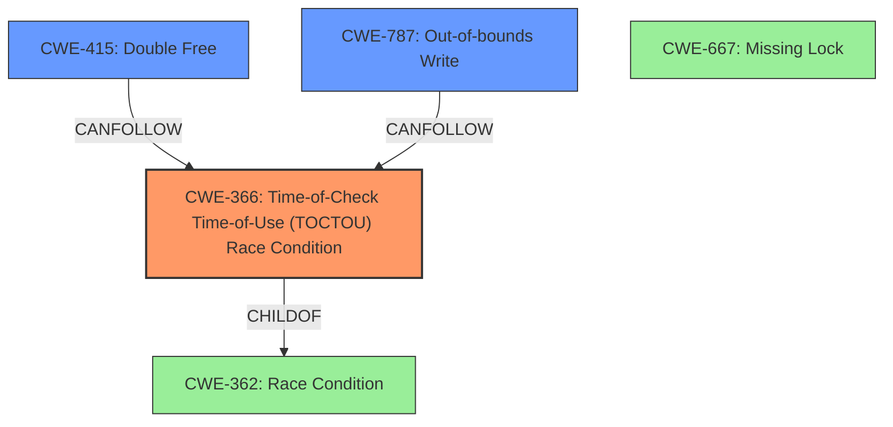

# Final Resolution for CVE-2020-11231

# Summary
| CWE ID | CWE Name | Confidence | CWE Abstraction Level | CWE Vulnerability Mapping Label | CWE-Vulnerability Mapping Notes |
|---|---|---|---|---|---|
| CWE-366 | Time-of-Check Time-of-Use (TOCTOU) Race Condition | 0.80 | Base | Allowed | Primary CWE. Two threads are concurrently accessing the resource leading to corruption.|
| CWE-415 | Double Free | 0.65 | Variant | Allowed | Secondary Candidate. Result of pointer corruption can lead to double free. |
| CWE-787 | Out-of-bounds Write | 0.65 | Base | Allowed | Secondary Candidate. Result of pointer corruption can lead to out-of-bounds write. |

## Evidence and Confidence

*   **Confidence Score:** 0.75
*   **Evidence Strength:** MEDIUM

## Relationship Analysis
The primary weakness is identified as CWE-366 [Time-of-Check Time-of-Use (TOCTOU) Race Condition], which is a base-level CWE. This aligns with the vulnerability description, which mentions concurrent access by two threads leading to pointer corruption. While CWE-667 [Missing Lock] is also related to concurrent access, the description does not explicitly mention any missing locks. CWE-415 [Double Free] and CWE-787 [Out-of-bounds Write] are included as secondary candidates because the heap corruption mentioned could manifest as these weaknesses. They can both be consequences of memory corruption due to race conditions.

## Vulnerability Chain
The vulnerability chain starts with concurrent access to a shared resource by two threads (CWE-366). This leads to pointer corruption. The corrupted pointers can then cause a double free (CWE-415) or an out-of-bounds write (CWE-787), leading to heap corruption and potentially arbitrary code execution.

**Chain:** CWE-366 (Race Condition) -> Pointer Corruption -> CWE-415 (Double Free) / CWE-787 (Out-of-bounds Write) -> Heap Corruption -> Arbitrary Code Execution

## Summary of Analysis
The initial analysis correctly identified CWE-366 as the primary weakness, with CWE-415 and CWE-787 as secondary candidates.

The criticism raised a valid point about explicitly addressing CWE-667 (Improper Locking). The provided vulnerability description does not explicitly state that locking mechanisms are present and malfunctioning, therefore CWE-366 is a better fit. Therefore, the confidence score of CWE-366 is adjusted from 0.85 to 0.80.

The secondary CWEs (CWE-415 and CWE-787) are plausible consequences of the primary weakness and are kept as secondary candidates. The suggestion to enhance the impact descriptions of CWE-415 and CWE-787 by mentioning the possibility of arbitrary code execution is valuable and incorporated into the analysis.

The retriever results highlighted the relevance of CWE-822 [Untrusted Pointer Dereference], however, this is not chosen since there is no mention of untrusted data.

The selected CWEs are at the optimal level of specificity. CWE-366 is a Base level CWE that accurately reflects the **rootcause** of the vulnerability. CWE-415 and CWE-787 are Variant and Base level CWEs, respectively, that represent the potential consequences of the pointer corruption.