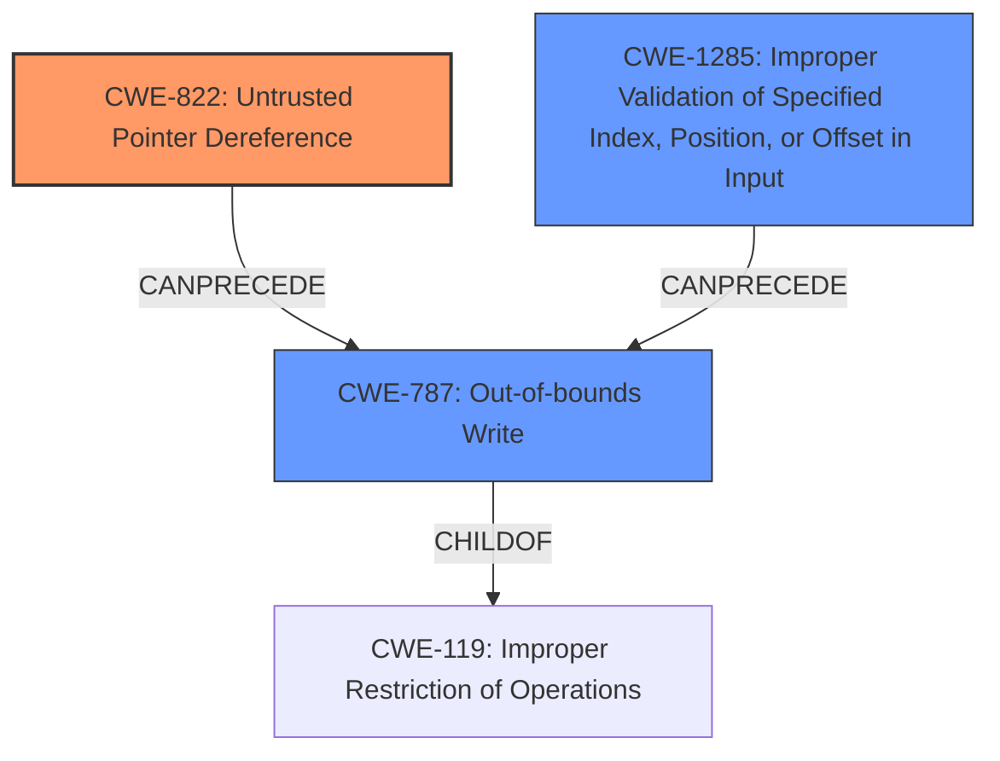

# Final Resolution for CVE-2020-11256

# Summary
| CWE ID | CWE Name | Confidence | CWE Abstraction Level | CWE Vulnerability Mapping Label | CWE-Vulnerability Mapping Notes |
|---|---|---|---|---|---|
| CWE-822 | **Untrusted Pointer Dereference** | 0.70 | Base | Allowed | The product obtains a value from an untrusted source, converts this value to a pointer, and dereferences the resulting pointer.  |
| CWE-787 | **Out-of-bounds Write** | 0.5 | Base | Allowed | The product writes data past the end, or before the beginning, of the intended buffer. |
| CWE-1285 | **Improper Validation of Specified Index, Position, or Offset in Input** | 0.3 | Base | Allowed | The product receives input that is expected to specify an index, position, or offset into an indexable resource such as a buffer or file, but it does not validate or incorrectly validates that the specified index/position/offset has the required properties. |

  - The Primary CWE should be first and noted as the Primary CWEs
  - The secondary candidate CWEs should be next and noted as secondary candidates.
  - The confidence is a confidence score 0 to 1 to rate your confidence in your assessment for that CWE.
  - The CWE Abstraction Level as one of these values: Base, Variant, Pillar, Class, Compound
  - The Mapping Notes Usage as one of these values: Allowed, Allowed-with-Review, Prohibited, Discouraged

## Evidence and Confidence

*   **Confidence Score:** 0.7
*   **Evidence Strength:** MEDIUM

## Relationship Analysis
The primary relationship that impacted the decision was the parent-child relationship between CWE-787 (**Out-of-bounds Write**) and CWE-119 (**Improper Restriction of Operations within the Bounds of a Memory Buffer**), with CWE-787 being a child of CWE-119. This indicated that while **out-of-bounds write** is a possible consequence, the immediate cause is the **lack of validation of the pointer**. The other relationships considered include chain relationships where an improper pointer dereference (**CWE-822**) or use of out-of-range offset (**CWE-823**) or **Improper validation of input** (**CWE-1285**) can precede an out-of-bounds write (**CWE-787**). I selected CWEs at the Base level to ensure sufficient specificity.

## Vulnerability Chain
The vulnerability chain starts with the **lack of validation of a pointer** passed to the trustzone. This **unvalidated pointer** is then dereferenced (**CWE-822**), potentially leading to memory corruption. The memory corruption can manifest as an **out-of-bounds write** (**CWE-787**). **Improper validation of input** (**CWE-1285**) can precede this chain.

## Summary of Analysis
The initial analysis correctly identified CWE-822 (**Untrusted Pointer Dereference**) and CWE-787 (**Out-of-bounds Write**) as potential weaknesses. The criticism provided a more nuanced view, which I largely agree with.

The vulnerability description states: "Memory corruption due to **lack of check of validation of pointer** to buffer passed to trustzone". Based on this, the primary issue is the **lack of validation**, which directly leads to potential for an **untrusted pointer dereference** (**CWE-822**). This confirms my decision to keep **CWE-822** as the primary CWE. I agree with the criticism that a confidence score of 0.7 is more appropriate because the untrusted source of the pointer is an assumption. The description does not explicitly state that the pointer's *source* is untrusted.

I've kept CWE-787 (**Out-of-bounds Write**) as a secondary CWE, as it is a possible consequence of the memory corruption, but not explicitly stated. A low confidence score of 0.5 is assigned to it as well.

I have added CWE-1285 (**Improper Validation of Specified Index, Position, or Offset in Input**) to account for the **lack of validation** of the pointer or offset used to access the buffer. I have assigned a confidence score of 0.3.

The selected CWEs are at the Base level of abstraction, providing sufficient specificity.