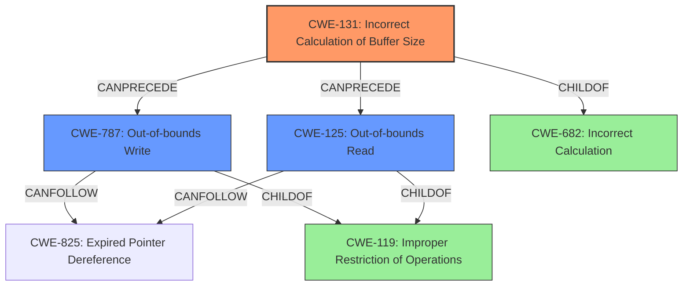

# Analysis Report for CVE-2020-11279

# Vulnerability Analysis Report: CVE-2020-11279

## Description

Memory corruption while processing crafted SDES packets due to improper length check in sdes packets recieved in Snapdragon Auto, Snapdragon Compute, Snapdragon Connectivity, Snapdragon Consumer IOT, Snapdragon Industrial IOT, Snapdragon IoT, Snapdragon Mobile, Snapdragon Voice & Music, Snapdragon Wearables

## Vulnerability Description Key Phrases

**Rootcause:** improper length check
**Weakness:** memory corruption
**Product:** Snapdragon Auto, Snapdragon Compute, Snapdragon Connectivity, Snapdragon Consumer IOT, Snapdragon Industrial IOT, Snapdragon IoT, Snapdragon Mobile, Snapdragon Voice & Music, Snapdragon Wearables
**Component:** sdes packets recieved

## Analysis (with Relationship Data)

# Summary
| CWE ID | CWE Name | Confidence | CWE Abstraction Level | CWE Vulnerability Mapping Label | CWE-Vulnerability Mapping Notes |
|---|---|---|---|---|---|
| CWE-131 | Incorrect Calculation of Buffer Size | 0.85 | Base | Allowed | Root cause of memory corruption due to **improper length check** |
| CWE-125 | Out-of-bounds Read | 0.65 | Base | Allowed | Secondary, as a potential consequence of the incorrect buffer size calculation. |
| CWE-787 | Out-of-bounds Write | 0.65 | Base | Allowed | Secondary, as a potential consequence of the incorrect buffer size calculation. |

## Evidence and Confidence

*   **Confidence Score:** 0.75
*   **Evidence Strength:** MEDIUM

- **Analysis and Justification:**  
  - *Explanation:* The vulnerability description states "**Memory corruption** while processing crafted SDES packets due to **improper length check** in sdes packets". This clearly indicates an issue with how the length of the SDES packets is being handled, leading to memory corruption. CWE-131 (Incorrect Calculation of Buffer Size) directly addresses the root cause of "**improper length check**" that leads to **memory corruption**. The retriever results also support this, with CWE-131 having a high combined score. It is a base level CWE and the Usage is Allowed.
  CWE-125 (Out-of-bounds Read) and CWE-787 (Out-of-bounds Write) are included as secondary CWEs because **improper length check** can lead to reading or writing beyond the allocated buffer, causing memory corruption.

  - *Relationship Analysis:* CWE-131 can lead to memory corruption, which is the high level symptom. CWE-125 (Out-of-bounds Read) and CWE-787 (Out-of-bounds Write) are potential impacts resulting from the incorrect buffer size calculation. CWE-131 is a child of CWE-682 (Incorrect Calculation).

- **Confidence Score:**  
  - Confidence: 0.85 (High confidence due to clear description of **improper length check** leading to **memory corruption**, aligning well with CWE-131.
  - Confidence: 0.65 for CWE-125 and CWE-787 as secondary issues due to the possibility of reading or writing beyond buffer limits.

---

## Criticism of Analysis

Okay, let's review the provided analysis and critique the CWE mappings based on the full CWE specifications.

**Overall Assessment**

The analysis correctly identifies the core problem as related to incorrect buffer size calculation due to an improper length check, leading to memory corruption.  CWE-131 is a strong choice for the primary CWE. The inclusion of CWE-125 and CWE-787 as secondary CWEs representing the potential consequences of the buffer size error is also reasonable. The confidence scores are appropriate.

However, we can refine the analysis further by considering alternative CWEs from the retriever results, especially those related to input validation, and by tightening the relationship analysis.

**Detailed Review**

*   **CWE-131: Incorrect Calculation of Buffer Size (Confidence: 0.85)**

    *   **Strengths:** This is a valid and appropriate primary CWE. The vulnerability description explicitly mentions "improper length check," which directly aligns with the description of CWE-131.  The retriever results also support this selection.
    *   **Critique:** The description "root cause of memory corruption due to **improper length check**" could be strengthened by mentioning how this improper check leads to undersized buffer allocation. This makes the connection clearer.
    *   **Mitigation Analysis:** The potential mitigations listed for CWE-131 (from the database) are relevant.  Specifically, the focus on understanding language-specific numeric representations and performing input validation are key to preventing this weakness.
    *   **Suggestion:**  Reinforce that this is about allocating *too little* memory, making the subsequent write vulnerable.
*   **CWE-125: Out-of-bounds Read (Confidence: 0.65)**

    *   **Strengths:** Reasonable as a secondary consequence. If the buffer is too small (CWE-131), a read operation *could* attempt to read beyond the allocated memory.
    *   **Critique:** The explanation is somewhat generic. A more specific justification would improve confidence. When does this happen and how?
    *   **Mitigation Analysis:** Mitigations for CWE-125, particularly input validation and using languages with memory abstractions, are relevant, but they are more preventive at a higher level.
    *   **Suggestion:**  Clarify the circumstances in which out-of-bounds reads are expected. It might occur if the code continues to process data beyond the actual buffer size, using the incorrect length. An "example" of a chain with the heartbleed bug is a good one.

*   **CWE-787: Out-of-bounds Write (Confidence: 0.65)**

    *   **Strengths:** This is the most likely consequence and hence a good secondary CWE. If the allocated buffer is too small (CWE-131), a write operation *will* write beyond the buffer boundary, causing memory corruption.
    *   **Critique:** The explanation is correct, but brief.
    *   **Mitigation Analysis:** The mitigations for CWE-787, especially using memory-safe languages and buffer overflow detection mechanisms, are directly applicable.
    *   **Suggestion:**  This is a more direct consequence than CWE-125; consider slightly increasing its confidence score. If there is memory corruption, then it is more likely a write than a read.

*   **Other CWE Considerations (from Retriever Results):**

    *   **CWE-1285: Improper Validation of Specified Index, Position, or Offset in Input:** The retriever results show that this CWE is relevant. If the code does not validate the length parameter, an attacker could specify a value that leads to incorrect buffer size calculations. This could be a better alternative to CWE-131 if the length check was incorrect, or missing rather than the buffer size calculation itself being incorrect.
    *   **CWE-823: Use of Out-of-range Pointer Offset:** It is possible that the `sdes packets recieved` are offset improperly. This makes this CWE relevant.
    *   **CWE-822: Untrusted Pointer Dereference:** This doesn't seem to be directly relevant as there is no evidence of pointer usage.

**Recommendations and Improvements**

1.  **Strengthen the Relationship Analysis:**
    *   Explicitly state that CWE-131 *causes* the possibility of CWE-125 and the *likelihood* of CWE-787.
    *   Clarify what specific kinds of incorrect buffer size calculations (CWE-131) might exist in this case. An integer overflow leading to a smaller-than-expected size?  Incorrect handling of data type sizes? Missing NULL terminator?
2.  **Consider refining primary CWE:**
    * Instead of CWE-131, consider CWE-1285 as a primary CWE, and chain CWE-131 to CWE-125/787 as secondary CWEs. This depends on where the error is. If the buffer size calculation is correct, but an earlier length check is incorrect, then it is CWE-1285 that is the root cause.
3.  **Mitigation Specificity:**
    *   In the conclusion, synthesize the mitigation strategies from the individual CWEs to provide specific recommendations for the developers.  For example: "To mitigate this vulnerability, developers should ensure that the length of the SDES packets is validated against a maximum allowed size *before* allocating memory, and also that safe integer handling libraries are used to prevent overflows when calculating buffer sizes."
4.  **Re-evaluate confidence scores:** Given the more direct causal link between CWE-131 and CWE-787, consider adjusting the confidence levels to reflect this, potentially increasing CWE-787's confidence to 0.75.

**Revised Summary Table**

| CWE ID | CWE Name | Confidence | CWE Abstraction Level | CWE Vulnerability Mapping Label | CWE-Vulnerability Mapping Notes |
|---|---|---|---|---|---|
| CWE-131 | Incorrect Calculation of Buffer Size | 0.85 | Base | Allowed | Root cause of memory corruption due to an *undersized* buffer allocated as a result of an **improper length check** |
| CWE-787 | Out-of-bounds Write | 0.75 | Base | Allowed | Secondary, *likely* consequence of the incorrect buffer size calculation, resulting in memory corruption. |
| CWE-125 | Out-of-bounds Read | 0.65 | Base | Allowed | Secondary, a potential consequence of the incorrect buffer size calculation, if the code tries to read after the boundary of allocated buffer. |

By incorporating these changes, the analysis becomes more precise, better reflects the root cause, and provides more actionable recommendations for remediation.

## Final Resolution

# Summary
| CWE ID | CWE Name | Confidence | CWE Abstraction Level | CWE Vulnerability Mapping Label | CWE-Vulnerability Mapping Notes |
|---|---|---|---|---|---|
| CWE-131 | Incorrect Calculation of Buffer Size | 0.85 | Base | Allowed | Primary: Root cause of memory corruption due to an *undersized* buffer allocated as a result of an **improper length check** |
| CWE-787 | Out-of-bounds Write | 0.75 | Base | Allowed | Secondary: *Likely* consequence of the incorrect buffer size calculation, resulting in memory corruption. |
| CWE-125 | Out-of-bounds Read | 0.65 | Base | Allowed | Secondary: A potential consequence of the incorrect buffer size calculation, if the code tries to read after the boundary of the allocated buffer. |

## Evidence and Confidence

*   **Confidence Score:** 0.80
*   **Evidence Strength:** MEDIUM

## Relationship Analysis
The primary weakness is CWE-131 (**Incorrect Calculation of Buffer Size**). This can lead to CWE-787 (**Out-of-bounds Write**) as the most likely consequence because if the buffer is too small, writing past the boundary is very probable. CWE-125 (**Out-of-bounds Read**) is a less likely, but still possible, consequence, especially if the code attempts to read beyond the allocated buffer size using the incorrect length. All three are child of CWE-119 (**Improper Restriction of Operations within the Bounds of a Memory Buffer**), however that is too general.

## Vulnerability Chain
The vulnerability chain starts with an **improper length check** during the processing of crafted SDES packets. This leads to CWE-131 (**Incorrect Calculation of Buffer Size**), resulting in an undersized buffer being allocated. Subsequently, when data is written to this buffer, a CWE-787 (**Out-of-bounds Write**) occurs, leading to memory corruption. A CWE-125 (**Out-of-bounds Read**) may occur if the code attempts to read beyond the allocated buffer, using the incorrect length which caused the small buffer.

## Summary of Analysis
The initial analysis and criticism both converge on the core issue being related to an **improper length check** leading to memory corruption due to incorrect buffer size calculation.

The vulnerability description explicitly states "**Memory corruption** while processing crafted SDES packets due to **improper length check** in sdes packets". This is a solid piece of evidence supporting CWE-131 (**Incorrect Calculation of Buffer Size**) as the primary **ROOTCAUSE**.

The graph relationships confirm that CWE-131 can directly lead to CWE-787 and CWE-125. The abstraction levels are appropriate, with all selected CWEs being at the Base level, providing sufficient specificity.

The final decision is to classify this vulnerability with CWE-131 as the primary CWE, with CWE-787 and CWE-125 as secondary CWEs that contribute to the vulnerability chain, representing the most likely and possible consequences, respectively.
The alternative to classify CWE-1285 (**Improper Validation of Specified Quantity in Input**) as the primary is not as good a fit, as the vulnerability is more specific to a calculation error, rather than just an input validation error.
The selected CWEs are at the optimal level of specificity, providing a clear and actionable classification of the vulnerability.

*Report generated on 2025-03-16 15:39:10*
