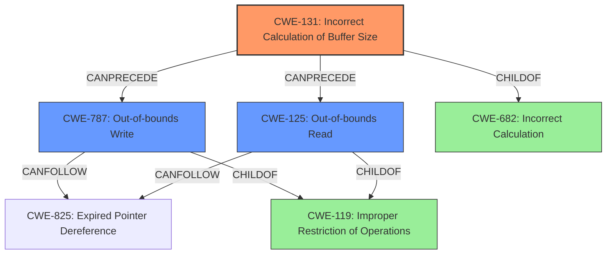

# Final Resolution for CVE-2020-11279

# Summary
| CWE ID | CWE Name | Confidence | CWE Abstraction Level | CWE Vulnerability Mapping Label | CWE-Vulnerability Mapping Notes |
|---|---|---|---|---|---|
| CWE-131 | Incorrect Calculation of Buffer Size | 0.85 | Base | Allowed | Primary: Root cause of memory corruption due to an *undersized* buffer allocated as a result of an **improper length check** |
| CWE-787 | Out-of-bounds Write | 0.75 | Base | Allowed | Secondary: *Likely* consequence of the incorrect buffer size calculation, resulting in memory corruption. |
| CWE-125 | Out-of-bounds Read | 0.65 | Base | Allowed | Secondary: A potential consequence of the incorrect buffer size calculation, if the code tries to read after the boundary of the allocated buffer. |

## Evidence and Confidence

*   **Confidence Score:** 0.80
*   **Evidence Strength:** MEDIUM

## Relationship Analysis
The primary weakness is CWE-131 (**Incorrect Calculation of Buffer Size**). This can lead to CWE-787 (**Out-of-bounds Write**) as the most likely consequence because if the buffer is too small, writing past the boundary is very probable. CWE-125 (**Out-of-bounds Read**) is a less likely, but still possible, consequence, especially if the code attempts to read beyond the allocated buffer size using the incorrect length. All three are child of CWE-119 (**Improper Restriction of Operations within the Bounds of a Memory Buffer**), however that is too general.

## Vulnerability Chain
The vulnerability chain starts with an **improper length check** during the processing of crafted SDES packets. This leads to CWE-131 (**Incorrect Calculation of Buffer Size**), resulting in an undersized buffer being allocated. Subsequently, when data is written to this buffer, a CWE-787 (**Out-of-bounds Write**) occurs, leading to memory corruption. A CWE-125 (**Out-of-bounds Read**) may occur if the code attempts to read beyond the allocated buffer, using the incorrect length which caused the small buffer.

## Summary of Analysis
The initial analysis and criticism both converge on the core issue being related to an **improper length check** leading to memory corruption due to incorrect buffer size calculation.

The vulnerability description explicitly states "**Memory corruption** while processing crafted SDES packets due to **improper length check** in sdes packets". This is a solid piece of evidence supporting CWE-131 (**Incorrect Calculation of Buffer Size**) as the primary **ROOTCAUSE**.

The graph relationships confirm that CWE-131 can directly lead to CWE-787 and CWE-125. The abstraction levels are appropriate, with all selected CWEs being at the Base level, providing sufficient specificity.

The final decision is to classify this vulnerability with CWE-131 as the primary CWE, with CWE-787 and CWE-125 as secondary CWEs that contribute to the vulnerability chain, representing the most likely and possible consequences, respectively.
The alternative to classify CWE-1285 (**Improper Validation of Specified Quantity in Input**) as the primary is not as good a fit, as the vulnerability is more specific to a calculation error, rather than just an input validation error.
The selected CWEs are at the optimal level of specificity, providing a clear and actionable classification of the vulnerability.