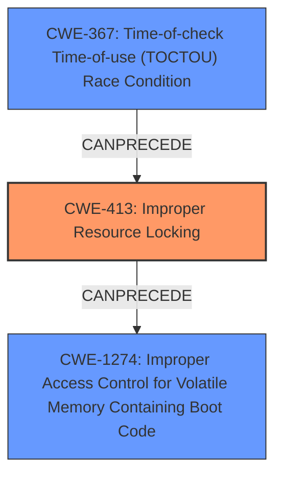

# Final Resolution for CVE-2020-11284

# Summary
| CWE ID | CWE Name | Confidence | CWE Abstraction Level | CWE Vulnerability Mapping Label | CWE-Vulnerability Mapping Notes |
|---|---|---|---|---|---|
| CWE-413 | Improper Resource Locking | 0.90 | Base | Allowed | Primary CWE. The product does not lock or does not correctly lock a resource when the product must have exclusive access to the resource. |
| CWE-1274 | Improper Access Control for Volatile Memory Containing Boot Code | 0.75 | Base | Allowed | Secondary CWE. The product conducts a secure-boot process that transfers bootloader code from Non-Volatile Memory (NVM) into Volatile Memory (VM), but it does not have sufficient access control or other protections for the Volatile Memory. |
| CWE-367 | Time-of-check Time-of-use (TOCTOU) Race Condition | 0.60 | Base | Allowed | Secondary CWE. The product checks the state of a resource before using that resource, but the resource's state can change between the check and the use in a way that invalidates the results of the check. |

## Evidence and Confidence

*   **Confidence Score:** 0.80
*   **Evidence Strength:** MEDIUM

## Relationship Analysis
- Parent-child hierarchical relationships: CWE-413 and CWE-1274 do not have direct parent-child relationships that strongly influence the decision. CWE-1274 is a child of CWE-284 (Improper Access Control), which provides context but does not change the classification itself.
- Chain relationships: The vulnerability description suggests a chain where **improper locking (CWE-413)** *CanPrecede* **improper access control (CWE-1274)**. Also, the possibility of TOCTOU Race condition exists in the system call sequence.
- Peer relationships: There are no Peer relationships that significantly alter the classification decision.
- Abstraction levels: The selection of Base level CWEs (CWE-413, CWE-1274 and CWE-367) provides the optimal level of specificity for mapping to the root causes of this vulnerability.

## Vulnerability Chain
The chain of events is as follows:
1.  **Root Cause:** **Improper Resource Locking (CWE-413)** due to an **improper system call sequence**.
2.  **Weakness:** Memory intended to be locked is unlocked.
3.  **Weakness:** A non-secure boot loader modifies the unlocked memory, which contains boot code.
4.  **Impact:** The secure boot process is compromised because it relies on untrusted memory.
5.  **Possible TOCTOU**: A race condition (**CWE-367**) in the system call sequence might exist, where the lock is checked, but the memory is modified before the lock can be enforced.

## Summary of Analysis
The initial analysis correctly identified CWE-413 and CWE-1274 as relevant. However, I am increasing the confidence in CWE-413 and including CWE-367 as a secondary concern:

*   CWE-413 (Improper Resource Locking): The core issue is the unlocking of locked memory. The vulnerability description explicitly states that "locked memory can be unlocked," directly aligning with CWE-413. The **improper system call sequence** is the mechanism that bypasses the intended locking.
    *Evidence: "locked memory can be unlocked and modified by non secure boot loader through improper system call sequence"*
*   CWE-1274 (Improper Access Control for Volatile Memory Containing Boot Code): This is a contributing factor, but secondary to the locking issue. The ability to modify unlocked memory compromises the secure boot process, specifically because volatile memory containing boot code is affected.
    *Evidence: "memory region untrusted source of input for secure boot loader"*
*   CWE-367 (Time-of-check Time-of-use (TOCTOU) Race Condition): The retriever flagged this with a high score, and it's possible that the **improper system call sequence** involves a race condition where a check is performed on the memory lock status, but the status changes before the memory is actually accessed. While not explicitly stated, it is possible.
    *Evidence: "improper system call sequence"*

The graph relationships influenced the decision to include CWE-367 and clarify the chain of events. The base-level abstraction of CWE-413 and CWE-1274 provides optimal specificity. The final classification reflects the root cause (locking) and its direct consequence (compromised secure boot).