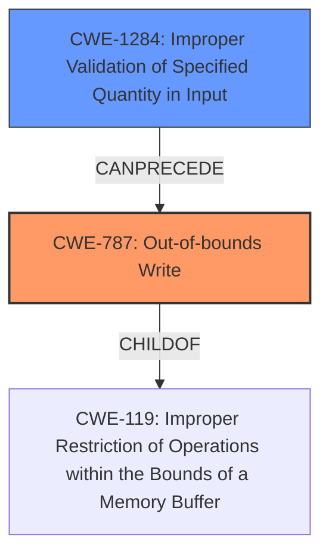

# Final Resolution for CVE-2020-11294

# Summary
| CWE ID | CWE Name | Confidence | CWE Abstraction Level | CWE Vulnerability Mapping Label | CWE-Vulnerability Mapping Notes |
|---|---|---|---|---|---|
| CWE-787 | Out-of-bounds Write | 0.95 | Base | Allowed | Acceptable-Use |
| CWE-1284 | Improper Validation of Specified Quantity in Input | 0.75 | Base | Allowed | Contributes to CWE-787 by failing to validate the prefix size, leading to memory corruption. |

  - The Primary CWE should be first and noted as the Primary CWEs
  - The secondary candidate CWEs should be next and noted as secondary candidates.
  - The confidence is a confidence score 0 to 1 to rate your confidence in your assessment for that CWE.
  - The CWE Abstraction Level as one of these values: Base, Variant, Pillar, Class, Compound
  - The Mapping Notes Usage as one of these values: Allowed, Allowed-with-Review, Prohibited, Discouraged

## Evidence and Confidence

*   **Confidence Score:** 0.9
*   **Evidence Strength:** HIGH

## Relationship Analysis
The decision was influenced by the following CWE relationships:
  - CWE-787 is a child of CWE-119, providing a broader context.
  - CWE-1284 CanPrecede CWE-787, illustrating a potential vulnerability chain.
  - The base abstraction levels of both CWE-787 and CWE-1284 make them appropriate for root cause analysis.

## Vulnerability Chain
The vulnerability chain starts with **CWE-1284 (Improper Validation of Specified Quantity in Input)**, where the prefix size is not properly validated. This leads to **CWE-787 (Out-of-bounds Write)**, as the unvalidated prefix size is used to write data beyond the buffer's boundaries, causing memory corruption.

## Summary of Analysis
The initial analysis correctly identified **CWE-787 (Out-of-bounds Write)** as the primary weakness due to the vulnerability description stating "**out of bound write**". The criticism highlighted the weaker justification for **CWE-1284 (Improper Validation of Specified Quantity in Input)** and **CWE-131 (Incorrect Calculation of Buffer Size)**.

Based on the vulnerability description "**prefix size is not validated**", **CWE-1284** is still relevant because it represents the failure to validate the size, which is a quantity. However, the confidence is slightly reduced to 0.75 to reflect the potential for misinterpretation. **CWE-131** was removed as the description does not suggest any incorrect calculation, only a missing validation step.

The graph relationships further support the selection of **CWE-787** as the primary issue and **CWE-1284** as a contributing factor in the vulnerability chain. Both CWEs are at the base level of abstraction, which is appropriate for identifying root causes.