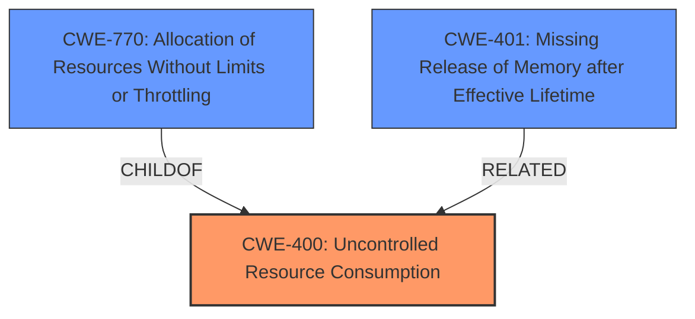

# Analysis Report for CVE-2020-14326

# Vulnerability Analysis Report: CVE-2020-14326

## Description

A vulnerability was found in RESTEasy, where RootNode incorrectly caches routes. This issue results in hash flooding, leading to slower requests with higher CPU time spent searching and adding the entry. This flaw allows an attacker to cause a denial of service.

## Vulnerability Description Key Phrases

**Impact:** denial of service
**Vector:** hash flooding
**Attacker:** attacker
**Product:** RESTEasy
**Component:** RootNode

## Analysis (with Relationship Data)

# Summary
| CWE ID | CWE Name | Confidence | CWE Abstraction Level | CWE Vulnerability Mapping Label | CWE-Vulnerability Mapping Notes |
|---|---|---|---|---|---|
| CWE-400 | Uncontrolled Resource Consumption | 0.85 | Class | Primary | Allowed-with-Review |
| CWE-770 | Allocation of Resources Without Limits or Throttling | 0.70 | Base | Secondary Candidate | Allowed |
| CWE-401 | Missing Release of Memory after Effective Lifetime | 0.65 | Variant | Secondary Candidate | Allowed |
| CWE-1333 | Inefficient Regular Expression Complexity | 0.60 | Base | Secondary Candidate | Allowed |

## Evidence and Confidence

*   **Confidence Score:** 0.80
*   **Evidence Strength:** HIGH

- **Analysis and Justification:**
  - *Explanation:* The vulnerability description describes a **denial of service** caused by **hash flooding** due to incorrect caching of routes. The CVE reference confirms that the root cause is "improper caching of routes in RootNode within RESTEasy, which leads to **hash flooding** and increased CPU usage when searching for and adding new entries." This aligns with CWE-400 (Uncontrolled Resource Consumption) because the improper caching leads to excessive CPU consumption and potentially memory exhaustion, leading to a **denial of service**. CWE-400 is a class-level CWE, but it is the most appropriate high-level categorization of the issue. Although CWE-400 is discouraged, no other base or variant level CWE adequately addresses the root cause and impact.
  - *Relationship Analysis:* CWE-400 is a class-level CWE and has child CWEs like CWE-770 (Allocation of Resources Without Limits or Throttling). While CWE-770 is a possible candidate, the primary issue here is not just the allocation of resources, but the uncontrolled consumption of CPU resources due to inefficient hash table lookups.

- **Confidence Score:**
  - Confidence: 0.85 (High evidence from the vulnerability description and CVE reference materials)

---
- **Analysis and Justification:**
  - *Explanation:* CWE-770 (Allocation of Resources Without Limits or Throttling) is a possible secondary candidate because the **improper caching** could be interpreted as an **allocation of resources without limits**. The system is caching routes without proper checks, which could lead to excessive memory usage.
  - *Relationship Analysis:* CWE-770 is a child of CWE-400. It describes a more specific type of resource consumption issue.

- **Confidence Score:**
  - Confidence: 0.70 (Supporting evidence from the vulnerability description and CVE reference materials)

---
- **Analysis and Justification:**
  - *Explanation:* CWE-401 (Missing Release of Memory after Effective Lifetime) is a possible secondary candidate because if routes are cached incorrectly and never released, it results in a missing release of memory.
  - *Relationship Analysis:* CWE-401 is a variant level CWE

- **Confidence Score:**
  - Confidence: 0.65 (Supporting evidence from the vulnerability description and CVE reference materials)

---
- **Analysis and Justification:**
  - *Explanation:* CWE-1333 (Inefficient Regular Expression Complexity) is a possible secondary candidate because it is possible the improper caching involves regular expressions.
  - *Relationship Analysis:* CWE-1333 is a base level CWE.

- **Confidence Score:**
  - Confidence: 0.60 (Supporting evidence from the vulnerability description and CVE reference materials)

## Criticism of Analysis

Okay, I've reviewed the analysis, focusing on the provided CWE specifications and mapping guidance. Here's my critique:

**Overall Assessment:**

The analysis is generally good and well-reasoned. The primary mapping to CWE-400 (Uncontrolled Resource Consumption) is justifiable, given the information available. The secondary candidates are also plausible, although some are weaker than others. However, as CWE-400 is discouraged, the analysis could be improved by focusing on a more specific CWE, and building an argument for it.

**Detailed Breakdown:**

*   **CWE-400: Uncontrolled Resource Consumption (Primary)**
    *   **Confidence: 0.85**
    *   **Justification:** The analysis correctly identifies the denial-of-service impact and links it to resource consumption (CPU, potentially memory) due to hash flooding.  The use of the term "hash flooding" strongly suggests uncontrolled consumption of CPU cycles as the hash lookups become increasingly expensive.
    *   **Critique:**
        *   The analysis acknowledges that CWE-400 is discouraged and at the Class level. This is a good starting point. The rationale for using it anyway is that no other base or variant level CWE adequately addresses the root cause and impact.
        *   The analysis could be strengthened by *directly* arguing that the child CWEs are *inadequate*. For example, it states that CWE-770 is possible, but the primary issue is not just allocation of resources, but the uncontrolled consumption of CPU resources due to inefficient hash table lookups.
        *   Consider exploring other child CWEs of CWE-400 in more detail to explain *why* they don't fit. What is it that makes this situation distinct from a more standard CWE-770?
        *   The explanation could benefit from explicitly noting that the *attacker* is able to influence the resource consumption via network requests. This is a key aspect of a DoS.
    *   **Suggested Improvement:** The analysis should explicitly state *why* other, lower-level CWEs were ruled out. What aspects of this specific flaw make CWE-400 the most appropriate choice, even with its discouraged status? Focus on the "incorrect behavior" that CWE-400 is intended to capture.

*   **CWE-770: Allocation of Resources Without Limits or Throttling (Secondary Candidate)**
    *   **Confidence: 0.70**
    *   **Justification:** The analysis notes that improper caching *could* be seen as allocation without limits.
    *   **Critique:**
        *   This is a weaker candidate than CWE-400 because the "allocation" of routes is happening in an uncontrolled way, but the problem *isn't* the allocation itself. The core issue is that the *lookup* becomes increasingly inefficient.
        *   The analysis does a good job of mentioning that it is a child of CWE-400 and describes a more specific type of resource consumption issue.
    *   **Suggested Improvement:** The analysis should explain more precisely why throttling is ineffective if the hashing algorithm is fundamentally flawed.

*   **CWE-401: Missing Release of Memory after Effective Lifetime (Secondary Candidate)**
    *   **Confidence: 0.65**
    *   **Justification:** Routes are cached incorrectly and never released.
    *   **Critique:**
        *   This is a plausible secondary issue, especially if the cache grows unboundedly.
        *   The description does well by noting it is a Variant level CWE
    *   **Suggested Improvement:** A slightly stronger connection could be made by arguing that routes should have a TTL (time-to-live) or other eviction policy, and the *absence* of that leads to the memory leak.

*   **CWE-1333: Inefficient Regular Expression Complexity (Secondary Candidate)**
    *   **Confidence: 0.60**
    *   **Justification:** It is possible the improper caching involves regular expressions.
    *   **Critique:**
        *   This is the weakest candidate. It's purely speculative and based on the *possibility* that regular expressions are involved.
        *   There's no evidence presented to support this claim.
        *   It is a base level CWE.
    *   **Suggested Improvement:** Unless there is concrete evidence of regular expressions being used in the routing logic and contributing to the inefficiency, this candidate should be removed.

**Alternative CWE considerations (and why they might *not* fit):**

*   **CWE-1176: Inefficient CPU Computation**: The description for CWE-1176 states, "The product performs CPU computations using algorithms that are not as efficient as they could be for the needs of the developer... If an attacker can influence the amount of computation that must be performed, e.g. by triggering worst-case complexity, then this performance problem might introduce a vulnerability." This could be a candidate, and a stronger case could be made for it over CWE-400 if more specifics were available on the inefficient hashing algorithm.  However, this is a Class level CWE as well and has a Usage of "Allowed-with-Review", suggesting a child CWE would be more appropriate.
*   **CWE-406:  Insufficient Throttling of Asymmetric Resource Consumption:**  This could also be considered if the amplification factor is a core feature of the exploitability.
*   **CWE-407: Inefficient Algorithmic Complexity:** Similar to CWE-1176, but focused more specifically on the *algorithmic* inefficiency. Again, more details on the hashing algorithm would make this a stronger candidate.

**Recommendations:**

1.  **Strengthen the argument for CWE-400 by explicitly refuting the applicability of its children.**  Provide clear reasons why each child (or at least the most likely ones) *doesn't* fully capture the vulnerability.
2.  **Re-evaluate CWE-1333.** Remove it unless there is some actual evidence to support the involvement of regular expressions.
3.  **Explore CWE-1176 or CWE-407.** If the hash function's inefficiency is a key factor, consider making a stronger case for one of these.  If so, try to find a base-level CWE for the specific type of algorithmic issue.
4.  **Focus on Input Validation:** Since the root cause is related to not checking requests, perhaps start with that.

By addressing these points, the analysis can be made more robust and defensible within the context of the CWE specifications.

## Final Resolution

# Summary 
| CWE ID | CWE Name | Confidence | CWE Abstraction Level | CWE Vulnerability Mapping Label | CWE-Vulnerability Mapping Notes |
|---|---|---|---|---|---|
| CWE-400 | Uncontrolled Resource Consumption | 0.8 | Class | Primary CWE | Allowed-with-Review |
| CWE-770 | Allocation of Resources Without Limits or Throttling | 0.65 | Base | Secondary Candidate | Allowed |
| CWE-401 | Missing Release of Memory after Effective Lifetime | 0.60 | Variant | Secondary Candidate | Allowed |

## Evidence and Confidence

*   **Confidence Score:** 0.75
*   **Evidence Strength:** MEDIUM

## Relationship Analysis
The primary relationship impacting the decision is the parent-child relationship between CWE-400 **(Uncontrolled Resource Consumption)** and its children, particularly CWE-770 **(Allocation of Resources Without Limits or Throttling)**. While a more specific CWE is generally preferred, the analysis concludes that none of the children adequately capture the core issue, which is the uncontrolled *consumption* of resources (primarily CPU) due to **hash flooding**, rather than a simple allocation problem. CWE-401 **(Missing Release of Memory after Effective Lifetime)** is considered a secondary issue, as the cached routes may not be released properly.

## Vulnerability Chain
The vulnerability chain starts with the **incorrect caching of routes** in RESTEasy's RootNode. This leads to **hash flooding**, which causes slower requests and higher CPU time spent searching and adding entries. The ultimate impact is a **denial of service** due to the uncontrolled consumption of CPU resources.
  - **Root Cause:** Incorrect caching of routes.
  - **Weakness 1:** Hash flooding.
  - **Weakness 2:** Uncontrolled consumption of CPU resources.
  - **Impact:** Denial of service.

## Summary of Analysis
The initial analysis and criticism provide a solid foundation for classifying this vulnerability. The assessment is based on the provided evidence, primarily the vulnerability description and CVE reference, which highlight the **hash flooding** issue.

The graph relationships influenced the final selection by emphasizing the need to consider more specific CWEs. However, after careful consideration, CWE-400 **(Uncontrolled Resource Consumption)** was chosen as the primary CWE because it best represents the high-level issue of uncontrolled resource consumption leading to a **denial of service**. While CWE-400 is discouraged, the analysis provides a reasonable justification for its use, arguing that the child CWEs don't fully capture the root cause of uncontrolled *consumption* due to **hash flooding**.

The CWEs were selected to reflect the optimal level of specificity based on the available evidence. While more specific CWEs could potentially be used if more details about the hashing algorithm were available, the current information supports CWE-400 as the most appropriate primary classification.

*Report generated on 2025-03-16 23:02:14*
