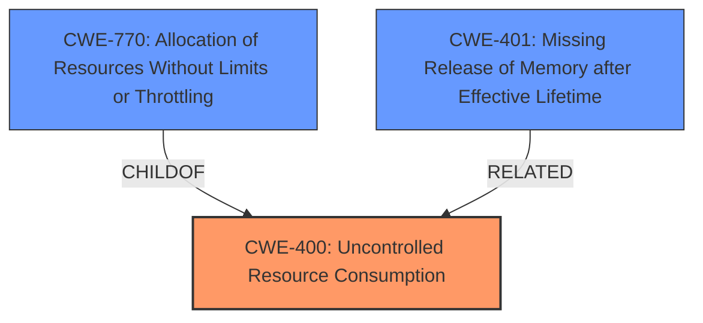

# Final Resolution for CVE-2020-14326

# Summary 
| CWE ID | CWE Name | Confidence | CWE Abstraction Level | CWE Vulnerability Mapping Label | CWE-Vulnerability Mapping Notes |
|---|---|---|---|---|---|
| CWE-400 | Uncontrolled Resource Consumption | 0.8 | Class | Primary CWE | Allowed-with-Review |
| CWE-770 | Allocation of Resources Without Limits or Throttling | 0.65 | Base | Secondary Candidate | Allowed |
| CWE-401 | Missing Release of Memory after Effective Lifetime | 0.60 | Variant | Secondary Candidate | Allowed |

## Evidence and Confidence

*   **Confidence Score:** 0.75
*   **Evidence Strength:** MEDIUM

## Relationship Analysis
The primary relationship impacting the decision is the parent-child relationship between CWE-400 **(Uncontrolled Resource Consumption)** and its children, particularly CWE-770 **(Allocation of Resources Without Limits or Throttling)**. While a more specific CWE is generally preferred, the analysis concludes that none of the children adequately capture the core issue, which is the uncontrolled *consumption* of resources (primarily CPU) due to **hash flooding**, rather than a simple allocation problem. CWE-401 **(Missing Release of Memory after Effective Lifetime)** is considered a secondary issue, as the cached routes may not be released properly.

## Vulnerability Chain
The vulnerability chain starts with the **incorrect caching of routes** in RESTEasy's RootNode. This leads to **hash flooding**, which causes slower requests and higher CPU time spent searching and adding entries. The ultimate impact is a **denial of service** due to the uncontrolled consumption of CPU resources.
  - **Root Cause:** Incorrect caching of routes.
  - **Weakness 1:** Hash flooding.
  - **Weakness 2:** Uncontrolled consumption of CPU resources.
  - **Impact:** Denial of service.

## Summary of Analysis
The initial analysis and criticism provide a solid foundation for classifying this vulnerability. The assessment is based on the provided evidence, primarily the vulnerability description and CVE reference, which highlight the **hash flooding** issue.

The graph relationships influenced the final selection by emphasizing the need to consider more specific CWEs. However, after careful consideration, CWE-400 **(Uncontrolled Resource Consumption)** was chosen as the primary CWE because it best represents the high-level issue of uncontrolled resource consumption leading to a **denial of service**. While CWE-400 is discouraged, the analysis provides a reasonable justification for its use, arguing that the child CWEs don't fully capture the root cause of uncontrolled *consumption* due to **hash flooding**.

The CWEs were selected to reflect the optimal level of specificity based on the available evidence. While more specific CWEs could potentially be used if more details about the hashing algorithm were available, the current information supports CWE-400 as the most appropriate primary classification.