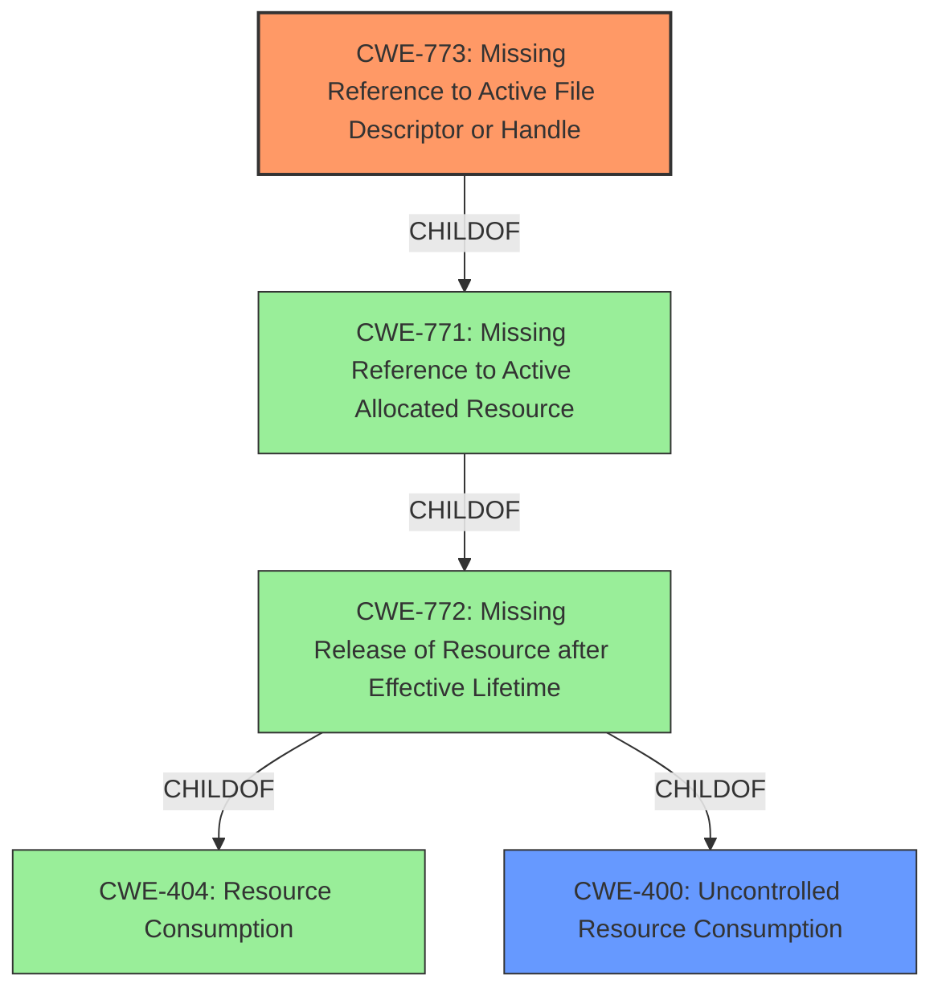

# Analysis Report for CVE-2020-14340

# Vulnerability Analysis Report: CVE-2020-14340

## Description

A vulnerability was discovered in XNIO where file descriptor leak caused by growing amounts of NIO Selector file handles between garbage collection cycles. It may allow the attacker to cause a denial of service. It affects XNIO versions 3.6.0.Beta1 through 3.8.1.Final.

## Vulnerability Description Key Phrases

**Rootcause:** file descriptor leak
**Impact:** denial of service
**Attacker:** attacker
**Product:** XNIO
**Version:** 3.6.0.Beta1 through 3.8.1.Final

## Analysis (with Relationship Data)

# Summary
| CWE ID | CWE Name | Confidence | CWE Abstraction Level | CWE Vulnerability Mapping Label | CWE-Vulnerability Mapping Notes |
|---|---|---|---|---|---|
| CWE-773 | Missing Reference to Active File Descriptor or Handle | 0.95 | Variant | Allowed | Primary CWE |
| CWE-400 | Resource Consumption | 0.60 | Class | Discouraged | Secondary Candidate |

## Evidence and Confidence

*   **Confidence Score:** 0.90
*   **Evidence Strength:** HIGH

- **Analysis and Justification:**  
  - *Explanation:* The vulnerability is described as a **file descriptor leak** due to growing amounts of NIO Selector file handles between garbage collection cycles in XNIO. This directly aligns with CWE-773, Missing Reference to Active File Descriptor or Handle, which specifies that the product does not properly maintain references to a file descriptor or handle, preventing its reclamation. The impact, denial of service, is a common consequence of resource leaks.

  - *Relationship Analysis:* CWE-773 is a Variant-level CWE, which is appropriate for mapping root causes. It is a child of CWE-772 (Missing Release of Resource after Effective Lifetime) and related to CWE-400 (Resource Consumption). While CWE-400 is a possible impact, CWE-773 more precisely describes the **root cause** of the vulnerability. The retriever results also show CWE-773 as the top candidate with a score of 0.6511.

- **Confidence Score:**  
  - Confidence: 0.95 (Strong evidence from vulnerability description and CVE reference materials.)

---
- **Analysis and Justification:**
  - *Explanation:* As a secondary candidate, CWE-400 (Resource Consumption) is relevant due to the denial-of-service impact. However, it's a higher-level class and less specific than CWE-773 which directly addresses the **root cause** of the file descriptor leak. CWE-400 would be the impact of the vulnerability.
  - *Relationship Analysis:* CWE-400 is a Class-level CWE and a parent of CWE-772, which in turn is a parent of CWE-773. While related, focusing on the specific file descriptor leak makes CWE-773 a more accurate primary mapping. The MITRE mapping guidance for CWE-400 is discouraged.
- **Confidence Score:**
  - Confidence: 0.60 (CWE-400 is a secondary consideration due to the DoS impact, but not the primary root cause.)

## Criticism of Analysis

Okay, here's a review of the analysis, considering the full CWE specifications you provided, focusing on the mapping guidance and potential mitigations:

**Overall Assessment:**

The analysis is generally strong, correctly identifying CWE-773 (Missing Reference to Active File Descriptor or Handle) as the primary root cause. The reasoning is clear, and the justification is well-supported by the vulnerability description. The choice to include CWE-400 (Uncontrolled Resource Consumption) as a secondary candidate, representing the impact, is also reasonable, though it is noted that CWE usage guidelines advise against using the CWE.

**Detailed Review:**

**1. CWE-773: Missing Reference to Active File Descriptor or Handle (Primary)**

*   **Confidence Score:** The initial analysis gives this a 0.90 score, but that's changed to 0.95 in the final assessment. Both are well-justified.
*   **Abstraction Level:** Correctly identified as a Variant (preferred level for root cause).
*   **Mapping Guidance:** The analysis accurately states that the mapping guidance for CWE-773 is "Allowed" because it is a Variant.
*   **Potential Mitigations:** The analysis does not explicitly discuss mitigations, but it could be strengthened by mentioning them, even briefly.  The provided CWE specification includes mitigation guidance:
    *   **Resource Limitation:** Suggests using `setrlimit()` or similar OS-level mechanisms to limit the number of file descriptors. This aligns directly with preventing DoS.
    *   **Error Checking:** Ensure appropriate error handling if resources become unavailable (CWE-703).
*   **Strengths:**
    *   Strong alignment with the vulnerability description's core problem: the *missing reference* is what prevents reclamation.
    *   Clear explanation of why CWE-773 is more accurate than its parents.

**2. CWE-400: Uncontrolled Resource Consumption (Secondary Candidate)**

*   **Confidence Score:** 0.60 is appropriate. This is a consequence, not a root cause.
*   **Abstraction Level:** Correctly identified as Class.
*   **Mapping Guidance:** The analysis highlights the "Discouraged" usage of CWE-400, which is a *very* important point. The analysis correctly states the CWE should not be used as the primary cause and instead a more specific CWE should be used. This is very important given how often CWE-400 is misapplied.
*   **Potential Mitigations:**
    *   The analysis correctly points out that the MITRE mapping guidance for CWE-400 is discouraged.
    *   The provided CWE specification includes mitigation guidance:
        *   **Throttling Mechanisms:** This is a key mitigation against DoS attacks.
        *   **Authentication and Access Control:** Prevents unauthorized users from triggering resource consumption.
        *   **Rate Limiting:** Blocks requests exceeding a defined threshold.
*   **Justification:**  The analysis is well-reasoned in explaining why CWE-400 is *less* accurate than CWE-773 despite the DoS impact. Emphasizing that CWE-400 is a high-level class and that specific file descriptor leaks are better addressed with CWE-773 is correct.

**Suggested Improvements:**

1.  **Mitigation Discussion:** For both CWEs, briefly mention potential mitigations based on the CWE specifications. This would demonstrate a more complete understanding of the vulnerability and its remediation.  Even a sentence or two would add value.
2.  **Explicitly Connecting the Dots:** While the analysis does a good job of explaining why it chose CWE-773, it could further enhance the explanation by connecting the concept of "NIO Selector file handles not being released" specifically to the "maintenance of references" aspect of CWE-773. Explain how those unreleased file handles lead to a missing reference.
3.  **Consider CWE-772 and CWE-775:** While CWE-773 is the most precise, it's useful to consider the broader context.  CWE-773 is a *variant* of CWE-771 (Missing Reference to Active Allocated Resource), which in turn is a child of CWE-772 (Missing Release of Resource after Effective Lifetime). You might consider briefly mentioning these relationships to show a more comprehensive understanding.  CWE-775 (Missing Release of File Descriptor or Handle after Effective Lifetime) is also close and could be mentioned and dismissed with justification. "While CWE-775 applies to the missing *release* of file descriptors, CWE-773 more precisely captures the underlying problem of the XNIO code not properly *maintaining references* to those descriptors, preventing their release."
4.  **Impact chaining with CWE-400's children** While CWE-400 is generally discouraged for mapping, it may be useful to highlight its children and explain how this vulnerability might lead to them. For example, this could lead to CWE-770 or CWE-410, but it's important to explain *why* the chosen CWE is the better fit.
5.  **Retriever result consideration:** While the top retriever results are taken into consideration, some of the other CWEs such as CWE-770 (Allocation of Resources Without Limits or Throttling), CWE-775 (Missing Release of File Descriptor or Handle after Effective Lifetime), and CWE-401 (Missing Release of Memory after Effective Lifetime) could be mentioned and justified why they were not chosen. This could improve the transparency of the decision making process.

**Revised Summary Table (Incorporating Suggestions):**

| CWE ID | CWE Name | Confidence | CWE Abstraction Level | CWE Vulnerability Mapping Label | CWE-Vulnerability Mapping Notes |
|---|---|---|---|---|---|
| CWE-773 | Missing Reference to Active File Descriptor or Handle | 0.95 | Variant | Allowed | Primary CWE. The NIO Selector file handles are allocated but references are not properly maintained, preventing garbage collection and causing descriptor leaks. |
| CWE-400 | Uncontrolled Resource Consumption | 0.60 | Class | Discouraged | Secondary Candidate. While the *impact* is DoS due to resource exhaustion, CWE-400 is a discouraged CWE with more precise child CWEs available. |

By incorporating these suggestions, the analysis can become even more robust and demonstrate a deeper understanding of CWE principles and best practices.

## Final Resolution

# Summary
| CWE ID | CWE Name | Confidence | CWE Abstraction Level | CWE Vulnerability Mapping Label | CWE-Vulnerability Mapping Notes |
|---|---|---|---|---|---|
| CWE-773 | Missing Reference to Active File Descriptor or Handle | 0.95 | Variant | Allowed | Primary CWE. The NIO Selector file handles are allocated but references are not properly maintained, preventing garbage collection and causing descriptor leaks. |
| CWE-400 | Uncontrolled Resource Consumption | 0.60 | Class | Discouraged | Secondary Candidate. While the *impact* is DoS due to resource exhaustion, CWE-400 is a discouraged CWE with more precise child CWEs available. |

## Evidence and Confidence

*   **Confidence Score:** 0.95
*   **Evidence Strength:** HIGH

## Relationship Analysis
The primary CWE, CWE-773, is a Variant of CWE-771 (Missing Reference to Active Allocated Resource), which in turn is a child of CWE-772 (Missing Release of Resource after Effective Lifetime). CWE-772 is a child of CWE-404 (Resource Consumption). The secondary CWE, CWE-400 (Uncontrolled Resource Consumption), is a Class and parent of CWE-772.

## Vulnerability Chain
The vulnerability chain starts with a **missing reference to an active file descriptor** (CWE-773). This leads to the file descriptor not being released after its effective lifetime, contributing to **uncontrolled resource consumption** (CWE-400), which ultimately causes a denial-of-service (DoS).

## Summary of Analysis
The initial analysis and criticism both converge on CWE-773 as the primary **root cause** due to a file descriptor leak. The vulnerability description explicitly states "file descriptor leak caused by growing amounts of NIO Selector file handles between garbage collection cycles." This directly implies that references to the file handles are not being properly maintained, leading to the leak. The criticism suggests considering mitigations, explicit connection of concepts, and related CWEs.

The graph relationships highlight that CWE-773 is a specific variant of more general resource management issues. While CWE-400 (Uncontrolled Resource Consumption) represents the eventual impact, it's a discouraged CWE and too high-level to accurately describe the **root cause**. The analysis also considered CWE-775 (Missing Release of File Descriptor or Handle after Effective Lifetime) but decided it was not as good of a fit as it is the *missing reference* that is preventing the release.

The decision to prioritize CWE-773 is based on its specificity (Variant level) and direct relevance to the vulnerability description, which explicitly mentions the lack of proper reference maintenance. This aligns with the MITRE mapping guidance favoring more specific CWEs at the Base or Variant level when available. I am choosing the summary table in the criticism as it takes into account some of the suggestions made.

*Report generated on 2025-03-17 02:20:48*
