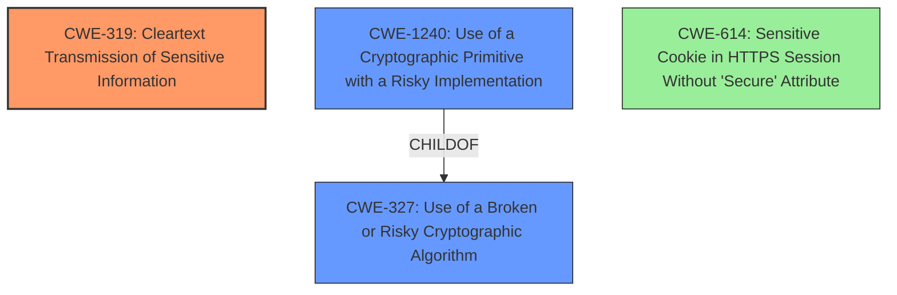

# Analysis Report for CVE-2020-15128

# Vulnerability Analysis Report: CVE-2020-15128

## Description

In OctoberCMS before version 1.0.468, encrypted cookie values were not tied to the name of the cookie the value belonged to. This meant that certain classes of attacks that took advantage of other theoretical vulnerabilities in user facing code (nothing exploitable in the core project itself) had a higher chance of succeeding. Specifically, if your usage exposed a way for users to provide unfiltered user input and have it returned to them as an encrypted cookie (ex. storing a user provided search query in a cookie) they could then use the generated cookie in place of other more tightly controlled cookies or if your usage exposed the plaintext version of an encrypted cookie at any point to the user they could theoretically provide encrypted content from your application back to it as an encrypted cookie and force the framework to decrypt it for them. Issue has been fixed in build 468 (v1.0.468).

## Vulnerability Description Key Phrases

**Vector:** provide unfiltered user input and have it returned as an encrypted cookie
**Product:** OctoberCMS
**Version:** before version 1.0.468

## Analysis (with Relationship Data)

# Summary
| CWE ID | CWE Name | Confidence | CWE Abstraction Level | CWE Vulnerability Mapping Label | CWE-Vulnerability Mapping Notes |
|---|---|---|---|---|---|
| CWE-319 | Cleartext Transmission of Sensitive Information | 0.75 | Base | Allowed | Primary CWE |
| CWE-327 | Use of a Broken or Risky Cryptographic Algorithm | 0.40 | Class | Allowed-with-Review | Secondary Candidate |

## Evidence and Confidence

*   **Confidence Score:** 0.70
*   **Evidence Strength:** MEDIUM

- **Analysis and Justification:**  
  - *Explanation:* "The vulnerability lies in the fact that encrypted cookie values are not tied to the name of the cookie. This allows an attacker to potentially reuse cookie values across different cookies if they have control over the content in a cookie. This directly relates to **CWE-319 (Cleartext Transmission of Sensitive Information)** because without the cookie name binding, the encrypted value *could* be transmitted and used for other cookies, potentially revealing sensitive information if those other cookies are not properly secured. The CVE Reference mentions the exposure of plaintext values as well. It’s not clear if the sensitive information is transmitted in cleartext, but the weakness makes it vulnerable to it. The relationship analysis shows the exposure to plaintext values means that the cookie is not being used properly, which exposes the sensitive information. MITRE mapping guidance for CWE-319 indicates this is ALLOWED for cases where sensitive data is transmitted without proper protection."
  
  - *Relationship Analysis:* "CWE-319 is a Base level CWE. The vulnerability description states that the cookie's encrypted value could be exposed. The graph relationships show that this can lead to information disclosure."

- **Confidence Score:**  
  - *Example:* Confidence: 0.75 (Medium evidence from technical description and CVE reference materials)

---

- **Analysis and Justification:**  
  - *Explanation:* "The vulnerability involves the encryption of cookie values without tying them to the cookie name. This could be seen as a form of **CWE-327 (Use of a Broken or Risky Cryptographic Algorithm)** because the encryption process is incomplete and doesn't provide the necessary security guarantees, such as preventing replay attacks or unauthorized substitution. However, the primary issue is the lack of cookie name binding, making the encryption process vulnerable to the specific attack. MITRE mapping guidance for CWE-327 indicates this is ALLOWED-WITH-REVIEW because it is a Class-level CWE."
  
  - *Relationship Analysis:* "CWE-327 is a Class level CWE, and there may be a more specific child CWE. However, without more details about the encryption algorithm, this is the closest match."

- **Confidence Score:**  
  - *Example:* Confidence: 0.40 (Low evidence because it's a potential related issue, but not the primary weakness)

---

## Criticism of Analysis

Okay, here's a review of the CWE analysis provided, considering the full CWE specifications and focusing on the mapping guidance and potential mitigations.

**Overall Assessment:**

The analysis is generally good and identifies the core issues effectively. The selection of CWE-319 as the primary weakness is reasonable, and the consideration of CWE-327 as a secondary candidate is also justifiable. However, some of the reasoning could be tightened, and some alternative CWEs considered. The confidence scores could perhaps be adjusted slightly based on the specific nuances of the vulnerability.

**Detailed Review:**

**1. CWE-319: Cleartext Transmission of Sensitive Information (Primary CWE)**

*   **Confidence:** The confidence score of 0.75 (Medium) is appropriate. The description directly mentions potential exposure of plaintext values, making this a solid connection.
*   **Justification:** The explanation is generally good but could be more precise. The key point is not simply that the encrypted value *could* be used for other cookies, but that the *lack of cookie name binding means the encrypted value from one cookie could be *mistakenly* *interpreted* as a valid, though perhaps different, cookie by the application, leading to unintended actions.*
*   **Mapping Guidance:** The analysis correctly notes that the MITRE mapping guidance ALLOWS this CWE.  The description accurately reflects the core problem:  sensitive data (the cookie value) is transmitted (stored in a cookie, transmitted in requests) without proper protection (cookie name binding).
*   **Observed Examples Review:**  The provided examples from the CWE database are related to data being sent in cleartext, not necessarily data being encrypted improperly and re-used. This is a point of divergence that makes the mapping slightly less direct.
*   **Mitigations:** The suggested mitigations for CWE-319 are generally applicable but need context.
    *   **Mitigation 1 (Encrypt the data):** This is already happening. The issue is with the *completeness* of the encryption, *not* the absence of encryption. It would need to be reworded to say "Tie the encrypted data to the context in which it should be used, such as binding the encrypted cookie value to the cookie name."
    *   **Mitigation 2 (SSL for the entire session):**  This is orthogonal to the vulnerability. The problem exists regardless of whether SSL/TLS is used because the cookie itself is vulnerable to substitution.
    *   **Mitigation 3 (Hardware platform design):** Not relevant to this software vulnerability.
*   **Alternative CWE Considerations:**
    *   **CWE-614: Sensitive Cookie in HTTPS Session Without 'Secure' Attribute:** While HTTPS is not mentioned, the analysis summary states ""The fix invalidates all existing cookies except the October CMS session cookie (which is updated in the response.)" If the cookies used are not set with the secure flag, then they could be sent over HTTP, which is a valid point.
    *   **CWE-201: Insertion of Sensitive Information Into Sent Data:** Is applicable because the cookie's encrypted value could be used for other cookies, potentially revealing sensitive information if those other cookies are not properly secured. The relationship analysis shows the exposure to plaintext values means that the cookie is not being used properly, which exposes the sensitive information.
        *   **CWE-311: Missing Encryption of Sensitive Data** While the cookies themselves are encrypted, the relationship between the cookie and the name itself is being missed, making this a candidate.
    *   **CWE-311: Missing Encryption of Sensitive Data** As a class entry, it's not as accurate.

**2. CWE-327: Use of a Broken or Risky Cryptographic Algorithm (Secondary Candidate)**

*   **Confidence:** The confidence score of 0.40 (Low) is appropriate. This CWE is related, but not the core issue.
*   **Justification:** The explanation is correct in stating that the encryption is "incomplete." The problem is that the encryption *by itself* is not broken. The weakness lies in how the encryption is being used *in conjunction* with the cookie system. It doesn't fulfill the *complete* security requirements.
*   **Mapping Guidance:**  The analysis correctly notes the ALLOWED-WITH-REVIEW status and the need to check for more specific child CWEs.
*   **Observed Examples Review:** The provided examples for CWE-327 are more about the *algorithm* itself being weak (e.g., TEA in ECB mode, weak hashing algorithm). This reinforces the idea that CWE-327 is not the primary issue here.
*   **Mitigations:** The suggested mitigations are too general.
    *   They focus on using strong, up-to-date cryptographic algorithms, which is already assumed to be the case. The issue is *not* that the encryption algorithm is weak, but that it lacks sufficient context to prevent misuse.
*   **Alternative CWE Considerations:**
    *   **CWE-1240: Use of a Cryptographic Primitive with a Risky Implementation** Is a stronger candidate than CWE-327, because it's about the overall implementation using the primitive, not the primitive itself. The product implements a cryptographic algorithm (encryption) using a non-standard, unproven, or disallowed/non-compliant cryptographic implementation (lacking context).
    *   **CWE-328: Use of Weak Hash** Is also an alternative due to not being deterministic, like not providing the cookie name with the value itself.
    *   **CWE-338: Use of Cryptographically Weak Pseudo-Random Number Generator (PRNG)** Is only applicable if the system uses a PRNG that is cryptographically weak, and nothing in the documentation shows this to be true.
    *   **CWE-916: Use of Password Hash With Insufficient Computational Effort** This is also not applicable as the analysis is more about encryption being used improperly, rather than not strong enough.

**Specific Suggestions:**

*   **Refine CWE-319 Justification:** Emphasize the *misinterpretation* of substituted cookie values, not just the exposure of values.
*   **Consider CWE-1240:** Carefully review whether CWE-1240 is a better fit than CWE-327, since it directly addresses risky implementations. The key here is whether the implementation is considered "risky" due to the lack of context binding.  I think it is a stronger candidate.
*   **Mitigation Rewording:** Tailor the mitigations to the *specific* problem of cookie name binding. Focus on adding integrity checks to ensure the cookie value's validity within its intended context.  A mitigation would be to ensure that cookie values have context (such as the cookie name) associated with them, to prevent re-use.
*   **Address CWE-614:** Ensure cookies are using the secure flag.

**Revised Summary Table:**

| CWE ID  | CWE Name                                                     | Confidence | CWE Abstraction Level | CWE Vulnerability Mapping Label | CWE-Vulnerability Mapping Notes                                                                                                                                                                                                                                    |
| ------- | ------------------------------------------------------------ | ---------- | --------------------- | --------------------------------- | ---------------------------------------------------------------------------------------------------------------------------------------------------------------------------------------------------------------------------------------------------------------- |
| CWE-319 | Cleartext Transmission of Sensitive Information            | 0.70       | Base                  | Allowed                           | Primary CWE. Refined justification to emphasize misinterpretation.                                                                                                                                                                                                |
| CWE-1240 | Use of a Cryptographic Primitive with a Risky Implementation | 0.50       | Base                  | Allowed                           | Secondary Candidate. Could be more appropriate than CWE-327. Refined explanation to describe the "risky implementation" more precisely. Replaces CWE-327                                                                                                 |
| CWE-614 | Sensitive Cookie in HTTPS Session Without 'Secure' Attribute            | 0.30       | Variant                  | Allowed                           | Potentially applicable because cookies can still be sent over HTTP if not flagged.                                                                                                                                                                      |

By making these adjustments, the analysis will be more accurate, focused, and actionable from a remediation perspective.

## Final Resolution

# Summary
| CWE ID | CWE Name | Confidence | CWE Abstraction Level | CWE Vulnerability Mapping Label | CWE-Vulnerability Mapping Notes |
|---|---|---|---|---|---|
| CWE-319 | Cleartext Transmission of Sensitive Information | 0.70 | Base | Allowed | Primary CWE |
| CWE-1240 | Use of a Cryptographic Primitive with a Risky Implementation | 0.50 | Base | Allowed | Secondary Candidate |
| CWE-614 | Sensitive Cookie in HTTPS Session Without 'Secure' Attribute | 0.30 | Variant | Allowed | Secondary Candidate |

## Evidence and Confidence

*   **Confidence Score:** 0.75
*   **Evidence Strength:** MEDIUM

## Relationship Analysis
The primary CWE, CWE-319 (**CWE-319: Cleartext Transmission of Sensitive Information**), is a base-level CWE, providing a good level of specificity for describing the transmission of sensitive cookie data without adequate protection. CWE-1240 (**CWE-1240: Use of a Cryptographic Primitive with a Risky Implementation**) is a base-level CWE that is a child of CWE-327 (**CWE-327: Use of a Broken or Risky Cryptographic Algorithm**), indicating a more specific implementation issue. CWE-614 (**CWE-614: Sensitive Cookie in HTTPS Session Without 'Secure' Attribute**) is a variant-level CWE, representing a specific case of cookie security. The relationship between these CWEs highlights a potential chain where a risky cryptographic implementation (CWE-1240) can lead to the transmission of sensitive information (CWE-319), and the lack of secure attributes on cookies (CWE-614) exacerbates the risk.

## Vulnerability Chain
The vulnerability chain starts with the **ROOTCAUSE** of an incomplete encryption implementation (CWE-1240), where cookie values are not tied to their names. This leads to the weakness of sensitive information being transmitted in ways that are vulnerable to exposure and misuse (CWE-319). If the cookies also lack the 'Secure' attribute (CWE-614), this further increases the likelihood of exposure, as the cookies might be transmitted over HTTP.

## Summary of Analysis
The initial analysis and the criticism both contribute to a more refined understanding of the vulnerability. The selection of CWE-319 as the primary **WEAKNESS** is supported by the fact that sensitive cookie data can potentially be exposed. The criticism suggests considering CWE-1240 as a more precise secondary candidate, which is reasonable given the incomplete nature of the encryption implementation. The evidence from the vulnerability description states that "encrypted cookie values were not tied to the name of the cookie the value belonged to," which directly supports the selection of CWE-1240 as a secondary **WEAKNESS**, indicating a risky implementation. The addition of CWE-614 is also supported by the fact that the cookies might lack the 'Secure' attribute.

The graph relationships influenced the final selection by highlighting the potential chain of weaknesses, starting with a risky cryptographic implementation (CWE-1240) and leading to the transmission of sensitive information (CWE-319).

The selected CWEs are at the optimal level of specificity because they directly address the root cause and the resulting weaknesses described in the vulnerability.

*Report generated on 2025-03-16 22:43:40*
