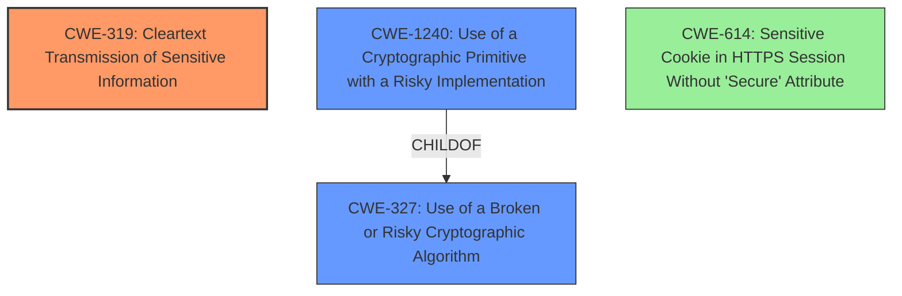

# Final Resolution for CVE-2020-15128

# Summary
| CWE ID | CWE Name | Confidence | CWE Abstraction Level | CWE Vulnerability Mapping Label | CWE-Vulnerability Mapping Notes |
|---|---|---|---|---|---|
| CWE-319 | Cleartext Transmission of Sensitive Information | 0.70 | Base | Allowed | Primary CWE |
| CWE-1240 | Use of a Cryptographic Primitive with a Risky Implementation | 0.50 | Base | Allowed | Secondary Candidate |
| CWE-614 | Sensitive Cookie in HTTPS Session Without 'Secure' Attribute | 0.30 | Variant | Allowed | Secondary Candidate |

## Evidence and Confidence

*   **Confidence Score:** 0.75
*   **Evidence Strength:** MEDIUM

## Relationship Analysis
The primary CWE, CWE-319 (**CWE-319: Cleartext Transmission of Sensitive Information**), is a base-level CWE, providing a good level of specificity for describing the transmission of sensitive cookie data without adequate protection. CWE-1240 (**CWE-1240: Use of a Cryptographic Primitive with a Risky Implementation**) is a base-level CWE that is a child of CWE-327 (**CWE-327: Use of a Broken or Risky Cryptographic Algorithm**), indicating a more specific implementation issue. CWE-614 (**CWE-614: Sensitive Cookie in HTTPS Session Without 'Secure' Attribute**) is a variant-level CWE, representing a specific case of cookie security. The relationship between these CWEs highlights a potential chain where a risky cryptographic implementation (CWE-1240) can lead to the transmission of sensitive information (CWE-319), and the lack of secure attributes on cookies (CWE-614) exacerbates the risk.

## Vulnerability Chain
The vulnerability chain starts with the **ROOTCAUSE** of an incomplete encryption implementation (CWE-1240), where cookie values are not tied to their names. This leads to the weakness of sensitive information being transmitted in ways that are vulnerable to exposure and misuse (CWE-319). If the cookies also lack the 'Secure' attribute (CWE-614), this further increases the likelihood of exposure, as the cookies might be transmitted over HTTP.

## Summary of Analysis
The initial analysis and the criticism both contribute to a more refined understanding of the vulnerability. The selection of CWE-319 as the primary **WEAKNESS** is supported by the fact that sensitive cookie data can potentially be exposed. The criticism suggests considering CWE-1240 as a more precise secondary candidate, which is reasonable given the incomplete nature of the encryption implementation. The evidence from the vulnerability description states that "encrypted cookie values were not tied to the name of the cookie the value belonged to," which directly supports the selection of CWE-1240 as a secondary **WEAKNESS**, indicating a risky implementation. The addition of CWE-614 is also supported by the fact that the cookies might lack the 'Secure' attribute.

The graph relationships influenced the final selection by highlighting the potential chain of weaknesses, starting with a risky cryptographic implementation (CWE-1240) and leading to the transmission of sensitive information (CWE-319).

The selected CWEs are at the optimal level of specificity because they directly address the root cause and the resulting weaknesses described in the vulnerability.