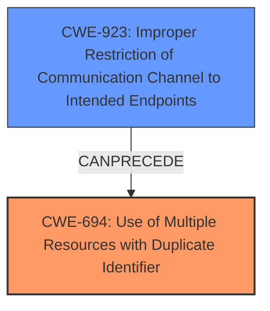

# Analysis Report for CVE-2020-15185

# Vulnerability Analysis Report: CVE-2020-15185

## Description

In Helm before versions 2.16.11 and 3.3.2, a Helm repository can contain duplicates of the same chart, with the last one always used. If a repository is compromised, this lowers the level of access that an attacker needs to inject a bad chart into a repository. To perform this attack, an attacker must have write access to the index file (which can occur during a MITM attack on a non-SSL connection). This issue has been patched in Helm 3.3.2 and 2.16.11. A possible workaround is to manually review the index file in the Helm repository cache before installing software.

## Vulnerability Description Key Phrases

**Weakness:** Helm before versions 2.16.11 and 3.3.2
**Vector:** inject a bad chart into a repository
**Attacker:** attacker
**Product:** Helm
**Version:** before versions 2.16.11 and 3.3.2

## Analysis (with Relationship Data)

# Summary
| CWE ID  | CWE Name                                                                  | Confidence | CWE Abstraction Level | CWE Vulnerability Mapping Label | CWE-Vulnerability Mapping Notes |
| :-------- | :------------------------------------------------------------------------ | :--------- | :---------------------- | :------------------------------ | :------------------------------ |
| CWE-694 | Use of Multiple Resources with Duplicate Identifier                     | 0.95       | Base                    | Primary                         | Allowed                       |

## Evidence and Confidence

*   **Confidence Score:** 0.95
*   **Evidence Strength:** HIGH

- **Analysis and Justification:**
  - *Explanation:* The vulnerability lies in the Helm repository allowing duplicate chart entries within the index file. The Helm client then uses the last entry which allows an attacker to inject a bad chart into the repository. This aligns with CWE-694 (Use of Multiple Resources with Duplicate Identifier) because the Helm repository uses multiple chart entries with the same identifier (chart name) and the last one is used, leading to the vulnerability. The **root cause** is the lack of deduplication allowing the **weakness** to exist.
  - *Relationship Analysis:* No direct relationships found.

- **Confidence Score:**
  - *Example:* Confidence: 0.95 (High evidence from technical description and CVE reference materials)

---

## Criticism of Analysis

Okay, here's a detailed review of the provided analysis, focusing on the CWE mapping, confidence, and considering the full CWE specifications:

**Overall Assessment:**

The analysis identifies **CWE-694 (Use of Multiple Resources with Duplicate Identifier)** as the primary CWE, and assigns it a high confidence score of 0.95. This is a reasonable, and likely correct, assessment. The justification is well-articulated, tying the vulnerability directly to the CWE's description.  However, some of the alternative CWEs identified in the initial retriever results are also worth considering, especially as secondary weaknesses or contributing factors.

**Detailed Review of CWE Mapping:**

*   **CWE-694 (Primary):** The selection of CWE-694 is strong. The vulnerability arises directly from the Helm repository allowing duplicate entries for charts identified by the same name. The description of CWE-694, *“The product uses multiple resources that can have the same identifier, in a context in which unique identifiers are required,"* accurately reflects the core issue. The explanation provided in the analysis is clear and convincing. The link to MITIGATION 1 of using Unique Identifiers in the Architectural design is also a valid point.

*   **Alternative CWEs (From Retriever Results):** Let's examine some of the top alternatives and why they might be relevant, even if not primary:

    *   **CWE-1284 (Improper Validation of Specified Quantity in Input):** This is about failing to validate quantities like size or length. While not directly the *cause*, it *could* be considered a contributing factor. The "quantity" in this case could be seen as the number of chart entries.  A robust validation of the number of entries *could* have prevented duplicates. However, the primary issue isn't the *number* of entries, but the *uniqueness* of their identifiers. Therefore, I would consider this as a secondary weakness at most.

    *   **CWE-427 (Uncontrolled Search Path Element):** This CWE is related to using search paths that can be controlled by an attacker. While the attack *can* be done over an unencrypted connection, and *could* lead to a path manipulation attack, the root cause is still duplicates, so this CWE isn't directly applicable.

    *   **CWE-22 (Improper Limitation of a Pathname to a Restricted Directory ('Path Traversal')):**  This CWE is only relevant if you stretch the definition to see the injected Chart as an attacker controlling the path. However, this is not its main purpose and is still a stretch.

    *   **CWE-201 (Insertion of Sensitive Information Into Sent Data):** This CWE is about sending information that should be protected. It is not applicable to this specific vulnerability.

    *   **CWE-306 (Missing Authentication for Critical Function):** This CWE is about missing authentication. It is not the main cause of the vulnerability. It could be a related factor if authentication was used to ensure the index file was not tampered with.

    *   **CWE-434 (Unrestricted Upload of File with Dangerous Type):** This CWE is only applicable if an attacker has access to upload arbitrary files to the repository.

    *   **CWE-923 (Improper Restriction of Communication Channel to Intended Endpoints):** This could be relevant if the communication channel to the Helm repository is not properly secured. If an attacker can perform a MITM attack, they could inject a malicious chart entry. However, this is more of a side effect or enabling factor for the attack rather than the root cause.

    *   **CWE-863 (Incorrect Authorization):** If the Helm repository has incorrect authorization settings, an attacker might be able to modify the index file and inject a malicious chart entry. This is also a side effect.

    *   **CWE-79 (Improper Neutralization of Input During Web Page Generation ('Cross-site Scripting')):** This CWE is not applicable in this scenario.

**Confidence Score:**

*   The confidence score of 0.95 for CWE-694 is justified. The evidence provided is strong, and the explanation directly links the vulnerability to the CWE definition.

**Mitigation Analysis:**

The analysis correctly points out that the mitigation strategy of MITIGATION 1 in CWE-694, "Where possible, use unique identifiers," applies. This is the core fix: ensure that chart names are unique within the repository.

**Suggestions for Improvement:**

1.  **Acknowledge Contributing Factors:**  While maintaining CWE-694 as the primary weakness, acknowledge CWE-923 as a relevant contributing factor. The possibility of a MITM attack on a non-SSL connection highlights the importance of secure communication channels.

2.  **Elaborate on Mitigation Strategies:** While the analysis mentions the "use unique identifiers" mitigation (which is a fix), it could also highlight the proactive mitigations from the CVE advisory, like using TLS, verifying charts, and manually reviewing index files. These steps can prevent exploitation even if duplicates exist.

3.  **Consider a Chain of CWEs:** Although assigning a single primary CWE is often preferred, consider if a *chain* of CWEs would better represent the attack.  For example:
    *   CWE-694: Use of Multiple Resources with Duplicate Identifier (Primary)
    *   CWE-923: Improper Restriction of Communication Channel to Intended Endpoints (Enabling Condition)

**Revised Summary Table (Example):**

| CWE ID  | CWE Name                                                                  | Confidence | CWE Abstraction Level | CWE Vulnerability Mapping Label | CWE-Vulnerability Mapping Notes |
| :-------- | :------------------------------------------------------------------------ | :--------- | :---------------------- | :------------------------------ | :------------------------------ |
| CWE-694 | Use of Multiple Resources with Duplicate Identifier                     | 0.95       | Base                    | Primary                         | Allowed                       |
| CWE-923 | Improper Restriction of Communication Channel to Intended Endpoints      | 0.50      | Class                    | Supporting                      | Allowed-with-Review        |

**In conclusion, the analysis is good and the primary CWE selection is strong. By acknowledging potential contributing factors and expanding on mitigation strategies, the analysis can be even more comprehensive.**

## Final Resolution

# Summary
| CWE ID  | CWE Name                                                                  | Confidence | CWE Abstraction Level | CWE Vulnerability Mapping Label | CWE-Vulnerability Mapping Notes |
| :-------- | :------------------------------------------------------------------------ | :--------- | :---------------------- | :------------------------------ | :------------------------------ |
| CWE-694 | Use of Multiple Resources with Duplicate Identifier                     | 0.95       | Base                    | Primary                         | Allowed                       |
| CWE-923 | Improper Restriction of Communication Channel to Intended Endpoints      | 0.50      | Class                    | Supporting                      | Allowed-with-Review        |

## Evidence and Confidence

*   **Confidence Score:** 0.90
*   **Evidence Strength:** HIGH

## Relationship Analysis
The primary relationship considered was the potential chain involving **CWE-694 (Use of Multiple Resources with Duplicate Identifier)** and **CWE-923 (Improper Restriction of Communication Channel to Intended Endpoints)**. While **CWE-694** is the **root cause** due to the lack of uniqueness enforcement, **CWE-923** represents an enabling condition where a compromised communication channel (MITM attack) allows the injection of malicious duplicate chart entries. The choice of **CWE-694** as primary is based on its direct relevance to the **weakness** itself, while **CWE-923** is secondary because it describes a condition that facilitates the exploitation of the primary **weakness**. Both are class level, with **CWE-694** being most specific.

## Vulnerability Chain
The vulnerability chain starts with the **root cause**, **CWE-694 (Use of Multiple Resources with Duplicate Identifier)**, where the Helm repository allows duplicate chart entries. This is then enabled by **CWE-923 (Improper Restriction of Communication Channel to Intended Endpoints)**, allowing an attacker to inject a malicious chart entry via a MITM attack. The consequence is that the Helm client uses the attacker's malicious chart, leading to potential compromise of the system. There are no missing links, based on the information provided.

## Summary of Analysis
The initial analysis correctly identified **CWE-694 (Use of Multiple Resources with Duplicate Identifier)** as the primary **weakness**. The criticism suggested considering **CWE-923 (Improper Restriction of Communication Channel to Intended Endpoints)** as a contributing factor, which is a valid point. The analysis is primarily based on the provided evidence from the vulnerability description, which states: "In Helm before versions 2.16.11 and 3.3.2, a Helm repository can contain duplicates of the same chart, with the last one always used. If a repository is compromised, this lowers the level of access that an attacker needs to inject a bad chart into a repository. To perform this attack, an attacker must have write access to the index file (which can occur during a MITM attack on a non-SSL connection)."

The graph relationship analysis influenced the final selection by highlighting the potential chain between the **root cause** (**CWE-694**) and the enabling condition (**CWE-923**). The selected CWEs are at the optimal level of specificity because **CWE-694** directly addresses the core issue of duplicate identifiers, and **CWE-923** captures the enabling factor of insecure communication. The use of **CWE-694** as primary and **CWE-923** as secondary provides a comprehensive representation of the vulnerability.

*Report generated on 2025-03-17 01:38:23*
