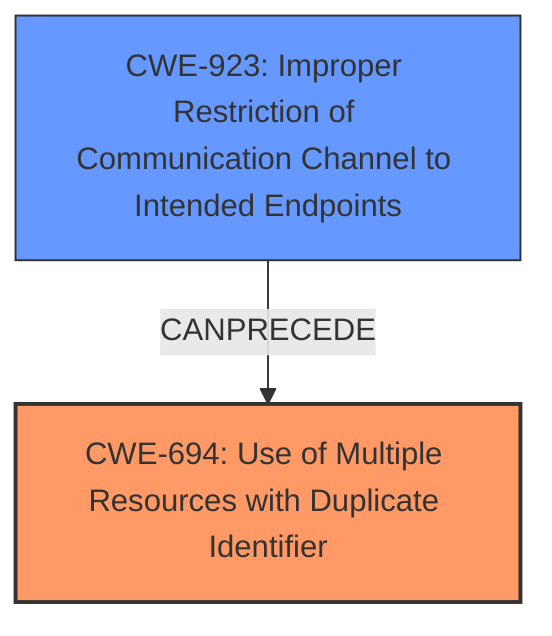

# Final Resolution for CVE-2020-15185

# Summary
| CWE ID  | CWE Name                                                                  | Confidence | CWE Abstraction Level | CWE Vulnerability Mapping Label | CWE-Vulnerability Mapping Notes |
| :-------- | :------------------------------------------------------------------------ | :--------- | :---------------------- | :------------------------------ | :------------------------------ |
| CWE-694 | Use of Multiple Resources with Duplicate Identifier                     | 0.95       | Base                    | Primary                         | Allowed                       |
| CWE-923 | Improper Restriction of Communication Channel to Intended Endpoints      | 0.50      | Class                    | Supporting                      | Allowed-with-Review        |

## Evidence and Confidence

*   **Confidence Score:** 0.90
*   **Evidence Strength:** HIGH

## Relationship Analysis
The primary relationship considered was the potential chain involving **CWE-694 (Use of Multiple Resources with Duplicate Identifier)** and **CWE-923 (Improper Restriction of Communication Channel to Intended Endpoints)**. While **CWE-694** is the **root cause** due to the lack of uniqueness enforcement, **CWE-923** represents an enabling condition where a compromised communication channel (MITM attack) allows the injection of malicious duplicate chart entries. The choice of **CWE-694** as primary is based on its direct relevance to the **weakness** itself, while **CWE-923** is secondary because it describes a condition that facilitates the exploitation of the primary **weakness**. Both are class level, with **CWE-694** being most specific.

## Vulnerability Chain
The vulnerability chain starts with the **root cause**, **CWE-694 (Use of Multiple Resources with Duplicate Identifier)**, where the Helm repository allows duplicate chart entries. This is then enabled by **CWE-923 (Improper Restriction of Communication Channel to Intended Endpoints)**, allowing an attacker to inject a malicious chart entry via a MITM attack. The consequence is that the Helm client uses the attacker's malicious chart, leading to potential compromise of the system. There are no missing links, based on the information provided.

## Summary of Analysis
The initial analysis correctly identified **CWE-694 (Use of Multiple Resources with Duplicate Identifier)** as the primary **weakness**. The criticism suggested considering **CWE-923 (Improper Restriction of Communication Channel to Intended Endpoints)** as a contributing factor, which is a valid point. The analysis is primarily based on the provided evidence from the vulnerability description, which states: "In Helm before versions 2.16.11 and 3.3.2, a Helm repository can contain duplicates of the same chart, with the last one always used. If a repository is compromised, this lowers the level of access that an attacker needs to inject a bad chart into a repository. To perform this attack, an attacker must have write access to the index file (which can occur during a MITM attack on a non-SSL connection)."

The graph relationship analysis influenced the final selection by highlighting the potential chain between the **root cause** (**CWE-694**) and the enabling condition (**CWE-923**). The selected CWEs are at the optimal level of specificity because **CWE-694** directly addresses the core issue of duplicate identifiers, and **CWE-923** captures the enabling factor of insecure communication. The use of **CWE-694** as primary and **CWE-923** as secondary provides a comprehensive representation of the vulnerability.