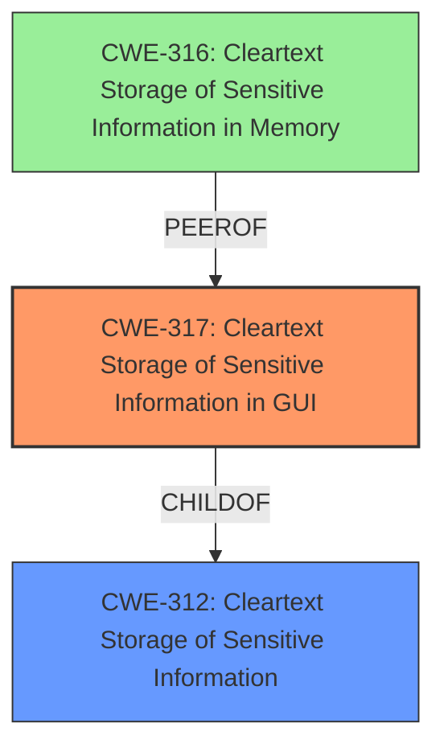

# Analysis Report for CVE-2020-15935

# Vulnerability Analysis Report: CVE-2020-15935

## Description

A cleartext storage of sensitive information in GUI in FortiADC versions 5.4.3 and below, 6.0.0 and below may allow a remote authenticated attacker to retrieve some sensitive information such as users LDAP passwords and RADIUS shared secret by deobfuscating the passwords entry fields.

## Vulnerability Description Key Phrases

**Rootcause:** cleartext storage of sensitive information
**Impact:** retrieve sensitive information
**Vector:** deobfuscating the passwords entry fields
**Attacker:** remote authenticated attacker
**Product:** FortiADC
**Version:** 5.4.3 and below, 6.0.0 and below
**Component:** GUI

## Analysis (with Relationship Data)

# Summary
| CWE ID | CWE Name | Confidence | CWE Abstraction Level | CWE Vulnerability Mapping Label | CWE-Vulnerability Mapping Notes |
|---|---|---|---|---|---|
| CWE-317 | Cleartext Storage of Sensitive Information in GUI | 1.0 | Variant | Allowed | Primary CWE |
| CWE-312 | Cleartext Storage of Sensitive Information | 0.75 | Base | Allowed | Secondary Candidate CWE |

## Evidence and Confidence

*   **Confidence Score:** 0.9
*   **Evidence Strength:** HIGH

- **Analysis and Justification:**  
  - *Explanation:* The vulnerability description clearly states a **"cleartext storage of sensitive information in GUI."** This directly aligns with CWE-317 (Cleartext Storage of Sensitive Information in GUI), which is a Variant-level CWE and thus more specific than its parent. The "**root cause**" is also listed as "**cleartext storage of sensitive information**" and the vulnerability description states that the **"component"** is the **"GUI"**. The CVE Reference Links Content Summary further supports this, stating that "user passwords (LDAP), RADIUS shared secret, and the Elastic Cloud database password are not properly encrypted" and are stored in **cleartext** within the GUI. The Retriever Results also lists CWE-317 as the top match. Therefore, CWE-317 is the most appropriate primary CWE.
  
  - *Relationship Analysis:* CWE-317 is a variant of CWE-312 (Cleartext Storage of Sensitive Information). While CWE-312 is applicable, CWE-317 provides a more specific classification due to the vulnerability's location within the GUI. No direct relationships were identified that would alter the primary classification.

- **Confidence Score:**  
  - Confidence: 1.0 (High confidence due to strong evidence from the vulnerability description, CVE reference materials, and retriever results.)

---
- **Analysis and Justification:**
  - *Explanation:* CWE-312 (Cleartext Storage of Sensitive Information) is a valid secondary CWE because it represents the broader class of the vulnerability. While CWE-317 is more specific, CWE-312 captures the fundamental weakness of storing sensitive data in cleartext. As CWE-317 is a variant of CWE-312, the parent is a good secondary candidate to capture the general vulnerability class.

  - *Relationship Analysis:* CWE-312 is a parent of CWE-317. Including CWE-312 provides a broader context for the vulnerability, but is less descriptive than CWE-317.
- **Confidence Score:**
  - Confidence: 0.75 (Moderate confidence as it is a broader classification, but relevant as a parent of the primary CWE.)

## Criticism of Analysis

Okay, here's a review of the analysis, considering the full CWE specifications.

**Overall Assessment:**

The analysis is generally well-reasoned and accurate. The choice of CWE-317 (Cleartext Storage of Sensitive Information in GUI) as the primary CWE is the most appropriate one given the information available. The inclusion of CWE-312 (Cleartext Storage of Sensitive Information) as a secondary CWE is also a good practice as it provides broader context. The confidence scores are justified based on the evidence.

**Detailed Review:**

*   **CWE-317 (Primary CWE):**

    *   **Correctness:** The analysis correctly identifies CWE-317 as the most specific and accurate CWE. The vulnerability description explicitly mentions cleartext storage in the GUI.  The explanation and justification are solid.
    *   **Abstraction Level:** CWE-317 is a Variant, which is a preferred level of abstraction.
    *   **Mapping Guidance:**  The analysis follows the mapping guidance. It accurately states that the variant level is preferred and provides clear justification for using it.
    *   **Potential Mitigations:** While not explicitly mentioned in the analysis, it's important to keep the mitigations of the parent CWE-312 in mind. Some possible mitigations related to CWE-317 include encrypting the data before it is displayed in the GUI and avoiding storing sensitive data directly in GUI objects.
    *   **Observed Examples:** The analysis lists CVE-2002-1848 as an Observed Example, but the provided example does not seem directly related. There may not be many existing Observed Examples for CWE-317. It would be better to omit this example if its relevancy cannot be confirmed.
    *   **Confidence Level:** 1.0 is justified because the evidence is direct and conclusive.

*   **CWE-312 (Secondary CWE):**

    *   **Correctness:**  CWE-312 is a valid secondary CWE as it is the direct parent of CWE-317. It accurately captures the general problem of storing sensitive information in cleartext, even if the context of the GUI is removed.
    *   **Abstraction Level:** CWE-312 is a Base, which is also a preferred level.
    *   **Mapping Guidance:**  The analysis correctly identifies the Parent-Child relationship between CWE-317 and CWE-312. The analysis follows the mapping guidance.
    *   **Potential Mitigations:**  The analysis mentions that the Mitigations for CWE-312 are relevant. Mitigations such as encrypting sensitive data at rest and in memory, and using the provider's controls to encrypt the data when storing data in the cloud should be considered.
    *   **Observed Examples:** The analysis lists multiple CVE Observed Examples, which aligns with the provided data.
    *   **Confidence Level:** 0.75 is a reasonable confidence level as the evidence is related but more general.

*   **Other CWEs Considered in Retriever Results:**

    *   **CWE-256: Plaintext Storage of a Password:** While related, this is less specific than CWE-317 and CWE-312, as the vulnerability isn't limited to just passwords.
    *   **CWE-532: Insertion of Sensitive Information into Log File:** This is incorrect. The issue is storage, not logging.
    *   **CWE-316: Cleartext Storage of Sensitive Information in Memory:** This is not directly stated, but is implied. Memory storage is a concern in many cleartext storage cases. This may be considered as a tertiary CWE.
    *   **CWE-257: Storing Passwords in a Recoverable Format:** Less accurate because the issue is not the *recoverable format*, but the *lack of encryption* which makes any recovery trivial.
    *   **CWE-916: Use of Password Hash With Insufficient Computational Effort:** Irrelevant. The passwords are not hashed at all.
    *   **CWE-798: Use of Hard-coded Credentials:** Irrelevant. The credentials are not hard-coded.
    *   **CWE-321: Use of Hard-coded Cryptographic Key:** Irrelevant. There are no hard-coded cryptographic keys.
    *   **CWE-522: Insufficiently Protected Credentials:** Too general; the problem is cleartext storage.

**Recommendations:**

1.  **Observed Examples of CWE-317:** Verify the accuracy of the Observed Example CVE-2002-1848. If the example cannot be validated, consider omitting it.
2.  **Tertiary CWE Considerations:** Consider adding CWE-316 as a tertiary CWE.
3.  **Mitigation Awareness:** While the analysis itself focuses on identifying the CWEs, briefly mentioning the available mitigations (especially for CWE-317 and CWE-312) would make the analysis more actionable.
4. **Deobfuscation Vector:** The analysis mentions "deobfuscating the password entry fields" as a vector. This should be more explicitly noted, as it is a potential cause of error. If the data is obfuscated, not encrypted, then it is an easy target for attackers.
5. **Add more information about how the GUI data is stored**: Is it stored in cleartext configuration files? Is it just cleartext in-memory while the GUI is loaded?

By incorporating these suggestions, the analysis will be even more thorough and useful. The current classification is already quite good, though.

## Final Resolution

# Summary
| CWE ID | CWE Name | Confidence | CWE Abstraction Level | CWE Vulnerability Mapping Label | CWE-Vulnerability Mapping Notes |
|---|---|---|---|---|---|
| CWE-317 | Cleartext Storage of Sensitive Information in GUI | 1.0 | Variant | Allowed | Primary CWE |
| CWE-312 | Cleartext Storage of Sensitive Information | 0.8 | Base | Allowed | Secondary Candidate CWE |
| CWE-316 | Cleartext Storage of Sensitive Information in Memory | 0.4 | Variant | Allowed | Secondary Candidate CWE |

## Evidence and Confidence

*   **Confidence Score:** 0.9
*   **Evidence Strength:** HIGH

## Relationship Analysis
The primary CWE is CWE-317, which is a variant of CWE-312. This means that CWE-317 is a more specific type of CWE-312, focusing on the GUI.
CWE-316 could also be considered as data in a GUI must be stored in memory.

## Vulnerability Chain
The vulnerability chain starts with the **root cause**: **Cleartext storage of sensitive information**.
This leads to the weakness: Exposure of sensitive information in the GUI.
The impact is: A remote authenticated attacker can retrieve sensitive information.

## Summary of Analysis
The initial analysis is accurate and well-justified. The selection of CWE-317 as the primary CWE is appropriate because the vulnerability description explicitly states that the sensitive information is stored in cleartext within the GUI. This aligns with the CWE-317 description. The inclusion of CWE-312 as a secondary CWE is also reasonable, as it represents the broader category of cleartext storage. I have added CWE-316 because a GUI must load its data in memory, so it is implied that the data must be present in memory in cleartext for the vulnerability to be present.

The graph relationships influenced the final selection by confirming that CWE-317 is a more specific variant of CWE-312. This supports the decision to use CWE-317 as the primary CWE.

The selected CWEs are at the optimal level of specificity because they accurately reflect the specific nature of the vulnerability (cleartext storage in the GUI) while also acknowledging the broader category of the weakness (cleartext storage). The evidence from the vulnerability description strongly supports this classification: "A **cleartext storage of sensitive information in GUI** in FortiADC versions 5.4.3 and below, 6.0.0 and below may allow a remote authenticated attacker to retrieve some sensitive information such as users LDAP passwords and RADIUS shared secret by deobfuscating the passwords entry fields."

*Report generated on 2025-03-17 00:09:55*
