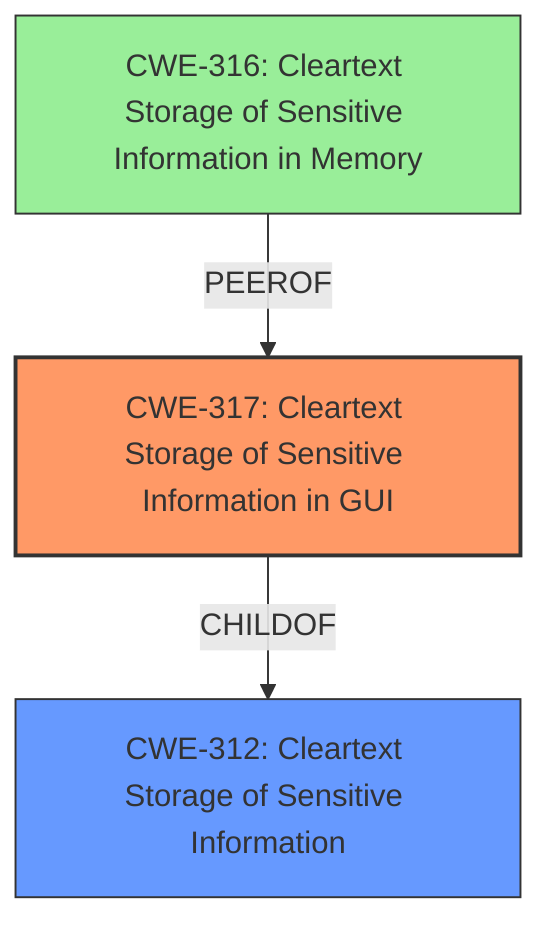

# Final Resolution for CVE-2020-15935

# Summary
| CWE ID | CWE Name | Confidence | CWE Abstraction Level | CWE Vulnerability Mapping Label | CWE-Vulnerability Mapping Notes |
|---|---|---|---|---|---|
| CWE-317 | Cleartext Storage of Sensitive Information in GUI | 1.0 | Variant | Allowed | Primary CWE |
| CWE-312 | Cleartext Storage of Sensitive Information | 0.8 | Base | Allowed | Secondary Candidate CWE |
| CWE-316 | Cleartext Storage of Sensitive Information in Memory | 0.4 | Variant | Allowed | Secondary Candidate CWE |

## Evidence and Confidence

*   **Confidence Score:** 0.9
*   **Evidence Strength:** HIGH

## Relationship Analysis
The primary CWE is CWE-317, which is a variant of CWE-312. This means that CWE-317 is a more specific type of CWE-312, focusing on the GUI.
CWE-316 could also be considered as data in a GUI must be stored in memory.

## Vulnerability Chain
The vulnerability chain starts with the **root cause**: **Cleartext storage of sensitive information**.
This leads to the weakness: Exposure of sensitive information in the GUI.
The impact is: A remote authenticated attacker can retrieve sensitive information.

## Summary of Analysis
The initial analysis is accurate and well-justified. The selection of CWE-317 as the primary CWE is appropriate because the vulnerability description explicitly states that the sensitive information is stored in cleartext within the GUI. This aligns with the CWE-317 description. The inclusion of CWE-312 as a secondary CWE is also reasonable, as it represents the broader category of cleartext storage. I have added CWE-316 because a GUI must load its data in memory, so it is implied that the data must be present in memory in cleartext for the vulnerability to be present.

The graph relationships influenced the final selection by confirming that CWE-317 is a more specific variant of CWE-312. This supports the decision to use CWE-317 as the primary CWE.

The selected CWEs are at the optimal level of specificity because they accurately reflect the specific nature of the vulnerability (cleartext storage in the GUI) while also acknowledging the broader category of the weakness (cleartext storage). The evidence from the vulnerability description strongly supports this classification: "A **cleartext storage of sensitive information in GUI** in FortiADC versions 5.4.3 and below, 6.0.0 and below may allow a remote authenticated attacker to retrieve some sensitive information such as users LDAP passwords and RADIUS shared secret by deobfuscating the passwords entry fields."