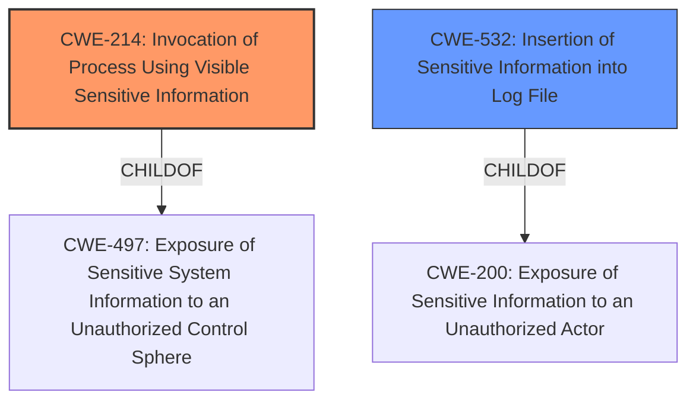

# Final Resolution for CVE-2020-1753

# Summary
| CWE ID | CWE Name | Confidence | CWE Abstraction Level | CWE Vulnerability Mapping Label | CWE-Vulnerability Mapping Notes |
|---|---|---|---|---|---|
| CWE-214 | Invocation of Process Using Visible Sensitive Information | 0.95 | Base | Primary | Allowed |
| CWE-532 | Insertion of Sensitive Information into Log File | 0.85 | Base | Secondary | Allowed |

## Evidence and Confidence

*   **Confidence Score:** 0.95
*   **Evidence Strength:** HIGH

## Relationship Analysis
The primary weakness is **CWE-214** [Invocation of Process Using Visible Sensitive Information], which directly addresses the passing of sensitive parameters via the command line. **CWE-532** [Insertion of Sensitive Information into Log File] is a secondary issue, representing the logging of these exposed parameters. Both are base-level CWEs, offering suitable specificity. **CWE-214** is a child of **CWE-497** [Exposure of Sensitive System Information to an Unauthorized Control Sphere], but **CWE-214** is more specific. **CWE-532** is a child of **CWE-200** [Exposure of Sensitive Information to an Unauthorized Actor], but, again, **CWE-532** offers better specificity.

## Vulnerability Chain
The vulnerability chain starts with the **ROOTCAUSE** of passing sensitive parameters on the command line (**CWE-214**). This leads to the exposure of these parameters in process listings and subsequently to their inclusion in log files (**CWE-532**). The chain highlights a failure to properly protect sensitive data during both process invocation and logging.

## Summary of Analysis
The initial analysis and criticism are well-aligned, and the selection of **CWE-214** [Invocation of Process Using Visible Sensitive Information] and **CWE-532** [Insertion of Sensitive Information into Log File] is appropriate. The evidence from the vulnerability description supports this. The graph relationships confirm that these CWEs are at the right level of specificity, being base-level CWEs that directly address the identified weaknesses. As the original analysis stated: "The vulnerability lies in how Ansible passes sensitive parameters to `kubectl`. Instead of using secure methods like environment variables or input configuration files, it passes passwords and tokens directly on the command line. This makes the sensitive information visible in process listings. This aligns perfectly with **CWE-214** [Invocation of Process Using Visible Sensitive Information]." The additional analysis included in the criticism, "Data (credentials) *are* being sent to `kubectl`, but the *primary issue* is the visibility of that data and its logging, not merely its transmission", reinforces the selection. This confirms that the chosen CWEs are at the optimal level of specificity.