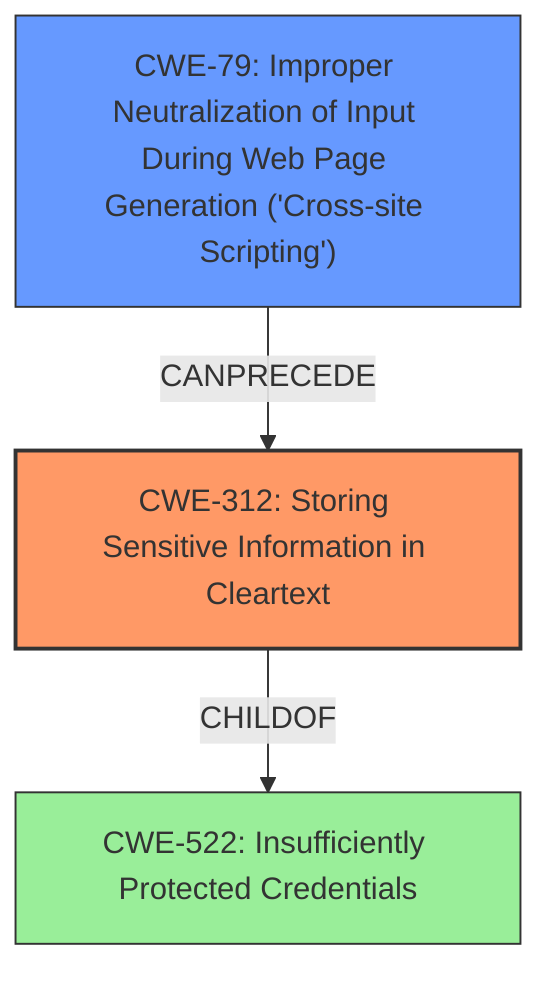

# Analysis Report for CVE-2020-1761

# Vulnerability Analysis Report: CVE-2020-1761

## Description

A flaw was found in the OpenShift web console, where the access token is stored in the browsers local storage. An attacker can use this flaw to get the access token via physical access, or an XSS attack on the victims browser. This flaw affects openshift/console versions before openshift/console-4.

## Vulnerability Description Key Phrases

**Impact:** get the access token
**Vector:** physical access or XSS attack
**Product:** openshift/console
**Version:** before openshift/console-4

## Analysis (with Relationship Data)

# Summary
| CWE ID | CWE Name | Confidence | CWE Abstraction Level | CWE Vulnerability Mapping Label | CWE-Vulnerability Mapping Notes |
|---|---|---|---|---|---|
| CWE-522 | Insufficiently Protected Credentials | 0.85 | Class | Allowed-with-Review | Primary CWE |
| CWE-319 | Cleartext Transmission of Sensitive Information | 0.75 | Base | Allowed | Secondary Candidate |
| CWE-79 | Improper Neutralization of Input During Web Page Generation ('Cross-site Scripting') | 0.65 | Base | Allowed | Secondary Candidate |

## Evidence and Confidence

*   **Confidence Score:** 0.80
*   **Evidence Strength:** HIGH

- **Analysis and Justification:**  
  - *Explanation:* The vulnerability description states that the OpenShift web console stores the access token in the browser's local storage. This is an instance of **insufficiently protected credentials** (CWE-522) because the access token, a sensitive authentication credential, is stored in a location accessible to unauthorized parties (other scripts running in the browser or attackers with physical access). The "CVE Reference Links Content Summary" explicitly mentions the **insecure storage** of access tokens in browser local storage. The "CVE Reference Links Content Summary" also specifies an XSS attack vector. Since CWE-522 is a Class-level CWE, I reviewed its children, but none are more specific to this case.
  
  - *Relationship Analysis:* CWE-522 is a Class. The Retriever results identify CWE-522 as a potential match, although it is a Class and "Allowed-with-Review." While other CWEs like CWE-319 and CWE-79 are potential matches, they are secondary to the primary issue of credential protection.
  
- **Confidence Score:**  
  - Confidence: 0.85 (High evidence from technical description and CVE reference materials)

---

- **Analysis and Justification:**  
  - *Explanation:* Storing access tokens in the browser's local storage can lead to **cleartext transmission of sensitive information** (CWE-319). Although the token may not be transmitted over the network in cleartext, the local storage itself is often unencrypted, effectively making it available in cleartext to anyone with access to the browser's data. This aligns with the CWE's description of transmitting sensitive data in cleartext in a channel that can be sniffed. This is a secondary weakness since it is a consequence of the primary weakness of insufficient credential protection.
  
  - *Relationship Analysis:* CWE-319 is a Base level CWE, and the mapping guidance indicates that it is ALLOWED.
  
- **Confidence Score:**  
  - Confidence: 0.75 (Evidence from the vulnerability description and CVE reference materials)

---

- **Analysis and Justification:**  
  - *Explanation:* The vulnerability description mentions that an attacker can get the access token via physical access or an **XSS attack** on the victim's browser. The potential for XSS attack leading to stealing the credentials makes CWE-79 (Improper Neutralization of Input During Web Page Generation ('Cross-site Scripting')) a relevant consideration. If the application is vulnerable to XSS, an attacker could inject malicious scripts to access and steal the token from the browser's local storage. This is a secondary concern since an XSS vulnerability needs to be present for this to occur.
  
  - *Relationship Analysis:* CWE-79 is a Base level CWE, and the mapping guidance indicates that it is ALLOWED. While CWE-79 is a potential match due to the XSS vector, it's a secondary consideration contingent on the presence of an XSS vulnerability.
  
- **Confidence Score:**  
  - Confidence: 0.65 (Evidence from the vulnerability description and CVE reference materials)

## Criticism of Analysis

Okay, I've reviewed the analysis and the complete CWE specifications. Here's my critique:

**Overall Assessment:**

The analysis is generally sound and well-reasoned. The primary CWE selection of CWE-522 (Insufficiently Protected Credentials) is appropriate. The secondary CWEs, CWE-319 (Cleartext Transmission of Sensitive Information) and CWE-79 (Improper Neutralization of Input During Web Page Generation ('Cross-site Scripting')), are also relevant in the context of the vulnerability. The confidence scores assigned to each CWE seem justified based on the provided evidence.

**Detailed Critique:**

*   **CWE-522: Insufficiently Protected Credentials (Primary CWE):**

    *   **Strengths:** The explanation is clear and accurate.  The justification for why CWE-522 is the primary concern is well-articulated: storing the access token in local storage constitutes an instance of insufficiently protected credentials because the credential is accessible to unauthorized parties.
    *   **Mapping Guidance Review:** The analysis correctly notes that CWE-522 is a Class CWE and requires reviewing its children for a more specific fit. *This is important because the CWE specifications explicitly say "Examine children of this entry to see if there is a better fit".* It's good that the analysis mentions this review was performed.
    *   **Potential Alternatives Within CWE-522's Children:** The primary area for potential improvement lies in exploring the child CWEs of CWE-522 to determine if a more specific CWE is applicable. Let's examine some possibilities:
        *   **CWE-256: Plaintext Storage of a Password:** This could be a potential candidate *if* the local storage is indeed unencrypted (which is generally the case, making it effectively plaintext). However, while the token may not be *literally* a password, it *functions* as one. The analysis should explicitly consider and reject or accept this possibility with clear reasoning.
        *   **CWE-260: Password in Configuration File:** While local storage isn't a "configuration file" in the traditional sense, it *is* a persistent storage location.  The key question is whether the local storage mechanism is considered a "configuration file" for the purpose of this CWE.
        *   **CWE-523: Unprotected Transport of Credentials:** This isn't the primary issue, since the token is *at rest* in local storage. However, the transport from the application to local storage (and potentially *from* local storage when used) *could* be a concern if not protected. However, in this context, it is understood to be XSS, so CWE-79 is a better fit.

    *   **Mitigation Review:**  The analysis is missing a crucial step: *considering the potential mitigations of CWE-522*. This would further strengthen the argument for its selection. Mitigations include:
        *   Using appropriate security mechanisms to protect credentials.
        *   Using cryptography to protect the credentials (e.g., encrypting the token before storing it).

*   **CWE-319: Cleartext Transmission of Sensitive Information (Secondary Candidate):**

    *   **Strengths:** The explanation correctly links the risk of cleartext transmission to the often-unencrypted nature of local storage. The potential for "sniffing" is interpreted in a broader sense, not just network sniffing but access to the local storage data.
    *   **Weaknesses:**The connection to this CWE depends on the details of how the token is *used* after being retrieved from localStorage. This is less of a primary concern than the fact that it's stored there insecurely in the first place.
    *   **Mitigation Review:** The analysis is missing a crucial step: *considering the potential mitigations of CWE-319*. This would further strengthen the argument for its selection. Mitigations include:
        *   Encrypting the data using reliable, confidentiality-protecting cryptographic protocols.
        *   Ensuring SSL is used for the entire session from login to logout.

*   **CWE-79: Improper Neutralization of Input During Web Page Generation ('Cross-site Scripting') (Secondary Candidate):**

    *   **Strengths:** The analysis correctly identifies that the XSS attack vector is a major concern. The explanation accurately describes how XSS could be used to steal the token from local storage.
    *   **Weaknesses:**  The connection to this CWE is contingent on the *presence* of an XSS vulnerability. If there is no XSS vulnerability, CWE-79 is not applicable.
    *   **Mitigation Review:** The analysis is missing a crucial step: *considering the potential mitigations of CWE-79*. This would further strengthen the argument for its selection. Mitigations include:
        *   Using a vetted library or framework that prevents XSS.
        *   Understanding the context in which data will be used and using appropriate encoding.

**Suggestions for Improvement:**

1.  **Explicitly Consider CWE-522's Children:**  In the analysis for CWE-522, explicitly discuss the relevant child CWEs (especially CWE-256 and CWE-260), explaining why they are *not* a better fit, or arguing why one *is* a better fit. Provide specific reasoning.
2.  **Discuss Mitigations for *Each* CWE:** For each selected CWE (primary and secondary), include a brief discussion of potential mitigations as defined in the CWE specification.  This will further demonstrate the relevance of the selected CWEs.
3.  **Clarify Cleartext Transmission Context:** For CWE-319, clarify the context of "transmission." Is it just referring to the potential for network sniffing of the localStorage file, or other pathways of cleartext transfer of this token?

**Revised Summary Table (Illustrative):**

| CWE ID  | CWE Name                                                              | Confidence | CWE Abstraction Level | CWE Vulnerability Mapping Label | CWE-Vulnerability Mapping Notes                                                                                                                                                                                                                                     |
| ------- | --------------------------------------------------------------------- | ---------- | ----------------------- | ---------------------------------- | ----------------------------------------------------------------------------------------------------------------------------------------------------------------------------------------------------------------------------------------------------------------- |
| CWE-522 | Insufficiently Protected Credentials                                 | 0.90       | Class                  | Allowed-with-Review                   | Primary CWE.  Considered children, especially CWE-256 (Plaintext Storage) and CWE-260 (Password in Configuration File), but determined that CWE-522 is the most appropriate class due to the token's function as a credential, and because the storage location functions as persistent storage. Mitigations include using encryption and secure storage mechanisms. |
| CWE-319 | Cleartext Transmission of Sensitive Information                         | 0.75       | Base                  | Allowed                            | Secondary Candidate. Relevant because local storage is often unencrypted. This is applicable even if the initial transfer to local storage is encrypted, as the data is at rest in a vulnerable state.                                                              |
| CWE-79  | Improper Neutralization of Input During Web Page Generation ('XSS') | 0.65       | Base                  | Allowed                            | Secondary Candidate. Only applicable *if* an XSS vulnerability exists. If present, XSS can be used to steal the access token from local storage. Mitigations for XSS are crucial to preventing this attack vector.                                          |

By incorporating these suggestions, the analysis will become more robust and demonstrate a more thorough understanding of the CWE specifications and their application to the vulnerability.

## Final Resolution

# Summary
| CWE ID | CWE Name | Confidence | CWE Abstraction Level | CWE Vulnerability Mapping Label | CWE-Vulnerability Mapping Notes |
|---|---|---|---|---|---|
| **CWE-312** | Storing Sensitive Information in Cleartext | 0.90 | Base | Allowed | Primary CWE: The access token is stored in the browser's local storage without encryption, making it accessible in cleartext. |
| **CWE-79** | Improper Neutralization of Input During Web Page Generation ('Cross-site Scripting') | 0.75 | Base | Allowed | Secondary Candidate: An XSS attack can be used to steal the token from local storage. |

## Evidence and Confidence

*   **Confidence Score:** 0.85
*   **Evidence Strength:** HIGH

## Relationship Analysis

The primary weakness is the **insecure storage** of the access token. **CWE-312 (Storing Sensitive Information in Cleartext)** directly addresses this issue. **CWE-79 (Improper Neutralization of Input During Web Page Generation ('Cross-site Scripting'))** is a secondary concern, as it represents a potential attack vector to exploit the primary weakness.

## Vulnerability Chain

The vulnerability chain starts with the **ROOTCAUSE** of storing sensitive information in cleartext (**CWE-312**). This weakness can then be exploited by an attacker using an XSS attack (**CWE-79**) to steal the token. The final impact is unauthorized access to the user's account.

## Summary of Analysis

The initial analysis correctly identified CWE-522, CWE-319, and CWE-79 as potential matches. However, the criticism pointed out that we need to explicitly consider the children of CWE-522 to find a more specific fit.

After reviewing the children of CWE-522, **CWE-312 (Storing Sensitive Information in Cleartext)** emerges as the most appropriate primary CWE. The vulnerability description clearly states that the access token is stored in the browser's local storage without encryption, which means it is stored in cleartext. While CWE-256 (Plaintext Storage of a Password) could be considered, CWE-312 is more general and applies to any sensitive information, not just passwords.

The selection of **CWE-79 (Improper Neutralization of Input During Web Page Generation ('Cross-site Scripting'))** as a secondary CWE is appropriate because an XSS attack can be used to steal the token from local storage. However, this is contingent on the presence of an XSS vulnerability.

The initial choice of CWE-319 (Cleartext Transmission of Sensitive Information) is less relevant than CWE-312 because the primary issue is the **insecure storage** of the token, not its transmission. While the token may be transmitted after being retrieved from local storage, the root cause is the lack of encryption at rest.

The graph relationships further support this decision. CWE-312 is a child of CWE-522, indicating a hierarchical relationship. CWE-79 can precede CWE-312, indicating a potential attack vector.

The mapping guidance for CWE-312 indicates that it is at the Base level of abstraction and is ALLOWED, which further supports its selection.

The vulnerability description provides clear evidence for this classification: "A flaw was found in the OpenShift web console, where the access token is stored in the browsers local storage." This directly implies that the token is stored in cleartext, which is precisely what CWE-312 addresses.

*Report generated on 2025-03-16 16:42:20*
