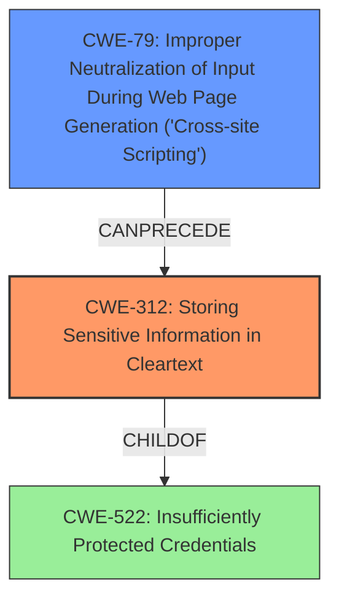

# Final Resolution for CVE-2020-1761

# Summary
| CWE ID | CWE Name | Confidence | CWE Abstraction Level | CWE Vulnerability Mapping Label | CWE-Vulnerability Mapping Notes |
|---|---|---|---|---|---|
| **CWE-312** | Storing Sensitive Information in Cleartext | 0.90 | Base | Allowed | Primary CWE: The access token is stored in the browser's local storage without encryption, making it accessible in cleartext. |
| **CWE-79** | Improper Neutralization of Input During Web Page Generation ('Cross-site Scripting') | 0.75 | Base | Allowed | Secondary Candidate: An XSS attack can be used to steal the token from local storage. |

## Evidence and Confidence

*   **Confidence Score:** 0.85
*   **Evidence Strength:** HIGH

## Relationship Analysis

The primary weakness is the **insecure storage** of the access token. **CWE-312 (Storing Sensitive Information in Cleartext)** directly addresses this issue. **CWE-79 (Improper Neutralization of Input During Web Page Generation ('Cross-site Scripting'))** is a secondary concern, as it represents a potential attack vector to exploit the primary weakness.

## Vulnerability Chain

The vulnerability chain starts with the **ROOTCAUSE** of storing sensitive information in cleartext (**CWE-312**). This weakness can then be exploited by an attacker using an XSS attack (**CWE-79**) to steal the token. The final impact is unauthorized access to the user's account.

## Summary of Analysis

The initial analysis correctly identified CWE-522, CWE-319, and CWE-79 as potential matches. However, the criticism pointed out that we need to explicitly consider the children of CWE-522 to find a more specific fit.

After reviewing the children of CWE-522, **CWE-312 (Storing Sensitive Information in Cleartext)** emerges as the most appropriate primary CWE. The vulnerability description clearly states that the access token is stored in the browser's local storage without encryption, which means it is stored in cleartext. While CWE-256 (Plaintext Storage of a Password) could be considered, CWE-312 is more general and applies to any sensitive information, not just passwords.

The selection of **CWE-79 (Improper Neutralization of Input During Web Page Generation ('Cross-site Scripting'))** as a secondary CWE is appropriate because an XSS attack can be used to steal the token from local storage. However, this is contingent on the presence of an XSS vulnerability.

The initial choice of CWE-319 (Cleartext Transmission of Sensitive Information) is less relevant than CWE-312 because the primary issue is the **insecure storage** of the token, not its transmission. While the token may be transmitted after being retrieved from local storage, the root cause is the lack of encryption at rest.

The graph relationships further support this decision. CWE-312 is a child of CWE-522, indicating a hierarchical relationship. CWE-79 can precede CWE-312, indicating a potential attack vector.

The mapping guidance for CWE-312 indicates that it is at the Base level of abstraction and is ALLOWED, which further supports its selection.

The vulnerability description provides clear evidence for this classification: "A flaw was found in the OpenShift web console, where the access token is stored in the browsers local storage." This directly implies that the token is stored in cleartext, which is precisely what CWE-312 addresses.