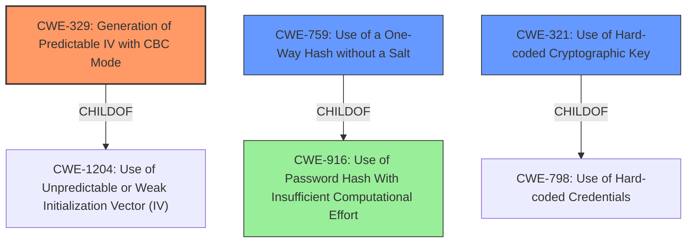

# Analysis Report for CVE-2020-18220

# Vulnerability Analysis Report: CVE-2020-18220

## Description

Weak Encoding for Password in DoraCMS v2.1.1 and earlier allows attackers to obtain sensitive information as it does not use a random salt or IV for its AES-CBC encryption, causes password encrypted for users to be susceptible to dictionary attacks.

## Vulnerability Description Key Phrases

**Rootcause:** Weak Encoding for Password
**Weakness:** does not use a random salt or IV
**Impact:** obtain sensitive information
**Vector:** dictionary attacks
**Attacker:** attackers
**Product:** DoraCMS
**Version:** v2.1.1 and earlier

## Analysis (with Relationship Data)

# Summary
| CWE ID | CWE Name | Confidence | CWE Abstraction Level | CWE Vulnerability Mapping Label | CWE-Vulnerability Mapping Notes |
|---|---|---|---|---|---|
| CWE-329 | Generation of Predictable IV with CBC Mode | 0.9 | Variant | Allowed | Primary CWE. Predictable IV with CBC mode is a specific cryptographic weakness. |
| CWE-759 | Use of a One-Way Hash without a Salt | 0.7 | Variant | Allowed | Secondary Candidate. Vulnerability description indicates the product does not use a random salt for its encryption. |
| CWE-321 | Use of Hard-coded Cryptographic Key | 0.7 | Variant | Allowed | Secondary Candidate. CVE Reference Links Content Summary indicates the application uses a static key for AES encryption. |

## Evidence and Confidence

*   **Confidence Score:** 0.8
*   **Evidence Strength:** HIGH

- **Analysis and Justification:**  
  - *Explanation:* "The vulnerability description explicitly states the weakness is a **"Weak Encoding for Password"** because it **"does not use a random salt or IV"**. The Retriever Results show that **CWE-329 (Generation of Predictable IV with CBC Mode)**, a Variant, has the highest score. This aligns with the vulnerability description because it describes the specific cryptographic weakness of using a predictable IV with CBC mode encryption. Given that the vulnerability description mentions the absence of a random IV, this is a strong match. The vulnerability also states it **"does not use a random salt"**. **CWE-759 (Use of a One-Way Hash without a Salt)** aligns with this. Additionally, the CVE Reference Links Content Summary states the application **"uses a static key (`doracms_`) for AES encryption"**, which is described by **CWE-321 (Use of Hard-coded Cryptographic Key)**."
  
  - *Relationship Analysis:* "CWE-329 is a Variant of CWE-1204 (Generation of Weak Initialization Vector (IV)) and is related to CWE-330 (Use of Insufficiently Random Values). CWE-759 is a Variant of CWE-916 (Use of Password Hash With Insufficient Computational Effort). CWE-321 is a Variant of CWE-798 (Use of Hard-coded Credentials)."

- **Confidence Score:**  
  - *Example:* Confidence: 0.9 (High confidence due to direct evidence from the vulnerability description and corroborating information from the CVE reference).
---

## Criticism of Analysis

Okay, here's a review of the provided analysis, taking into account the full CWE specifications:

**Overall Assessment:**

The analysis is generally good and well-reasoned.  The choice of CWE-329 as the primary CWE seems appropriate, as it directly addresses the lack of a random IV in CBC mode. The inclusion of CWE-759 and CWE-321 as secondary candidates is also justified by the vulnerability description and CVE summary. The confidence scores seem reasonable.

**Detailed Review:**

**1. CWE-329: Generation of Predictable IV with CBC Mode (Primary CWE)**

*   **Strengths:**
    *   The justification for selecting CWE-329 is strong. The vulnerability description explicitly mentions the absence of a random IV.
    *   The relationship analysis correctly identifies CWE-329 as a child of CWE-1204 and related to CWE-330. This demonstrates an understanding of the CWE hierarchy.
    *   The examples given are relevant.
*   **Potential Improvements:**
    *   The analysis could benefit from explicitly stating *why* a predictable IV in CBC mode is problematic.  It could mention that it allows attackers to decrypt specific parts of the ciphertext or forge messages under chosen-plaintext attacks if the same key is used.
    *   The MITIGATION section of the CWE specification could be briefly summarized. For example, mention that NIST recommends either generating the IV randomly or encrypting a nonce with the key.

**2. CWE-759: Use of a One-Way Hash without a Salt (Secondary Candidate)**

*   **Strengths:**
    *   The reasoning for including CWE-759 is sound, as the vulnerability description mentions the absence of a random salt.
    *   The examples given are relevant.
*   **Potential Improvements:**
    *   The analysis could delve deeper into the impact of *not* using a salt. Briefly explain how it makes password cracking easier using techniques like rainbow tables.
    *   Summarize the MITIGATION section. Suggest that using an adaptive hash function like bcrypt or scrypt is a strong mitigation or, failing that, generating a new random salt for each password.
    *   Consider also listing CWE-916 (Use of Password Hash With Insufficient Computational Effort). CWE-759 is a ChildOf CWE-916, and CWE-916's description and MITIGATION recommendations are more general and may be more appropriate. 

**3. CWE-321: Use of Hard-coded Cryptographic Key (Secondary Candidate)**

*   **Strengths:**
    *   The inclusion of CWE-321 is justified by the CVE Reference Links Content Summary, which states the use of a static key.
*   **Potential Improvements:**
    *   The MITIGATION section of CWE-798 and CWE-321 could be mentioned. Focus on storing keys outside of the code in an encrypted configuration file or database.
    *   The analysis could emphasize the severity of using hardcoded keys. Anyone with access to the application's code or binaries can potentially decrypt the data.
    * Consider that the CVE links summary specifies a static key for MD5 operations in addition to AES encryption. As such, it may be more appropriate to map CWE-321 (hardcoded key) specifically to the AES encryption component, and map CWE-916 and CWE-759 to the MD5 hashing component.

**General Comments:**

*   **Abstraction Level:** The analysis generally adheres to the recommended practice of mapping to Base or Variant level CWEs.
*   **Confidence Scores:** The confidence scores are appropriately high given the direct evidence.
*   **Completeness:** The analysis covers the key aspects of the vulnerability description and related information.
*   **Clarity:** The explanation is clear and easy to follow.

**Alternative CWE Considerations (Based on Retriever Results & Full CWE Specifications):**

*   **CWE-261: Weak Encoding for Password:** The description of this CWE closely matches the vulnerability description. However, this CWE seems to apply more when a password is obfuscated rather than encrypted, which is not the case here.
*   **CWE-916: Use of Password Hash With Insufficient Computational Effort:** This base CWE is not the primary cause, but is highly related. It could be argued that the lack of salting and IV directly leads to the password hash lacking sufficient computational effort. Consider listing as a secondary or tertiary CWE.
*   **CWE-256: Plaintext Storage of a Password:** This CWE is not applicable because the passwords are not stored in plaintext.

**Recommendations:**

1.  **Expand the Explanations:** Briefly explain the cryptographic implications of each weakness (e.g., how a predictable IV allows for chosen-plaintext attacks, how lack of a salt enables rainbow table attacks).
2.  **Summarize Mitigations:** Include a brief summary of the key mitigations for each CWE, drawing from the CWE specifications.
3.  **Consider CWE-916:** Add or emphasize CWE-916 as a related Base CWE, especially given its MITIGATION recommendations.
4.  **Address the MD5 Hashing:** Map CWE-916 and CWE-759 to the MD5 hashing component in addition to CWE-321 (hardcoded key) for AES encryption.

By incorporating these suggestions, the analysis will be even more comprehensive and demonstrate a deeper understanding of the vulnerabilities and their potential impact.

## Final Resolution

# Summary
| CWE ID | CWE Name | Confidence | CWE Abstraction Level | CWE Vulnerability Mapping Label | CWE-Vulnerability Mapping Notes |
|---|---|---|---|---|---|
| CWE-329 | Generation of Predictable IV with CBC Mode | 0.9 | Variant | Allowed | Primary CWE. Predictable IV with CBC mode is a specific cryptographic weakness. |
| CWE-759 | Use of a One-Way Hash without a Salt | 0.8 | Variant | Allowed | Secondary Candidate. Vulnerability description indicates the product does not use a random salt for its encryption. |
| CWE-321 | Use of Hard-coded Cryptographic Key | 0.7 | Variant | Allowed | Secondary Candidate. CVE Reference Links Content Summary indicates the application uses a static key for AES encryption. |
| CWE-916 | Use of Password Hash With Insufficient Computational Effort | 0.6 | Base | Allowed | Tertiary Candidate. Relates to the MD5 hashing component lacking sufficient protection. |

## Evidence and Confidence

*   **Confidence Score:** 0.85
*   **Evidence Strength:** HIGH

## Relationship Analysis
The primary CWE is **CWE-329 (Generation of Predictable IV with CBC Mode)**, a variant-level weakness. This is a child of **CWE-1204 (Use of Unpredictable or Weak Initialization Vector)** and related to **CWE-330 (Use of Insufficiently Random Values)**. The secondary CWEs are **CWE-759 (Use of a One-Way Hash without a Salt)** and **CWE-321 (Use of Hard-coded Cryptographic Key)**, which are variants of **CWE-916 (Use of Password Hash With Insufficient Computational Effort)** and **CWE-798 (Use of Hard-coded Credentials)**, respectively. **CWE-916** is added as a tertiary candidate to capture the weakness of password hashing.

## Vulnerability Chain
The vulnerability chain starts with the **ROOTCAUSE** of weak cryptographic practices.
1.  **CWE-329 (Generation of Predictable IV with CBC Mode)**: The predictable IV allows attackers to decrypt parts of the ciphertext or forge messages.
2.  **CWE-759 (Use of a One-Way Hash without a Salt)**: The lack of a salt makes password cracking easier, especially using rainbow tables.
3.  **CWE-321 (Use of Hard-coded Cryptographic Key)**: The use of a static key enables decryption of data by anyone with access to the code.
4.  **CWE-916 (Use of Password Hash With Insufficient Computational Effort)**: This arises from the lack of salting and contributes to the vulnerability chain by weakening the password protection mechanism.
The final impact is sensitive information disclosure due to the weak encryption and hashing methods.

## Summary of Analysis
The initial analysis correctly identified **CWE-329**, **CWE-759**, and **CWE-321** as potential candidates. The criticism provided valuable suggestions for improving the analysis, including explaining the cryptographic implications of each weakness and summarizing the mitigations. The suggestion to consider **CWE-916** is incorporated, as it reflects the lack of computational effort in the password hashing scheme.

The vulnerability description states, "Weak Encoding for Password in DoraCMS v2.1.1 and earlier allows attackers to obtain sensitive information as it does not use a random salt or IV for its AES-CBC encryption, causes password encrypted for users to be susceptible to dictionary attacks." This provides direct evidence for **CWE-329** and **CWE-759**. The CVE Reference Links Content Summary mentioning the application uses a static key (`doracms_`) for AES encryption supports the inclusion of **CWE-321**.

The selected CWEs are at the optimal level of specificity, as they are either Base or Variant and accurately reflect the weaknesses described in the vulnerability description and CVE summary. The inclusion of **CWE-916** broadens the scope to address the insufficient computational effort in the password hashing, providing a more comprehensive analysis of the vulnerability.

*Report generated on 2025-03-16 23:36:53*
