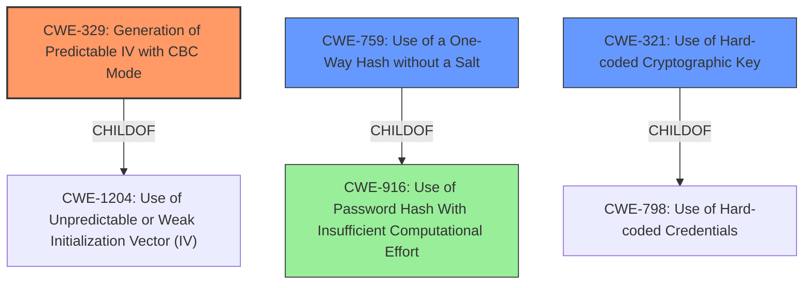

# Final Resolution for CVE-2020-18220

# Summary
| CWE ID | CWE Name | Confidence | CWE Abstraction Level | CWE Vulnerability Mapping Label | CWE-Vulnerability Mapping Notes |
|---|---|---|---|---|---|
| CWE-329 | Generation of Predictable IV with CBC Mode | 0.9 | Variant | Allowed | Primary CWE. Predictable IV with CBC mode is a specific cryptographic weakness. |
| CWE-759 | Use of a One-Way Hash without a Salt | 0.8 | Variant | Allowed | Secondary Candidate. Vulnerability description indicates the product does not use a random salt for its encryption. |
| CWE-321 | Use of Hard-coded Cryptographic Key | 0.7 | Variant | Allowed | Secondary Candidate. CVE Reference Links Content Summary indicates the application uses a static key for AES encryption. |
| CWE-916 | Use of Password Hash With Insufficient Computational Effort | 0.6 | Base | Allowed | Tertiary Candidate. Relates to the MD5 hashing component lacking sufficient protection. |

## Evidence and Confidence

*   **Confidence Score:** 0.85
*   **Evidence Strength:** HIGH

## Relationship Analysis
The primary CWE is **CWE-329 (Generation of Predictable IV with CBC Mode)**, a variant-level weakness. This is a child of **CWE-1204 (Use of Unpredictable or Weak Initialization Vector)** and related to **CWE-330 (Use of Insufficiently Random Values)**. The secondary CWEs are **CWE-759 (Use of a One-Way Hash without a Salt)** and **CWE-321 (Use of Hard-coded Cryptographic Key)**, which are variants of **CWE-916 (Use of Password Hash With Insufficient Computational Effort)** and **CWE-798 (Use of Hard-coded Credentials)**, respectively. **CWE-916** is added as a tertiary candidate to capture the weakness of password hashing.

## Vulnerability Chain
The vulnerability chain starts with the **ROOTCAUSE** of weak cryptographic practices.
1.  **CWE-329 (Generation of Predictable IV with CBC Mode)**: The predictable IV allows attackers to decrypt parts of the ciphertext or forge messages.
2.  **CWE-759 (Use of a One-Way Hash without a Salt)**: The lack of a salt makes password cracking easier, especially using rainbow tables.
3.  **CWE-321 (Use of Hard-coded Cryptographic Key)**: The use of a static key enables decryption of data by anyone with access to the code.
4.  **CWE-916 (Use of Password Hash With Insufficient Computational Effort)**: This arises from the lack of salting and contributes to the vulnerability chain by weakening the password protection mechanism.
The final impact is sensitive information disclosure due to the weak encryption and hashing methods.

## Summary of Analysis
The initial analysis correctly identified **CWE-329**, **CWE-759**, and **CWE-321** as potential candidates. The criticism provided valuable suggestions for improving the analysis, including explaining the cryptographic implications of each weakness and summarizing the mitigations. The suggestion to consider **CWE-916** is incorporated, as it reflects the lack of computational effort in the password hashing scheme.

The vulnerability description states, "Weak Encoding for Password in DoraCMS v2.1.1 and earlier allows attackers to obtain sensitive information as it does not use a random salt or IV for its AES-CBC encryption, causes password encrypted for users to be susceptible to dictionary attacks." This provides direct evidence for **CWE-329** and **CWE-759**. The CVE Reference Links Content Summary mentioning the application uses a static key (`doracms_`) for AES encryption supports the inclusion of **CWE-321**.

The selected CWEs are at the optimal level of specificity, as they are either Base or Variant and accurately reflect the weaknesses described in the vulnerability description and CVE summary. The inclusion of **CWE-916** broadens the scope to address the insufficient computational effort in the password hashing, providing a more comprehensive analysis of the vulnerability.