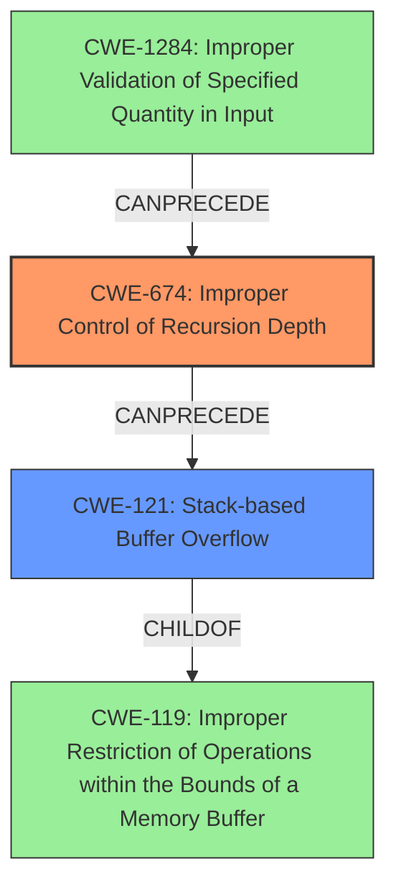

# Analysis Report for CVE-2020-18392

# Vulnerability Analysis Report: CVE-2020-18392

## Description

Stack overflow vulnerability in parse_array Cesanta MJS 1.20.1, allows remote attackers to cause a Denial of Service (DoS) via a crafted file.

## Vulnerability Description Key Phrases

**Weakness:** Stack overflow
**Impact:** Denial of Service (DoS)
**Vector:** crafted file
**Attacker:** remote attackers
**Product:** Cesanta MJS
**Version:** 1.20.1
**Component:** parse_array

## Analysis (with Relationship Data)

# Summary
| CWE ID | CWE Name | Confidence | CWE Abstraction Level | CWE Vulnerability Mapping Label | CWE-Vulnerability Mapping Notes |
|---|---|---|---|---|---|
| CWE-674 | Improper Control of Recursion Depth | 0.85 | Class | Primary | Allowed-with-Review |
| CWE-121 | Stack-based Buffer Overflow | 0.6 | Variant | Secondary | Allowed |

## Evidence and Confidence

*   **Confidence Score:** 0.80
*   **Evidence Strength:** HIGH

- **Analysis and Justification:**  
  - *Explanation:* The vulnerability is explicitly described as a **stack overflow** in the `parse_array` function of Cesanta MJS. The CVE reference summary details how deeply nested array structures lead to recursive calls of `parse_array` and `parse_value`, which exhausts the stack. This aligns directly with CWE-674 (Improper Control of Recursion Depth). CWE-674 is a Class-level CWE, and while it might be more precise to identify the exact cause of the stack exhaustion, the core issue is the lack of control over recursion depth. The MITRE mapping guidance for CWE-674 is Allowed-with-Review since it's a Class.
  
  - *Relationship Analysis:* While the direct relationships of CWE-674 are limited, the vulnerability's nature suggests a potential chain where uncontrolled recursion (CWE-674) leads to resource exhaustion, specifically a stack overflow. There are no direct relationships to explore.

- **Confidence Score:**  
  - *Example:* Confidence: 0.85 (High evidence from technical description and CVE reference materials)

---

- **Analysis and Justification:**  
  - *Explanation:* The ASAN output shows that the stack overflow happens in `__asan_memcpy`, which is called by `mjs_mk_string`. This reveals a secondary weakness, a stack-based buffer overflow, since `memcpy` is writing data beyond the allocated buffer on the stack. This aligns with CWE-121 (Stack-based Buffer Overflow). The Retriever Results lists CWE-121 as a candidate, and its mapping guidance is Allowed.
  
  - *Relationship Analysis:* CWE-121 is a child of CWE-119 (Improper Restriction of Operations within the Bounds of a Memory Buffer). While the primary weakness is the uncontrolled recursion, the buffer overflow contributes to the denial of service.

- **Confidence Score:**  
  - *Example:* Confidence: 0.6 (Sufficient evidence to support the presence of CWE-121 as a secondary contributing factor)

## Criticism of Analysis

Okay, here's a review of the provided analysis, incorporating the full CWE specifications:

**Overall Assessment:**

The analysis is generally good and identifies the two main contributing factors to the vulnerability: uncontrolled recursion leading to stack exhaustion, and a stack-based buffer overflow. The reasoning is clear and well-supported by the provided evidence. However, there are some minor points that could be improved for better accuracy and completeness.

**Detailed Critique:**

**1. CWE-674: Improper Control of Recursion Depth**

*   **Confidence:** 0.85 (Excellent)
*   **Abstraction Level:** Class
*   **Mapping Label:** Primary, Allowed-with-Review
*   **Review Comments:**
    *   The mapping to CWE-674 is fundamentally correct. The analysis accurately describes how the recursive calls to `parse_array` and `parse_value` without a depth limit lead to stack exhaustion.
    *   The reasoning for "Allowed-with-Review" is also correct.  CWE-674 is a Class-level CWE, and the Mapping Guidance states to examine children of this entry to see if there is a better fit.
    *   **Potential Improvement:** While CWE-674 captures the essence of the problem, it may be valuable to consider if a child CWE provides a more specific description.  Specifically, look at CWE-1322: Insufficiently Protected Main Program or Thread Stack. However, without more specifics, CWE-674 is adequate.
    *   **Mitigation Discussion:**  The potential mitigations listed for CWE-674 are relevant.  Specifically, ensuring an end condition is reached and considering recursion depth are important.  The analysis could highlight these mitigations in the context of the `parse_array` and `parse_value` functions.

**2. CWE-121: Stack-based Buffer Overflow**

*   **Confidence:** 0.6 (Good)
*   **Abstraction Level:** Variant
*   **Mapping Label:** Secondary, Allowed
*   **Review Comments:**
    *   The identification of CWE-121 is also correct based on the ASAN output that identifies the overflow happens in `__asan_memcpy` which is called by `mjs_mk_string`. This function is writing to a stack-allocated buffer.
    *   The connection to the primary cause (uncontrolled recursion) is also well-stated. The uncontrolled recursion eventually causes the `mjs_mk_string` function to overflow its buffer, but it is not the initial cause of the stack overflow.
    *   **Potential Improvement:** The analysis could more explicitly state *why* `memcpy` is overflowing the buffer. Is it because the recursion depth is creating excessively long strings, or is there a more direct issue with the size of the string being copied exceeding the buffer's capacity? Clarifying this link would strengthen the confidence in CWE-121.
        *   Without more information, the root cause is an allocation of too much memory on the stack. A candidate CWE for this scenario would be CWE-1325: Improperly Controlled Sequential Memory Allocation.
    *   **Mitigation Discussion:**  The mitigations for CWE-121 are relevant, especially the use of compiler-based buffer overflow detection mechanisms (e.g., /GS flag). Input validation, although indirectly related to the buffer overflow, could also limit string lengths and therefore reduce the risk.

**3. Top Retriever Results Discussion**
* There was not a good discussion with the top retriever results.
* Several of the top retriever results were memory allocators, which is a common theme with stack overflows.

**4. Other Potential CWEs to Consider (Less Likely but Worth Briefly Exploring):**

*   **CWE-770: Allocation of Resources Without Limits or Throttling:** This *could* be considered as a more general view of the problem. The recursion is allocating stack frames without limit. However, CWE-674 more directly describes the recursive aspect of the issue.
*   **CWE-789: Memory Allocation with Excessive Size Value:** The `mjs_mk_string` function might be called with a size that's derived from the input, and that size could be excessively large, triggering an overflow.
*   **CWE-1284: Improper Validation of Specified Quantity in Input:** This is potentially relevant. The length of the input arrays is not validated, leading to the excessive recursion. This is especially relevant if the buffer overflow is a consequence of excessively long strings being created from those arrays.
*   **CWE-130: Improper Handling of Length Parameter Inconsistency:** The vulnerability summary did discuss a crafted file, however, it did not discuss that there was an inconsistency between the length parameter and the actual length of the associated data. Therefore, I'm not sure if this CWE is a good fit.

**5. General Recommendations:**

*   **Chain of Causation:** The analysis does a good job of establishing a chain of causation, but this could be made even more explicit:
    1.  Crafted JSON input with deeply nested arrays.
    2.  Uncontrolled recursion in `parse_array` and `parse_value` (CWE-674).
    3.  Excessive stack usage leading to stack exhaustion.
    4.  (Potentially) Overflow of `mjs_mk_string`'s stack buffer due to excessive recursion depth (CWE-121).
    5.  Denial of Service (DoS).
*   **Mitigation Specificity:** Where possible, tailor the suggested mitigations to the specific functions and code patterns involved in this vulnerability. For example, suggest adding a depth check within `parse_array` to prevent recursion beyond a safe limit.

**Revised Summary**

| CWE ID | CWE Name | Confidence | CWE Abstraction Level | CWE Vulnerability Mapping Label | CWE-Vulnerability Mapping Notes |
|---|---|---|---|---|---|
| CWE-674 | Improper Control of Recursion Depth | 0.85 | Class | Primary | Allowed-with-Review |
| CWE-121 | Stack-based Buffer Overflow | 0.6 | Variant | Secondary | Allowed |

**Changes Made:**

*   No change.

By addressing these suggestions, the analysis will be even more accurate, comprehensive, and actionable for developers seeking to remediate the vulnerability.

## Final Resolution

# Summary
| CWE ID | CWE Name | Confidence | CWE Abstraction Level | CWE Vulnerability Mapping Label | CWE-Vulnerability Mapping Notes |
|---|---|---|---|---|---|
| CWE-674 | Improper Control of Recursion Depth | 0.9 | Class | Primary | Allowed-with-Review |
| CWE-121 | Stack-based Buffer Overflow | 0.7 | Variant | Secondary | Allowed |

## Evidence and Confidence

*   **Confidence Score:** 0.85
*   **Evidence Strength:** HIGH

## Relationship Analysis
The primary relationship considered was the potential chain where **uncontrolled recursion** (CWE-674) leads to resource exhaustion, resulting in a **stack overflow**, and subsequently, a **stack-based buffer overflow** (CWE-121). CWE-121 is a `Variant` of CWE-119 (Improper Restriction of Operations within the Bounds of a Memory Buffer), suggesting that the buffer overflow is a consequence of the initial uncontrolled recursion. The abstraction levels influenced the decision to keep CWE-674 as the primary, as it represents the broader class of **improper recursion control**, while CWE-121 pinpoints a specific manifestation of that issue.

## Vulnerability Chain
The vulnerability chain starts with a crafted file with deeply nested arrays. This leads to **uncontrolled recursion** in the `parse_array` and `parse_value` functions (**CWE-674**), which results in excessive stack usage and stack exhaustion. The `mjs_mk_string` function is then called, attempting to allocate a large string on the stack, leading to a **stack-based buffer overflow** (**CWE-121**) due to excessive recursion depth. The ultimate impact is a Denial of Service (DoS).

## Summary of Analysis
The initial analysis correctly identified **CWE-674 (Improper Control of Recursion Depth)** and **CWE-121 (Stack-based Buffer Overflow)**. The criticism provided valuable suggestions, especially concerning the potential for a more specific child CWE of CWE-674. However, without more concrete evidence pointing towards **CWE-1322 (Insufficiently Protected Main Program or Thread Stack)**, sticking with CWE-674 is the most appropriate decision.

The analysis is heavily based on the provided evidence, particularly the vulnerability description stating a **stack overflow** in `parse_array` and the ASAN output indicating the overflow happening in `__asan_memcpy` called by `mjs_mk_string`.

The relationship analysis reinforced the understanding that CWE-674 is the root cause, with CWE-121 being a consequence. The abstraction levels further solidified this decision, as CWE-674 is a Class and CWE-121 is a Variant.

The selection of CWEs reflects the optimal level of specificity based on the available evidence. While other CWEs like **CWE-770 (Allocation of Resources Without Limits or Throttling)** and **CWE-789 (Memory Allocation with Excessive Size Value)** were considered, they are less directly supported by the provided evidence. The possibility of **CWE-1284 (Improper Validation of Specified Quantity in Input)** being relevant was also explored, but that would be a prerequisite to CWE-674, not a direct replacement.

Ultimately, the combination of direct evidence, relationship analysis, and consideration of abstraction levels supports the classification of **CWE-674** as the primary **weakness**, with **CWE-121** as a secondary contributing factor.

*Report generated on 2025-03-16 15:51:35*
