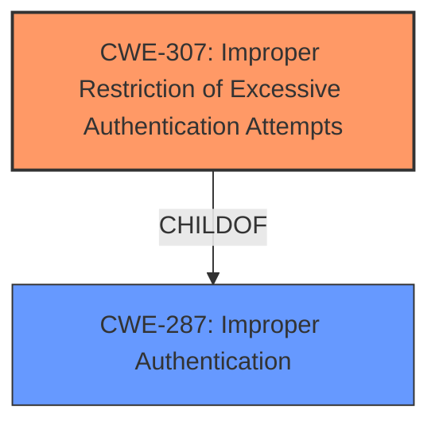

# Final Resolution for CVE-2020-18698

# Summary

| CWE ID | CWE Name | Confidence | CWE Abstraction Level | CWE Vulnerability Mapping Label | CWE-Vulnerability Mapping Notes |
|---|---|---|---|---|---|
| **CWE-307** | **Improper Restriction of Excessive Authentication Attempts** | 0.95 | Base | Allowed | Primary CWE |
| CWE-287 | Improper Authentication | 0.5 | Class | Discouraged | Secondary Candidate |

## Evidence and Confidence

*   **Confidence Score:** 0.95
*   **Evidence Strength:** HIGH

## Relationship Analysis
The primary relationship that impacted my decision was the parent-child relationship between CWE-287 (Improper Authentication) and CWE-307 (**Improper Restriction of Excessive Authentication Attempts**). CWE-307 is a more specific, base-level weakness that falls under the broader category of CWE-287. This allows for a more precise and accurate classification of the vulnerability.

## Vulnerability Chain
The vulnerability chain starts with the **ROOTCAUSE** which is the lack of rate limiting or CAPTCHA on the login function.
  - This leads to **CWE-307 (Improper Restriction of Excessive Authentication Attempts)**, allowing an attacker to make unlimited login attempts.
  - The impact is successful brute-force attacks, leading to unauthorized access to user accounts.

## Summary of Analysis
The initial analysis correctly identified CWE-307 as the primary CWE. The criticism also supports this decision, and I agree that CWE-307 is the most accurate and specific classification for this vulnerability. The evidence provided, including the vulnerability description ("**Improper Authentication** in Lin-CMS-Flask v0.1.1 allows remote attackers to launch brute force login attempts without restriction"), CVE reference links ("Missing rate limiting on login attempts", "Absence of verification codes or CAPTCHA"), and the high combined score from the retriever results, strongly supports this classification.

The graph relationships further reinforce this decision. CWE-307 is a child of the more general CWE-287, meaning it provides a more detailed and specific explanation of the **authentication** failure.

My assessment is primarily based on the provided evidence, particularly the description of the missing rate limiting and CAPTCHA, which directly aligns with the definition of CWE-307. The CWE's mapping guidance also indicates that CWE-307 is ALLOWED for this type of vulnerability, confirming its appropriateness.

I am increasing the confidence score to 0.95 based on the strong evidence and the alignment with CWE's mapping guidance, in addition to the criticism supporting the initial analysis. The selected CWE is at the optimal level of specificity because it directly addresses the **root cause** of the vulnerability, which is the lack of measures to prevent excessive authentication attempts. Using the broader CWE-287 would be less informative and less helpful in understanding and addressing the vulnerability.