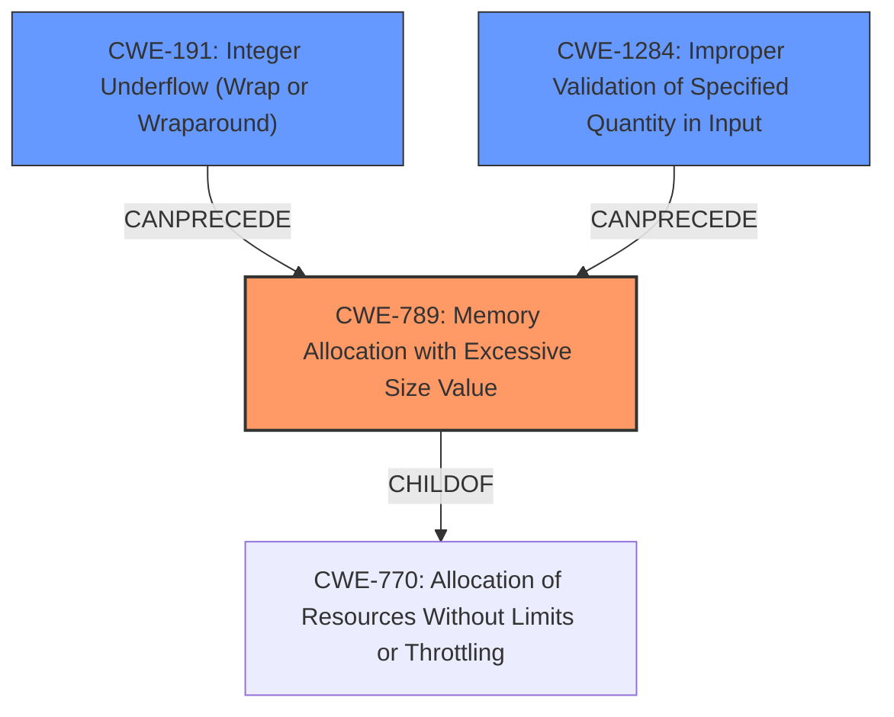

# Final Resolution for CVE-2020-18899

# Summary
| CWE ID | CWE Name | Confidence | CWE Abstraction Level | CWE Vulnerability Mapping Label | CWE-Vulnerability Mapping Notes |
|---|---|---|---|---|---|
| **CWE-789** | **Memory Allocation with Excessive Size Value** | 0.95 | Variant | Allowed | The product allocates memory based on an untrusted, large size value, but it does not ensure that the size is within expected limits, allowing arbitrary amounts of memory to be allocated. Lacks input validation and resource limits. |
| **CWE-191** | **Integer Underflow (Wrap or Wraparound)** | 0.80 | Base | Allowed | The product subtracts one value from another, such that the result is less than the minimum allowable integer value, which produces a value that is not equal to the correct result. Lacks safe integer handling. |
| CWE-1284 | Improper Validation of Specified Quantity in Input | 0.60 | Base | Allowed | The product receives input that is expected to specify a quantity (such as size or length), but it does not validate or incorrectly validates that the quantity has the required properties. |

## Evidence and Confidence

*   **Confidence Score:** 0.90
*   **Evidence Strength:** HIGH

## Relationship Analysis
The primary **WEAKNESS** is **CWE-789 (Memory Allocation with Excessive Size Value)** because the vulnerability ultimately manifests as an attempt to allocate an extremely large amount of memory. **CWE-191 (Integer Underflow)** can precede **CWE-789**, as an integer underflow leads to the excessive size value. **CWE-1284 (Improper Validation of Specified Quantity in Input)** can also precede **CWE-789**, because the input is not validated before allocation. **CWE-789** is a child of **CWE-770 (Allocation of Resources Without Limits or Throttling)**, but **CWE-789** is more specific since the size of the allocation is the core issue.

## Vulnerability Chain
The chain starts with a crafted input containing a large `subBox.length` value. If `subBox.length` is smaller than `sizeof(box)`, an **integer underflow (CWE-191)** occurs during the subtraction operation `subBox.length - sizeof(box)`. This results in a very large, effectively uncontrolled, size value. Because the size is not validated **(CWE-1284)**, this large value is then used in a memory allocation request, leading to **CWE-789 (Memory Allocation with Excessive Size Value)**. The attempted allocation of this excessive amount of memory results in a denial-of-service (DoS) due to memory exhaustion. The **ROOTCAUSE** is the integer underflow and the lack of input validation; the impact is a DoS.

## Summary of Analysis
The initial analysis correctly identified **CWE-789** as the primary **WEAKNESS** due to the excessive memory allocation. The criticism suggested strengthening the analysis by explicitly mentioning the missing mitigations for **CWE-789**, such as input validation and resource limits. The criticism also correctly pointed out that an integer underflow is possible, so **CWE-191** should be considered.
The vulnerability description clearly states, "An uncontrolled memory allocation in DataBufdata(subBox.length-sizeof(box)) function of Exiv2 0.27 allows attackers to cause a denial of service (DOS) via a crafted input." This directly aligns with the **CWE-789** description: "The product allocates memory based on an untrusted, large size value, but it does not ensure that the size is within expected limits, allowing arbitrary amounts of memory to be allocated."
The retriever results, relationship analysis, and criticism support the conclusion that **CWE-789** is the most appropriate primary classification at the Variant level of abstraction. The addition of **CWE-191** is appropriate because it can cause the large size value, and the addition of **CWE-1284** is appropriate because the size value is not validated before the allocation.
The selected CWEs are at the optimal level of specificity because they accurately represent the **ROOTCAUSE** and manifestation of the vulnerability. **CWE-789** describes the excessive memory allocation, **CWE-191** describes the integer underflow that leads to the large size, and **CWE-1284** describes the lack of input validation.