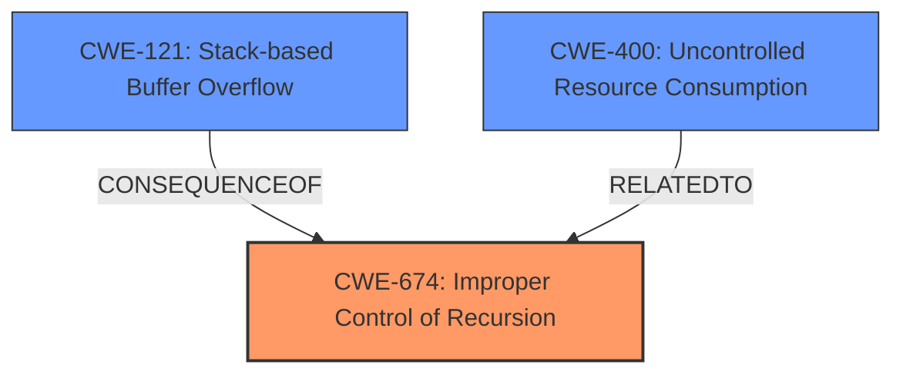

# Final Resolution for CVE-2020-19463

# Summary
| CWE ID | CWE Name | Confidence | CWE Abstraction Level | CWE Vulnerability Mapping Label | CWE-Vulnerability Mapping Notes |
|---|---|---|---|---|---|
| CWE-674 | Improper Control of Recursion | 0.95 | Class | Primary | Allowed-with-Review |
| CWE-121 | Stack-based Buffer Overflow | 0.6 | Base | Secondary Candidate | Allowed |

## Evidence and Confidence

*   **Confidence Score:** 0.95
*   **Evidence Strength:** HIGH

## Relationship Analysis
The primary weakness is **CWE-674 (Improper Control of Recursion)**, which is a Class-level CWE. While it doesn't have direct parent-child relationships that immediately clarify specificity, its connection to resource exhaustion, particularly the stack, is crucial. The criticism correctly points out the need to explicitly discard **CWE-121 (Stack-based Buffer Overflow)** as the primary weakness, because while a stack overflow does occur, it is a symptom. The root cause is uncontrolled recursion. **CWE-674** lacks explicit relationships to buffer overflows in the graph, but the vulnerability description, along with the valgrind output, strongly suggests that the uncontrolled recursion leads to the consumption of stack memory, ultimately causing a stack overflow. Addressing **CWE-674** would inherently mitigate the risk of a stack overflow in this context.

## Vulnerability Chain
The vulnerability chain starts with the **ROOTCAUSE**, which is the **CWE-674 (Improper Control of Recursion)**. This leads to excessive consumption of stack memory. The consequence of this is a **stack overflow**, which can be classified as **CWE-121 (Stack-based Buffer Overflow)**. The ultimate impact is a Denial of Service (DoS) as the application crashes due to the stack overflow.

## Summary of Analysis
The initial analysis correctly identified **CWE-674 (Improper Control of Recursion)** as the primary **WEAKNESS** based on the vulnerability description stating a "stack overflow" due to excessive recursion. The criticism highlighted the importance of explicitly addressing why other CWEs, particularly **CWE-121 (Stack-based Buffer Overflow)**, are not the primary **WEAKNESS**.

Based on the evidence, relationship analysis, and mapping guidance, the decision to classify this vulnerability as primarily **CWE-674 (Improper Control of Recursion)** is well-justified. The valgrind output confirms the stack overflow, but the root cause, as explicitly stated in the vulnerability description, is the uncontrolled recursion. While **CWE-121 (Stack-based Buffer Overflow)** accurately describes the symptom, **CWE-674 (Improper Control of Recursion)** represents the underlying cause. Therefore, **CWE-674** is at the optimal level of specificity.

I have updated the assessment to explicitly discard **CWE-121 (Stack-based Buffer Overflow)** as the primary **WEAKNESS**, emphasizing that it's a symptom of the root cause (uncontrolled recursion), making **CWE-674** a more accurate representation.

I have added **CWE-121** as a secondary candidate CWE, to show that a stack overflow condition does occur.