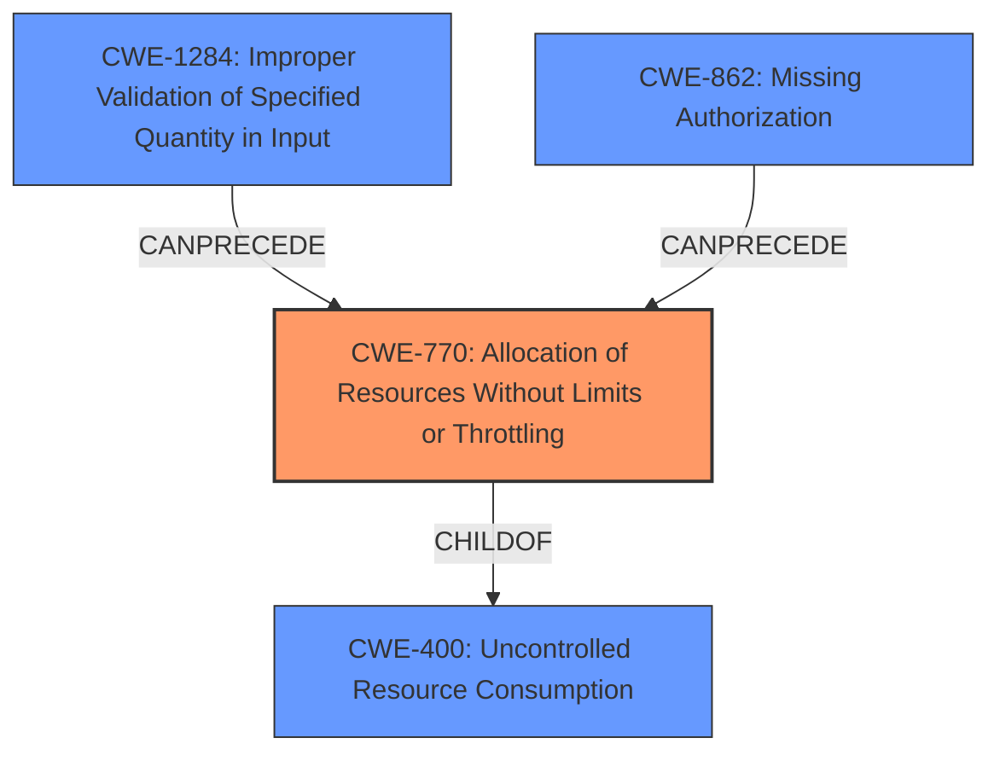

# Final Resolution for CVE-2020-22785

# Summary
| CWE ID | CWE Name | Confidence | CWE Abstraction Level | CWE Vulnerability Mapping Label | CWE-Vulnerability Mapping Notes |
|---|---|---|---|---|---|
| CWE-770 | Allocation of Resources Without Limits or Throttling | 0.90 | Base | Allowed | Primary CWE |
| CWE-1284 | Improper Validation of Specified Quantity in Input | 0.80 | Base | Allowed | Secondary Candidate |
| CWE-862 | Missing Authorization | 0.70 | Class | Allowed-with-Review | Secondary Candidate |
| CWE-400 | Uncontrolled Resource Consumption | 0.65 | Class | Discouraged | Secondary Candidate |

## Evidence and Confidence

*   **Confidence Score:** 0.85
*   **Evidence Strength:** HIGH

## Relationship Analysis
The primary **WEAKNESS** is **CWE-770 [Allocation of Resources Without Limits or Throttling]**, which is a base-level CWE and a child of **CWE-400 [Uncontrolled Resource Consumption]**. This parent-child relationship helped refine the classification to a more specific weakness. **CWE-1284 [Improper Validation of Specified Quantity in Input]** is a related **ROOTCAUSE** because the lack of validation on input size contributes to the resource exhaustion. **CWE-862 [Missing Authorization]** contributes to the problem by allowing unauthorized users to trigger the resource allocation.

## Vulnerability Chain
The vulnerability chain starts with **CWE-1284 [Improper Validation of Specified Quantity in Input]** and **CWE-862 [Missing Authorization]**. The lack of input validation on the file size and missing authorization checks allow attackers to send a large number of requests to import/export pads, leading to **CWE-770 [Allocation of Resources Without Limits or Throttling]**. Finally, this results in **CWE-400 [Uncontrolled Resource Consumption]** and a denial-of-service (DoS) condition.

## Summary of Analysis
The initial analysis correctly identified **CWE-770 [Allocation of Resources Without Limits or Throttling]** as the primary **WEAKNESS**, as it directly relates to the lack of resource limits in the import/export functionality. The criticism highlighted the importance of considering the maximum file size limit, which aligns with **CWE-1284 [Improper Validation of Specified Quantity in Input]**. The criticism also pointed to the possibility of **CWE-862 [Missing Authorization]** to perform import actions on pads a user is not an author on.

The vulnerability description states: "Aggressively targeting random pad import endpoints with empty data would flatten all pads due to lack of rate limiting and missing ownership check." This statement supports both the resource exhaustion due to lack of rate limiting (**CWE-770**) and the **missing ownership check**, which maps to authorization issues (**CWE-862**). The additional context regarding the missing maximum file size limit strongly supports including **CWE-1284**.

The graph relationships influenced the final selection by highlighting the parent-child relationship between **CWE-770** and **CWE-400**, confirming that **CWE-770** provides a more specific classification. The relationships between **CWE-1284**, **CWE-862**, and **CWE-770** helped establish the vulnerability chain.

The selected CWEs are at the optimal level of specificity because they directly address the root causes and contributing factors to the vulnerability. **CWE-770** captures the core issue of unlimited resource allocation, **CWE-1284** highlights the lack of input validation on file size, and **CWE-862** focuses on the missing authorization check. While **CWE-400** is relevant, it is less specific than **CWE-770** and serves as a broader categorization of the impact.