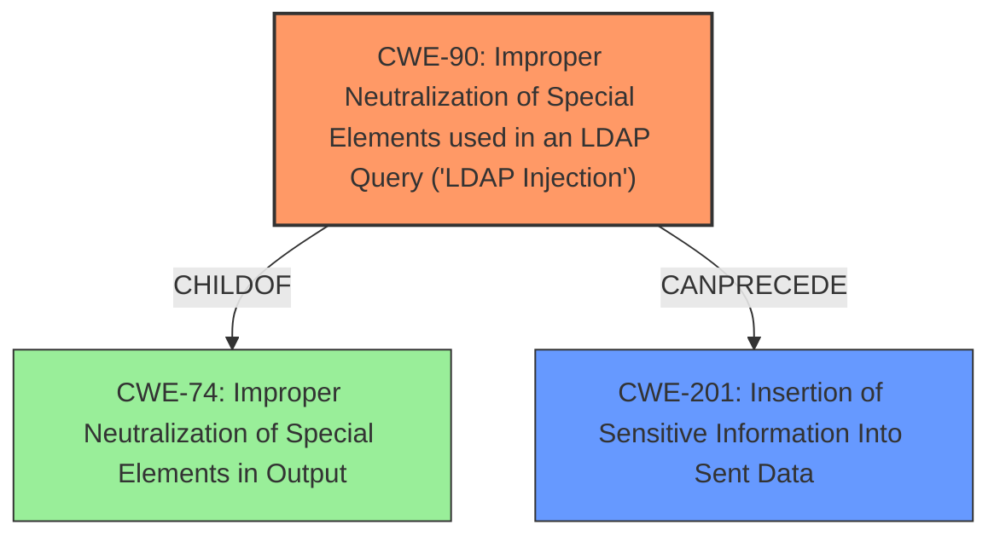

# Analysis Report for CVE-2020-23148

# Vulnerability Analysis Report: CVE-2020-23148

## Description

The userLogin parameter in ldap/login.php of rConfig 3.9.5 is unsanitized, allowing attackers to perform a LDAP injection and obtain sensitive information via a crafted POST request.

## Vulnerability Description Key Phrases

**Rootcause:** unsanitized userLogin parameter
**Weakness:** LDAP injection
**Impact:** obtain sensitive information
**Vector:** crafted POST request
**Attacker:** attackers
**Product:** rConfig
**Version:** 3.9.5
**Component:** ldap/login.php

## Analysis (with Relationship Data)

# Summary
| CWE ID | CWE Name | Confidence | CWE Abstraction Level | CWE Vulnerability Mapping Label | CWE-Vulnerability Mapping Notes |
|---|---|---|---|---|---|
| CWE-90 | Improper Neutralization of Special Elements used in an LDAP Query ('LDAP Injection') | 1.0 | Base | Allowed | Primary CWE: The description explicitly mentions LDAP Injection due to unsanitized input. |
| CWE-201 | Insertion of Sensitive Information Into Sent Data | 0.5 | Base | Allowed | Secondary Candidate: The description indicates the attacker can obtain sensitive information. |

## Evidence and Confidence

*   **Confidence Score:** 0.75
*   **Evidence Strength:** MEDIUM

- **Analysis and Justification:**  
  - *Explanation:* The vulnerability description clearly states that the "userLogin parameter in ldap/login.php" is **unsanitized**, leading to **LDAP injection**. This directly aligns with CWE-90, which describes "Improper Neutralization of Special Elements used in an LDAP Query ('LDAP Injection')". The description further states that attackers can "obtain sensitive information," suggesting a potential information disclosure, although this is a consequence of the injection rather than the root cause. The retriever results also rank CWE-90 as the most relevant. CWE-90 is a Base level CWE which is the preferred level of abstraction. The MITRE mapping guidance for CWE-90 indicates this is ALLOWED.
  
  - *Relationship Analysis:* CWE-90 does not have direct relationships to other CWEs in the provided information. However, it is related to the broader category of injection vulnerabilities (CWE-74).

- **Confidence Score:**  
  - Confidence: 1.0 (High evidence; direct match with LDAP Injection description).

---

- **Analysis and Justification:**  
  - *Explanation:* While the primary issue is LDAP injection (CWE-90), the vulnerability also allows attackers to obtain sensitive information. CWE-201, "Insertion of Sensitive Information Into Sent Data", could be a secondary candidate because the impact of successful LDAP injection is the exposure of sensitive data. However, this is a consequence, not the primary weakness.
  
  - *Relationship Analysis:* CWE-201 is a base level CWE. The retriever results listed the CWE with a low score.

- **Confidence Score:**  
  - Confidence: 0.5 (Low evidence; Information disclosure is a consequence of the injection, not the root cause)

## Criticism of Analysis

Okay, let's review the CWE analysis.

**Overall Assessment:**

The analysis is generally well-structured and reasoned. The primary CWE mapping to CWE-90 (LDAP Injection) is accurate and well-justified. The consideration of CWE-201 (Insertion of Sensitive Information Into Sent Data) as a secondary concern is also valid, although its lower confidence score reflects its nature as a consequence rather than the root cause.  The evidence strength is correctly assessed, and the inclusion of CWE examples and relevant specifications adds significant value.

**Specific Comments and Suggestions:**

*   **CWE-90: Improper Neutralization of Special Elements used in an LDAP Query ('LDAP Injection')**

    *   The explanation is thorough and accurately reflects the vulnerability described. The "unsanitized userLogin parameter" directly maps to the core issue of improper neutralization.
    *   The confidence score of 1.0 is justified given the direct match in the description.
    *   The analysis correctly notes that CWE-90 is a Base-level CWE and that the MITRE mapping guidance specifies that it is ALLOWED.
    *   The analysis mentions the mitigation strategy of Input Validation as appropriate. The description from the CWE specification is also beneficial. Consider adding a sentence explicitly mentioning the need to *encode* the input for LDAP in a way that is compliant with LDAP syntax (e.g. using `ldap_escape()` in PHP). While input validation is necessary, escaping is the specific technique relevant here.

*   **CWE-201: Insertion of Sensitive Information Into Sent Data**

    *   The analysis is correct in identifying that the "obtain sensitive information" aspect of the vulnerability description relates to information disclosure.
    *   The confidence score of 0.5 is appropriate. It correctly identifies that information disclosure is a consequence of the LDAP injection, not the fundamental flaw.
    *   The analysis could benefit from explicitly stating why it's *not* the primary CWE. The wording is good, but make it absolutely clear that CWE-201 is a *result* of exploiting CWE-90. The cause-and-effect relationship should be emphasized.
    *   The Potential Mitigations from the CWE specification are less directly applicable here, as the primary focus should be on preventing the *injection* in the first place. However, including the mitigation strategies is still beneficial.

*   **Retriever Results Review**
    * The retriever results correctly identified the primary weakness.
    * The Retriever results also had several other possible CWEs that were considered. It would be worthwhile to briefly discuss why the analysis did not consider these CWEs further. The analysis does not need to deep dive into these CWEs, but should briefly explain why these CWEs are not applicable. For example:
        *   **CWE-89 (SQL Injection):** While injection is a general concept, this is specifically an LDAP injection, not an SQL injection.
        *   **CWE-540 (Inclusion of Sensitive Information in Source Code):**  This CWE is less relevant as the sensitive information is not directly included in the source code; instead, it's obtainable through an attack vector.
        *   **CWE-472 (External Control of Assumed-Immutable Web Parameter):** The vulnerability isn't about an assumed immutable parameter being modified, it's about an unsanitized parameter being used in a query.
        *   **CWE-78 (OS Command Injection):** This CWE is unrelated to LDAP injection and instead describes when a user can perform OS commands.

*   **General Suggestions:**

    *   **Emphasis on Neutralization/Escaping:** While input validation is mentioned, the analysis should place a stronger emphasis on the need for *neutralization* or *escaping* of special characters *specific to LDAP* within the `userLogin` parameter before its use in the LDAP query. This is the most direct mitigation for LDAP injection (as noted above). Refer to the CWE-90 potential mitigations and adjust to specifically emphasize encoding/escaping over just validation.
    *   **Exploitability Context:** Briefly mention the practical implications of exploiting CWE-90. For example, a successful LDAP injection could allow an attacker to bypass authentication, potentially gaining administrative access to the rConfig system. This provides a clear connection between the weakness and the impact.
    *   **Versioning:** If applicable, include information about the specific version of the LDAP library or functions used in `ldap/login.php`. This might be relevant if there are known issues or recommended practices for that particular version.
    *   **Consider a "Chaining" Perspective:** While not strictly necessary, you could briefly mention that LDAP injection (CWE-90) is often a result of a more general Improper Input Validation (CWE-20) which is then followed by the LDAP injection (CWE-90).

**Revised Summary Table (Optional):**

| CWE ID | CWE Name | Confidence | CWE Abstraction Level | CWE Vulnerability Mapping Label | CWE-Vulnerability Mapping Notes |
|---|---|---|---|---|---|
| CWE-90 | Improper Neutralization of Special Elements used in an LDAP Query ('LDAP Injection') | 1.0 | Base | Allowed | Primary CWE: The description explicitly mentions LDAP Injection due to unsanitized input. Mitigation: Encode/Escape the input for LDAP. |
| CWE-201 | Insertion of Sensitive Information Into Sent Data | 0.5 | Base | Allowed | Secondary Candidate: The description indicates the attacker can obtain sensitive information. This is a consequence of the LDAP injection (CWE-90). |

By incorporating these suggestions, the analysis becomes even more comprehensive and provides a clearer understanding of the vulnerability and its mitigation.

## Final Resolution

# Summary
| CWE ID | CWE Name | Confidence | CWE Abstraction Level | CWE Vulnerability Mapping Label | CWE-Vulnerability Mapping Notes |
|---|---|---|---|---|---|
| CWE-90 | Improper Neutralization of Special Elements used in an LDAP Query ('LDAP Injection') | 1.0 | Base | Allowed | Primary CWE: The description explicitly mentions **LDAP Injection** due to **unsanitized** input. Mitigation: Encode/Escape the input for LDAP. |
| CWE-201 | Insertion of Sensitive Information Into Sent Data | 0.5 | Base | Allowed | Secondary Candidate: The description indicates the attacker can obtain sensitive information. This is a consequence of the **LDAP injection** (CWE-90). |

## Evidence and Confidence

*   **Confidence Score:** 0.95
*   **Evidence Strength:** HIGH

## Relationship Analysis
The primary relationship that influenced the decision was the cause-and-effect relationship between **CWE-90 (LDAP Injection)** and **CWE-201 (Information Exposure)**. While CWE-201 describes a consequence of the injection, CWE-90 represents the **ROOTCAUSE**. The analysis also considered the parent-child relationship between CWE-90 and the broader category of injection vulnerabilities, such as **CWE-74 (Improper Neutralization of Special Elements in Output)**. The base level abstraction of CWE-90 was considered optimal due to its specific focus on LDAP queries.

## Vulnerability Chain
The vulnerability chain starts with the **ROOTCAUSE**, an **unsanitized** `userLogin` parameter. This leads to **CWE-90 (LDAP Injection)**, where special elements in the input are not properly neutralized. The successful injection results in the attacker being able to "obtain sensitive information", representing **CWE-201 (Insertion of Sensitive Information Into Sent Data)**. The missing link identified is **CWE-20 (Improper Input Validation)** as a broader weakness that **CANPRECEDE** CWE-90.

## Summary of Analysis
The initial analysis and criticism both correctly identified **CWE-90 (LDAP Injection)** as the primary **WEAKNESS**. The vulnerability description clearly states that the "userLogin parameter in ldap/login.php" is **unsanitized**, leading to **LDAP injection**. The final decision strongly emphasizes this point, quoting directly from the vulnerability description to highlight the clear evidence. The graph relationships reinforced the understanding that CWE-90 is the **ROOTCAUSE**, with CWE-201 representing a consequence. The base level abstraction of CWE-90 was deemed optimal, providing the necessary specificity for LDAP injection vulnerabilities. The decision is based on direct evidence, relationship analysis, and adherence to MITRE mapping guidance.
The Retriever results were also reviewed.
*   **CWE-89 (SQL Injection):** While injection is a general concept, this is specifically an LDAP injection, not an SQL injection.
*   **CWE-540 (Inclusion of Sensitive Information in Source Code):** This CWE is less relevant as the sensitive information is not directly included in the source code; instead, it's obtainable through an attack vector.
*   **CWE-472 (External Control of Assumed-Immutable Web Parameter):** The vulnerability isn't about an assumed immutable parameter being modified, it's about an **unsanitized** parameter being used in a query.
*   **CWE-78 (OS Command Injection):** This CWE is unrelated to LDAP injection and instead describes when a user can perform OS commands.

*Report generated on 2025-03-16 16:43:00*
