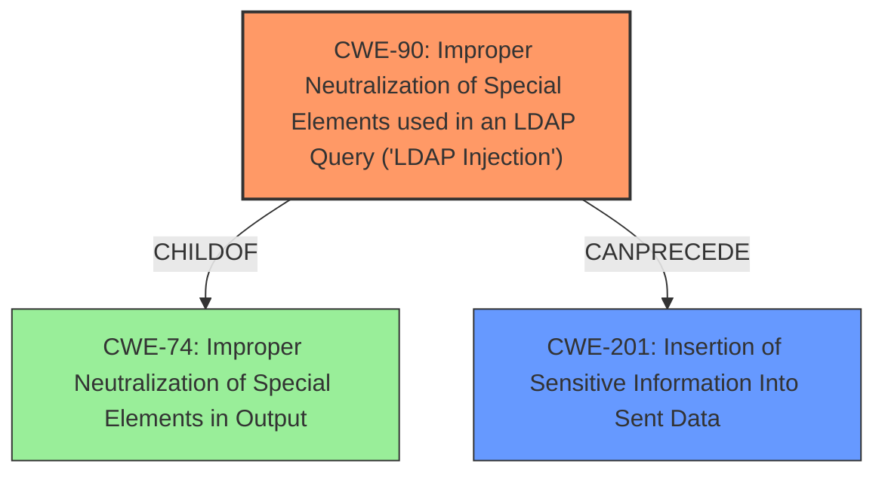

# Final Resolution for CVE-2020-23148

# Summary
| CWE ID | CWE Name | Confidence | CWE Abstraction Level | CWE Vulnerability Mapping Label | CWE-Vulnerability Mapping Notes |
|---|---|---|---|---|---|
| CWE-90 | Improper Neutralization of Special Elements used in an LDAP Query ('LDAP Injection') | 1.0 | Base | Allowed | Primary CWE: The description explicitly mentions **LDAP Injection** due to **unsanitized** input. Mitigation: Encode/Escape the input for LDAP. |
| CWE-201 | Insertion of Sensitive Information Into Sent Data | 0.5 | Base | Allowed | Secondary Candidate: The description indicates the attacker can obtain sensitive information. This is a consequence of the **LDAP injection** (CWE-90). |

## Evidence and Confidence

*   **Confidence Score:** 0.95
*   **Evidence Strength:** HIGH

## Relationship Analysis
The primary relationship that influenced the decision was the cause-and-effect relationship between **CWE-90 (LDAP Injection)** and **CWE-201 (Information Exposure)**. While CWE-201 describes a consequence of the injection, CWE-90 represents the **ROOTCAUSE**. The analysis also considered the parent-child relationship between CWE-90 and the broader category of injection vulnerabilities, such as **CWE-74 (Improper Neutralization of Special Elements in Output)**. The base level abstraction of CWE-90 was considered optimal due to its specific focus on LDAP queries.

## Vulnerability Chain
The vulnerability chain starts with the **ROOTCAUSE**, an **unsanitized** `userLogin` parameter. This leads to **CWE-90 (LDAP Injection)**, where special elements in the input are not properly neutralized. The successful injection results in the attacker being able to "obtain sensitive information", representing **CWE-201 (Insertion of Sensitive Information Into Sent Data)**. The missing link identified is **CWE-20 (Improper Input Validation)** as a broader weakness that **CANPRECEDE** CWE-90.

## Summary of Analysis
The initial analysis and criticism both correctly identified **CWE-90 (LDAP Injection)** as the primary **WEAKNESS**. The vulnerability description clearly states that the "userLogin parameter in ldap/login.php" is **unsanitized**, leading to **LDAP injection**. The final decision strongly emphasizes this point, quoting directly from the vulnerability description to highlight the clear evidence. The graph relationships reinforced the understanding that CWE-90 is the **ROOTCAUSE**, with CWE-201 representing a consequence. The base level abstraction of CWE-90 was deemed optimal, providing the necessary specificity for LDAP injection vulnerabilities. The decision is based on direct evidence, relationship analysis, and adherence to MITRE mapping guidance.
The Retriever results were also reviewed.
*   **CWE-89 (SQL Injection):** While injection is a general concept, this is specifically an LDAP injection, not an SQL injection.
*   **CWE-540 (Inclusion of Sensitive Information in Source Code):** This CWE is less relevant as the sensitive information is not directly included in the source code; instead, it's obtainable through an attack vector.
*   **CWE-472 (External Control of Assumed-Immutable Web Parameter):** The vulnerability isn't about an assumed immutable parameter being modified, it's about an **unsanitized** parameter being used in a query.
*   **CWE-78 (OS Command Injection):** This CWE is unrelated to LDAP injection and instead describes when a user can perform OS commands.