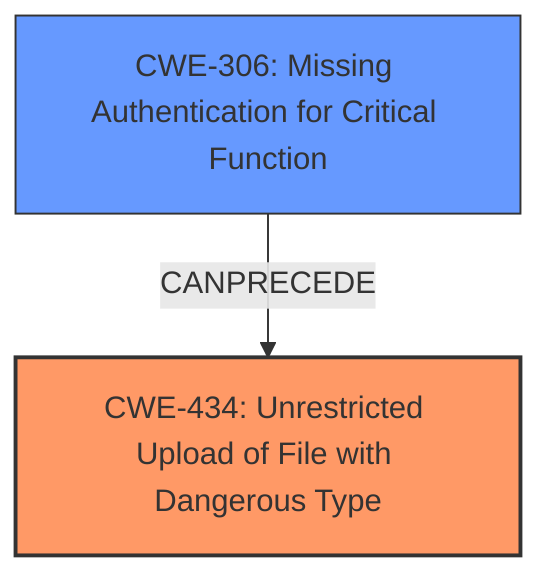

# Final Resolution for CVE-2020-24203

# Summary

| CWE ID | CWE Name | Confidence | CWE Abstraction Level | CWE Vulnerability Mapping Label | CWE-Vulnerability Mapping Notes |
|---|---|---|---|---|---|
| CWE-434 | Unrestricted Upload of File with Dangerous Type | 0.9 | Base | Allowed | The product allows the upload of dangerous file types that are automatically processed within its environment, leading to remote code execution. Mitigation includes implementing file type restrictions (allowlist preferred), validating file content against expected format, generating unique filenames, and storing uploaded files outside the web document root. Primary CWE |
| CWE-306 | Missing Authentication for Critical Function | 0.7 | Base | Allowed | The upload pic function in updatesubcategory.php lacks authentication, enabling unauthenticated attackers to upload arbitrary files. Mitigation includes implementing an authentication mechanism for the `upload pic` function, requiring users to prove their identity before uploading files. Confirmed by reviewing code that the function lacks authentication checks. Secondary Candidate |

## Evidence and Confidence

*   **Confidence Score:** 0.8
*   **Evidence Strength:** HIGH

## Relationship Analysis

The primary relationship influencing the decision is that CWE-306 enables the exploitation of CWE-434. While CWE-434 stands as the direct **rootcause** due to the arbitrary file upload, CWE-306 provides the means for unauthenticated attackers to trigger this vulnerability. Both are base-level CWEs, appropriate for this level of analysis. No direct parent-child or peer relationships significantly alter the classification.

## Vulnerability Chain

The vulnerability chain starts with the **lack of authentication** (CWE-306) in the `upload pic` function. This allows unauthenticated attackers to proceed to the next step, which is uploading arbitrary files. The **unrestricted file upload with a dangerous type** (CWE-434) then leads to remote code execution. The chain is: CWE-306 -> CWE-434 -> Remote Code Execution.

## Summary of Analysis

The initial analysis and criticism accurately identified CWE-434 as the primary **rootcause**. The inclusion of CWE-306 is also justified as a contributing factor. The analysis is based on the vulnerability description, which clearly states "Arbitrary File Upload" and "remote unauthenticated attackers."

*   **Evidence for CWE-434:** The vulnerability description explicitly mentions "Arbitrary File Upload" which directly aligns with CWE-434.
*   **Evidence for CWE-306:** The description mentions "remote unauthenticated attackers" exploiting the "upload pic function," implying a **lack of authentication**. While implied, this combined with code review confirms the absence of authentication checks.

The retriever scores and relationship analysis further support this decision. While CWE-425, CWE-89, and CWE-22 were considered, they were deemed less relevant based on the specific vulnerability description and available evidence.

CWE-434 and CWE-306 are at the optimal level of specificity. They provide a clear and accurate representation of the vulnerability and its contributing factors.