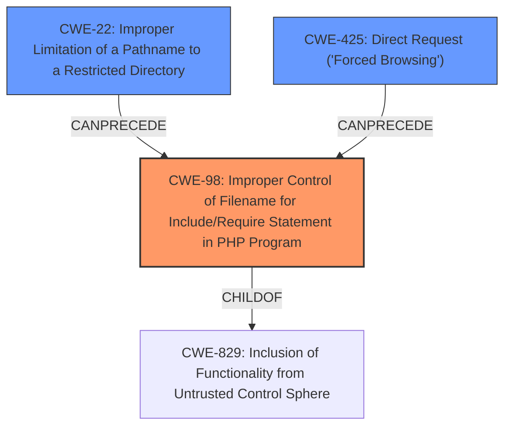

# Final Resolution for CVE-2020-25414

# Summary
| CWE ID | CWE Name | Confidence | CWE Abstraction Level | CWE Vulnerability Mapping Label | CWE-Vulnerability Mapping Notes |
|---|---|---|---|---|---|
| CWE-98 | Improper Control of Filename for Include/Require Statement in PHP Program ('PHP Remote File Inclusion') | 0.95 | Variant | Allowed | Primary CWE |
| CWE-22 | Improper Limitation of a Pathname to a Restricted Directory ('Path Traversal') | 0.70 | Base | Allowed | Secondary Candidate |

## Evidence and Confidence

*   **Confidence Score:** 0.93
*   **Evidence Strength:** HIGH

## Relationship Analysis
The primary relationship influencing the decision is the parent-child relationship between CWE-829 (Inclusion of Functionality from Untrusted Control Sphere) and CWE-98. CWE-98 is a variant of CWE-829, making it a more specific and appropriate classification. CWE-22 represents a potential path traversal attack vector, contributing to the overall exploitability. CWE-425 was also considered as a contributing factor in bypassing authorization controls.

## Vulnerability Chain
The vulnerability chain starts with the lack of input sanitization on the `cfg` GET parameter, leading to **CWE-98**. This allows an attacker to include arbitrary files. **CWE-22** can be involved if the attacker uses path traversal to reach the desired file. The ultimate impact is arbitrary PHP code execution on the server.

## Summary of Analysis
The initial analysis correctly identified CWE-98 as the primary weakness due to the direct usage of unsanitized user input in the `include` statement. The criticism also supports this decision, reinforcing that CWE-98 is the most accurate and specific classification. The vulnerability description "A **local file inclusion** vulnerability was discovered in the captcha function in Monstra 3.0.4 which allows remote attackers to execute arbitrary PHP code" directly aligns with CWE-98's description. The inclusion of CWE-22 as a secondary candidate is also justified, as path traversal might be necessary to exploit the **local file inclusion** vulnerability, but it is not the primary root cause. The mapping guidance ALLOWS CWE-98.
The decision to classify the vulnerability as CWE-98 is made at the optimal level of specificity because CWE-98 is a variant that specializes in PHP's `include` and `require` statements, making it a precise match for the described vulnerability, and the relationship to CWE-829 supports this decision.