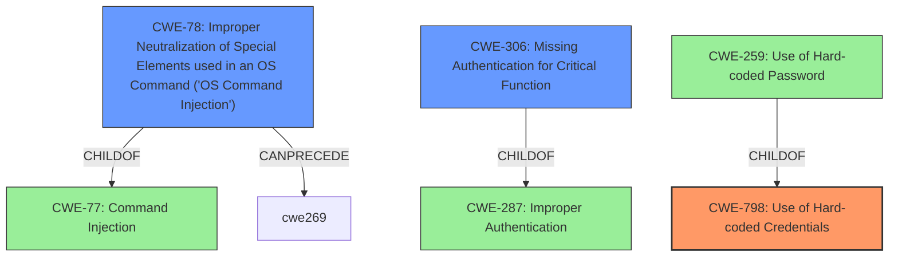

# Analysis Report for CVE-2020-25560

# Vulnerability Analysis Report: CVE-2020-25560

## Description

In SapphireIMS 5.0, it is possible to use the hardcoded credential in clients (username sapphire, password ims) and gain access to the portal. Once the access is available, the attacker can inject malicious OS commands on ping, traceroute and snmp functions and execute code on the server. We also observed the same is true if the JSESSIONID is completely removed.

## Vulnerability Description Key Phrases

**Rootcause:** hardcoded credential
**Impact:** command injection
**Product:** SapphireIMS
**Version:** 5.0
**Component:** clients

## Analysis (with Relationship Data)

# Summary
| CWE ID | CWE Name | Confidence | CWE Abstraction Level | CWE Vulnerability Mapping Label | CWE-Vulnerability Mapping Notes |
|---|---|---|---|---|---|
| CWE-798 | Use of Hard-coded Credentials | 0.95 | Base | Allowed | Primary CWE |
| CWE-78 | Improper Neutralization of Special Elements used in an OS Command ('OS Command Injection') | 0.85 | Base | Allowed | Secondary Candidate CWE |
| CWE-306 | Missing Authentication for Critical Function | 0.75 | Base | Allowed | Secondary Candidate CWE |

## Evidence and Confidence

*   **Confidence Score:** 0.90
*   **Evidence Strength:** HIGH

- **Analysis and Justification:**  
  - *Explanation:* The primary **weakness** is the **hardcoded credential**. The vulnerability description explicitly states: "In SapphireIMS 5.0, it is possible to use the **hardcoded credential** in clients (username sapphire, password ims) and gain access to the portal." This aligns directly with CWE-798 (Use of Hard-coded Credentials), which is a Base-level CWE suitable for mapping. The Retriever Results also list CWE-798 as the top candidate with a high score. The CVE Reference Links Content Summary also confirms "**Hardcoded Credentials:** The application uses hardcoded credentials, "username: sapphire, password: ims" to access the portal (referenced as a related vulnerability)". MITRE mapping guidance for CWE-798 indicates this is ALLOWED.
  - The second **weakness** is the command injection vulnerability. Once authenticated (or even without authentication if the JSESSIONID is removed), an attacker can inject malicious OS commands. This aligns with CWE-78 (Improper Neutralization of Special Elements used in an OS Command ('OS Command Injection')). The CVE Reference Links Content Summary also states: "**Command injection:** The application fails to sanitize user-supplied input when constructing OS commands for "ping", "traceroute", and "snmp" functions allowing for arbitrary command execution." MITRE mapping guidance for CWE-78 indicates this is ALLOWED for OS command injection vulnerabilities.
  - The third **weakness** is the Missing Authentication for Critical Function. The vulnerability description mentions that the attack can be done even if the JSESSIONID is removed. The CVE Reference Links Content Summary also states "**Unauthenticated access:** The application can be accessed without requiring any authentication, or with a missing/invalid JSESSIONID, which bypasses access controls." This aligns to CWE-306 (Missing Authentication for Critical Function).
  - *Relationship Analysis:* CWE-798 (Use of Hard-coded Credentials) is a parent of CWE-259 (Use of Hard-coded Password) and CWE-321 (Use of Hard-coded Cryptographic Key). Since the vulnerability explicitly mentions username and password, CWE-259 could be considered. However, CWE-798 is a more general case that encapsulates both passwords and cryptographic keys and is a better fit. CWE-78 is a child of CWE-77 (Command Injection) and is related to CWE-74 (Improper Neutralization of Special Elements). The graph relationships show CWE-78 CanPrecede CWE-269 (Privilege Management) since command injection often leads to privilege escalation.

- **Confidence Score:**
  - Confidence: 0.90 (High confidence due to explicit mention of hardcoded credentials and command injection in the vulnerability description and CVE summary)

---

## Criticism of Analysis

Okay, here's a detailed review of the provided CWE analysis, incorporating the full CWE specifications:

**Overall Assessment:**

The analysis is generally well-reasoned and uses appropriate CWEs. The confidence levels assigned seem justified based on the available information. The justification and relationship analysis for each CWE mapping are clear and helpful. The use of the full CWE specifications to inform the analysis is excellent.

**Specific CWE Mapping Review:**

1.  **CWE-798: Use of Hard-coded Credentials (Primary CWE)**
    *   **Assessment:** Correct. The vulnerability description explicitly states the presence of hardcoded credentials ("username sapphire, password ims"). This directly matches the description of CWE-798.
    *   **Mapping Guidance:** *Allowed*. This is consistent with CWE's mapping guidance.
    *   **Justification Strength:** HIGH. The evidence is explicit and direct.
    *   **Relationship Analysis:** The analysis correctly notes the potential for using the more specific CWE-259 (Use of Hard-coded Password), but defends the use of CWE-798 as the more general case that encompasses both passwords and keys. This is a good decision.
    *   **Confidence:** 0.95 - Justified.
    *   **Mitigation Considerations:**  Mitigation 1 discusses storing the credentials in a protected, encrypted location or database. Mitigation 2 is more relevant as it applies to inbound authentication, utilizing "first login" mode, which is pertinent here, but this will require further analysis to understand the intended user flow.  Mitigation 3 may apply, but it is situational.

2.  **CWE-78: Improper Neutralization of Special Elements used in an OS Command ('OS Command Injection') (Secondary Candidate CWE)**
    *   **Assessment:** Correct. The vulnerability description mentions the ability to inject malicious OS commands via ping, traceroute, and snmp functions. This clearly aligns with CWE-78.
    *   **Mapping Guidance:** *Allowed*. This is correct as the description indicates OS command injection.
    *   **Justification Strength:** HIGH. The evidence is direct as the attacker can inject OS commands.
    *   **Relationship Analysis:** The relationship to parent CWE-77 and further to CWE-74 is properly mentioned.
    *   **Confidence:** 0.85 - Justified.
    *   **Mitigation Considerations:** Mitigations 1 and 3 are the most relevant.  Mitigation 1 suggests using library calls, but this might not be feasible for ping, traceroute, and snmp, so the application should resort to Mitigation 3, which emphasizes input validation. Mitigation 2 is to use a sandbox which could prevent any external access, however, the application report specifically called out command injections in ping, traceroute and snmp.

3.  **CWE-306: Missing Authentication for Critical Function (Secondary Candidate CWE)**
    *   **Assessment:** Correct. The ability to execute commands even when the JSESSIONID is removed demonstrates a lack of authentication.
    *   **Mapping Guidance:** *Allowed*. This aligns with the provided description.
    *   **Justification Strength:** HIGH. This is a direct quote from the description and CVE Reference.
    *   **Relationship Analysis:** This is correctly identified as a child of CWE-287 (Improper Authentication).
    *   **Confidence:** 0.75 - Justified.
    *   **Mitigation Considerations:** Mitigation 1 of dividing the software into areas requiring identity and using centralized authentication is important. Mitigation 2 is to ensure that any checks performed on the client side are also done on the server side. Mitigation 3 speaks to avoid custom, "grow-your-own" authentication routines, which, depending on the architecture, may or may not apply.

**Additional Considerations:**

*   **CWE-1392: Use of Default Credentials**. While CWE-798 is the correct primary CWE, consider whether CWE-1392 could also apply, especially if the hardcoded credentials are *intended* as default credentials that administrators should change. If they are *intended* to be changed, then CWE-1392 becomes more relevant. The vulnerability report should be more explicit on the intentions behind the credentials.

*  **CWE-913: Improper Control of Dynamically-Managed Code Resources** The dynamic use of exec() with user controlled code (in the case of the LLM API commands) *may* be an avenue to consider. Since it depends on how ping, traceroute and SNMP functions are implemented, *or if the system permits users to use these features through dynamic LLM functions*. This is a stretch based on the current vulnerability analysis.

**Suggested Improvements:**

*   **Expand on Relationship Analysis:** Provide more specifics about how the different CWEs relate to each other in the context of the application. For example, "Exploitation of CWE-798 allows an attacker to bypass authentication, leading to the possibility of exploiting CWE-78."
*   **Prioritize Mitigations:** For each CWE, identify which mitigation strategies are the *most* relevant and effective for the specific vulnerability.
*   **Address Specificity:** While the analysis is good, it could be improved by considering more specific CWEs where appropriate. However, this depends on the level of detail available in the vulnerability description.
* **Clarification:** Provide more context and examples to improve readability. This will help future analysts follow your reasoning.

**Conclusion:**

This is a solid CWE analysis. The mappings are accurate, well-justified, and demonstrate a good understanding of the CWE specifications. The suggested improvements would further strengthen the analysis and make it more actionable.

## Final Resolution

# Summary
| CWE ID | CWE Name | Confidence | CWE Abstraction Level | CWE Vulnerability Mapping Label | CWE-Vulnerability Mapping Notes |
|---|---|---|---|---|---|
| CWE-798 | Use of Hard-coded Credentials | 0.95 | Base | Allowed | Primary CWE |
| CWE-78 | Improper Neutralization of Special Elements used in an OS Command ('OS Command Injection') | 0.85 | Base | Allowed | Secondary Candidate CWE |
| CWE-306 | Missing Authentication for Critical Function | 0.75 | Base | Allowed | Secondary Candidate CWE |

## Evidence and Confidence

*   **Confidence Score:** 0.90
*   **Evidence Strength:** HIGH

## Relationship Analysis
The primary **weakness**, CWE-798 (Use of Hard-coded Credentials), is a base-level CWE and has child CWEs like CWE-259 (Use of Hard-coded Password) and CWE-321 (Use of Hard-coded Cryptographic Key). While CWE-259 could be more specific since a username/password combination is mentioned, CWE-798 is a suitable base-level classification. The secondary **weakness**, CWE-78 (Improper Neutralization of Special Elements used in an OS Command ('OS Command Injection')), stems from the ability to inject OS commands. This vulnerability can be traced back to CWE-77 (Command Injection) and CWE-74 (Improper Neutralization of Special Elements). The third **weakness**, CWE-306 (Missing Authentication for Critical Function), is related to CWE-287 (Improper Authentication) and highlights the lack of proper authentication mechanisms.

## Vulnerability Chain
The vulnerability chain starts with CWE-798 (**hardcoded credentials**), which allows an attacker to bypass authentication (CWE-306) and gain access to the system. Once authenticated (or without authentication), the attacker can inject malicious OS commands (CWE-78) on ping, traceroute, and snmp functions, leading to arbitrary code execution on the server. The root cause is the use of **hardcoded credentials**, and the impact is arbitrary code execution.

## Summary of Analysis
The initial analysis and criticism both correctly identified the primary and secondary CWEs. The evidence provided in the vulnerability description and the CVE summary supports the selection of CWE-798, CWE-78, and CWE-306. The graph relationships further clarify how these weaknesses are interconnected. CWE-798, the **root cause**, allows attackers to exploit CWE-78 and CWE-306.

The decision to choose CWE-798 over CWE-259 is justified because CWE-798 is a more general case and the vulnerability description mentions both username and password. The mapping guidance for CWE-798, CWE-78, and CWE-306 indicates that these CWEs are ALLOWED.

The selected CWEs are at the optimal level of specificity, given the available evidence. While more specific CWEs could be considered, the current level provides a clear and accurate representation of the vulnerability. The evidence is based on the following quotes:

*   "In SapphireIMS 5.0, it is possible to use the **hardcoded credential** in clients (username sapphire, password ims) and gain access to the portal." (supports CWE-798)
*   "Once the access is available, the attacker can inject malicious OS commands on ping, traceroute and snmp functions and execute code on the server." (supports CWE-78)
*   "We also observed the same is true if the JSESSIONID is completely removed." (supports CWE-306)

The analysis in both the initial assessment and the criticism are very strong and align with the findings.

*Report generated on 2025-03-16 16:43:58*
