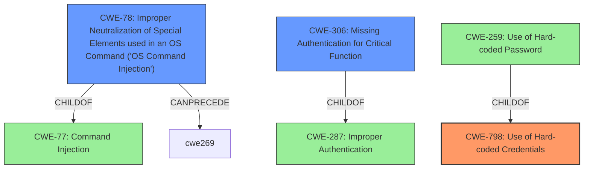

# Final Resolution for CVE-2020-25560

# Summary
| CWE ID | CWE Name | Confidence | CWE Abstraction Level | CWE Vulnerability Mapping Label | CWE-Vulnerability Mapping Notes |
|---|---|---|---|---|---|
| CWE-798 | Use of Hard-coded Credentials | 0.95 | Base | Allowed | Primary CWE |
| CWE-78 | Improper Neutralization of Special Elements used in an OS Command ('OS Command Injection') | 0.85 | Base | Allowed | Secondary Candidate CWE |
| CWE-306 | Missing Authentication for Critical Function | 0.75 | Base | Allowed | Secondary Candidate CWE |

## Evidence and Confidence

*   **Confidence Score:** 0.90
*   **Evidence Strength:** HIGH

## Relationship Analysis
The primary **weakness**, CWE-798 (Use of Hard-coded Credentials), is a base-level CWE and has child CWEs like CWE-259 (Use of Hard-coded Password) and CWE-321 (Use of Hard-coded Cryptographic Key). While CWE-259 could be more specific since a username/password combination is mentioned, CWE-798 is a suitable base-level classification. The secondary **weakness**, CWE-78 (Improper Neutralization of Special Elements used in an OS Command ('OS Command Injection')), stems from the ability to inject OS commands. This vulnerability can be traced back to CWE-77 (Command Injection) and CWE-74 (Improper Neutralization of Special Elements). The third **weakness**, CWE-306 (Missing Authentication for Critical Function), is related to CWE-287 (Improper Authentication) and highlights the lack of proper authentication mechanisms.

## Vulnerability Chain
The vulnerability chain starts with CWE-798 (**hardcoded credentials**), which allows an attacker to bypass authentication (CWE-306) and gain access to the system. Once authenticated (or without authentication), the attacker can inject malicious OS commands (CWE-78) on ping, traceroute, and snmp functions, leading to arbitrary code execution on the server. The root cause is the use of **hardcoded credentials**, and the impact is arbitrary code execution.

## Summary of Analysis
The initial analysis and criticism both correctly identified the primary and secondary CWEs. The evidence provided in the vulnerability description and the CVE summary supports the selection of CWE-798, CWE-78, and CWE-306. The graph relationships further clarify how these weaknesses are interconnected. CWE-798, the **root cause**, allows attackers to exploit CWE-78 and CWE-306.

The decision to choose CWE-798 over CWE-259 is justified because CWE-798 is a more general case and the vulnerability description mentions both username and password. The mapping guidance for CWE-798, CWE-78, and CWE-306 indicates that these CWEs are ALLOWED.

The selected CWEs are at the optimal level of specificity, given the available evidence. While more specific CWEs could be considered, the current level provides a clear and accurate representation of the vulnerability. The evidence is based on the following quotes:

*   "In SapphireIMS 5.0, it is possible to use the **hardcoded credential** in clients (username sapphire, password ims) and gain access to the portal." (supports CWE-798)
*   "Once the access is available, the attacker can inject malicious OS commands on ping, traceroute and snmp functions and execute code on the server." (supports CWE-78)
*   "We also observed the same is true if the JSESSIONID is completely removed." (supports CWE-306)

The analysis in both the initial assessment and the criticism are very strong and align with the findings.