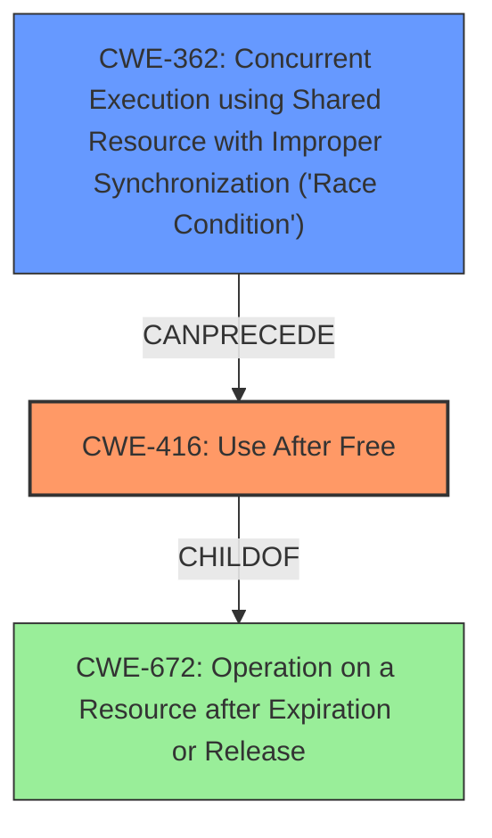

# Final Resolution for CVE-2020-25668

# Summary
| CWE ID | CWE Name | Confidence | CWE Abstraction Level | CWE Vulnerability Mapping Label | CWE-Vulnerability Mapping Notes |
|---|---|---|---|---|---|
| CWE-416 | Use After Free | 0.9 | Variant | Allowed | Primary CWE |
| CWE-362 | Concurrent Execution using Shared Resource with Improper Synchronization ('Race Condition') | 0.7 | Class | Allowed-with-Review | Secondary Candidate - Contributes to CWE-416 |

## Evidence and Confidence

*   **Confidence Score:** 0.9
*   **Evidence Strength:** HIGH

## Relationship Analysis
The primary weakness is **CWE-416 (Use After Free)**, a Variant. It accurately reflects the vulnerability where memory is accessed after being freed. **CWE-362 (Concurrent Execution using Shared Resource with Improper Synchronization ('Race Condition'))**, a Class, is the secondary weakness, representing the race condition that leads to the use-after-free. **CWE-362** can precede **CWE-416**, showing the race condition as a trigger. The abstraction levels are suitable, with **CWE-416** being a more specific Variant and **CWE-362** representing the broader class of concurrency issues. No peer relationships were more appropriate.

## Vulnerability Chain
The vulnerability chain starts with **CWE-362 (Concurrent Execution using Shared Resource with Improper Synchronization ('Race Condition'))**, where concurrent access to the `fg_console` variable is not properly synchronized. This leads to a state where the `vc` pointer is freed prematurely, and subsequently accessed by `con_font_op`, resulting in **CWE-416 (Use After Free)**. The root cause is the **improper synchronization**, and the impact is accessing freed memory.

## Summary of Analysis
The initial analysis and criticism both align well with the evidence provided in the vulnerability description and CVE reference materials. The primary weakness is correctly identified as **CWE-416 (Use After Free)**, supported by the statement: "access to the global variable fg_console is not properly synchronized leading to a **use after free** in con_font_op." The secondary weakness, **CWE-362 (Concurrent Execution using Shared Resource with Improper Synchronization ('Race Condition'))**, is also well-justified, as "access to the global variable fg_console is not properly synchronized" indicates a race condition.

The graph relationships confirm that **CWE-362** can indeed lead to **CWE-416**, establishing a clear vulnerability chain. The chosen CWEs are at the optimal level of specificity, with **CWE-416** being a Variant and directly reflecting the **use-after-free** condition, and **CWE-362** being a Class that explains the **improper synchronization** contributing to the vulnerability. I am confident in this classification because it accurately reflects both the root cause and the resulting vulnerability.