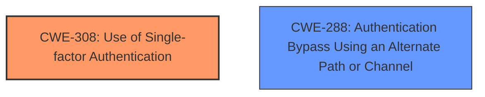

# Final Resolution for CVE-2020-26136

# Summary
| CWE ID | CWE Name | Confidence | CWE Abstraction Level | CWE Vulnerability Mapping Label | CWE-Vulnerability Mapping Notes |
|---|---|---|---|---|---|
| CWE-308 | Use of Single-factor Authentication | 0.9 | Base | Allowed | Primary CWE |
| CWE-288 | Authentication Bypass Using an Alternate Path or Channel | 0.7 | Base | Allowed | Secondary Candidate |

## Evidence and Confidence

*   **Confidence Score:** 0.9
*   **Evidence Strength:** HIGH

## Relationship Analysis
The primary relationship influencing the decision is the lack of a strong relationship for CWE-306. CWE-308 and CWE-288 do not have defined relationships to each other, but they both fall under the broader category of authentication issues. The base level of abstraction is suitable as it directly reflects the specific weaknesses observed in the vulnerability.

## Vulnerability Chain
The vulnerability chain starts with the acceptance of basic authentication (**CWE-308**), which bypasses the intended MFA. This creates an alternate authentication path (**CWE-288**), leading to unauthorized access. The root cause is the **lack of enforcement of MFA** when basic authentication is used.

## Summary of Analysis
The initial analysis and criticism were both considered. The decision to remove CWE-306 is based on the critic's argument that the endpoint does have authentication (basic auth), just not the *right* kind (MFA). The vulnerability is not a *lack* of authentication; it's the *presence* of weak authentication bypassing stronger authentication.

The primary justification is based on the vulnerability description which states "GraphQL doesnt honour MFA (multi-factor authentication) when using basic authentication." This directly points to **CWE-308 (Use of Single-factor Authentication)** because basic authentication is a single factor.

The selected CWEs are at the optimal level of specificity because they directly address the root cause and the alternate path.