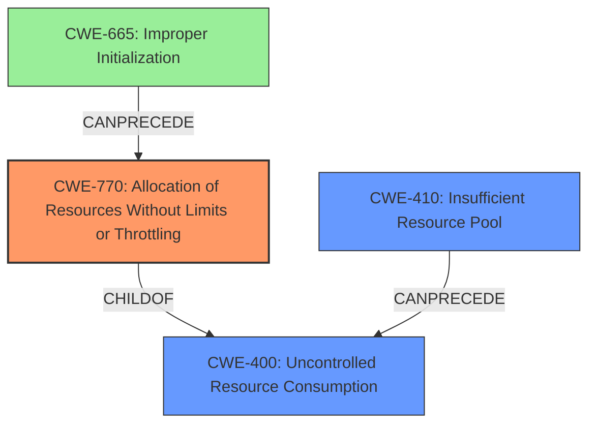

# Final Resolution for CVE-2020-26195

# Summary
| CWE ID  | CWE Name                                                              | Confidence | CWE Abstraction Level | CWE Vulnerability Mapping Label | CWE-Vulnerability Mapping Notes |
| :-------- | :-------------------------------------------------------------------- | :--------- | :---------------------- | :------------------------------ | :------------------------------ |
| CWE-770 | Allocation of Resources Without Limits or Throttling                 | 0.85       | Base                    | Allowed                         | Primary CWE                     |
| CWE-410 | Insufficient Resource Pool                 | 0.65       | Base                    | Allowed                         | Secondary CWE                     |
| CWE-665 | Improper Initialization                                      | 0.40       | Class                    | Allowed                         | Secondary Candidate                     |

## Evidence and Confidence

*   **Confidence Score:** 0.80
*   **Evidence Strength:** MEDIUM

## Relationship Analysis
The primary relationship that influenced the decision was the parent-child relationship between CWE-400 (Uncontrolled Resource Consumption) and CWE-770 (Allocation of Resources Without Limits or Throttling). While CWE-400 initially seemed relevant, the analysis, along with the criticism, highlighted that CWE-770 provides a more specific and accurate representation of the **root cause**: the lack of limits on resource allocation. Additionally, CWE-410 (Insufficient Resource Pool) was considered due to the potential exhaustion of a fixed resource pool, influenced by the CANPRECEDE relationship to CWE-400. CWE-665 (Improper Initialization) was considered to show that it chains into CWE-770.

## Vulnerability Chain
The vulnerability chain starts with the OneFS SMB directory auto-create feature's flawed logic, which leads to **allocation of resources without limits or throttling (CWE-770)**. This, in turn, leads to the potential exhaustion of a **fixed resource pool (CWE-410)**, ultimately resulting in the system slowing down due to uncontrolled resource consumption. A potential **improper initialization (CWE-665)** could be a prerequisite to CWE-770 if limit variables are not set correctly.

## Summary of Analysis
The initial analysis correctly identified CWE-770 as the primary weakness, which aligns with the vulnerability description that "OneFS SMB directory auto-create may erroneously create a directory for a user" and "a remote unauthenticated attacker may take advantage of this issue to **slow down the system**." The criticism helped refine the analysis by suggesting the inclusion of CWE-410 if there is an insufficient resource pool.

The decision to prioritize CWE-770 is based on its specificity and direct relevance to the **root cause**, as indicated by the CWE description: "The product allocates a reusable resource or group of resources on behalf of an actor without imposing any restrictions on the size or number of resources that can be allocated, in violation of the intended security policy for that actor." This directly reflects the vulnerability's description of unlimited directory creation.

CWE-400, while related, is a broader class and less specific. The choice of CWE-770 provides a more precise understanding of the **weakness**.

The inclusion of CWE-410 acknowledges the possibility of exhausting a fixed resource pool, which would amplify the impact of the unlimited resource allocation. This addition provides a more comprehensive understanding of the vulnerability's potential consequences.

The final classification reflects the optimal level of specificity, focusing on the **root cause** (CWE-770) and considering potential contributing factors (CWE-410 and CWE-665). The confidence score is increased to 0.85 due to the refined justification and the inclusion of relevant CWEs that contribute to a more complete picture of the vulnerability.