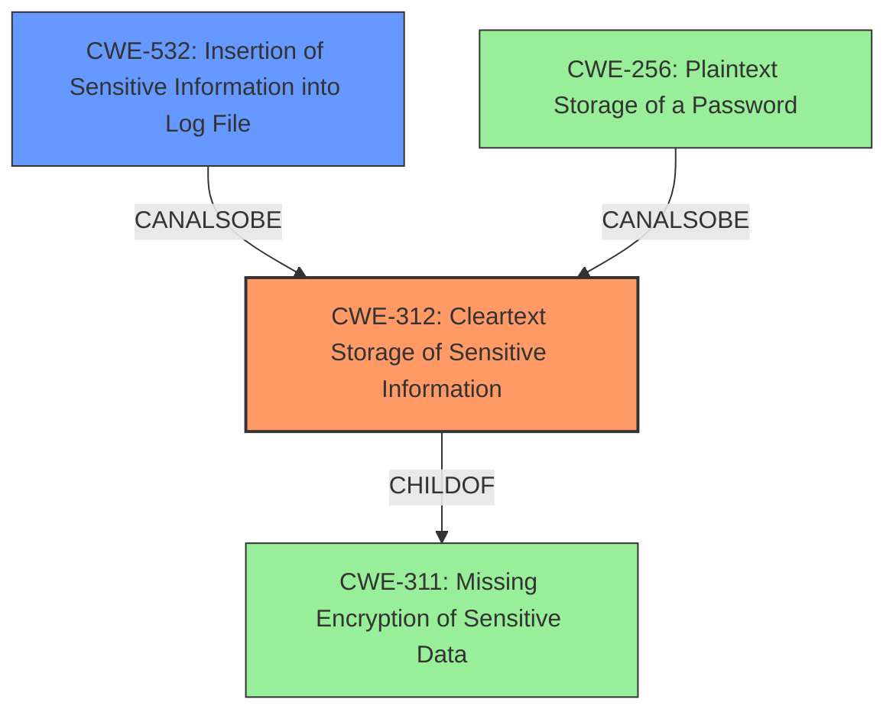

# Final Resolution for CVE-2020-26199

# Summary
| CWE ID  | CWE Name                                        | Confidence | CWE Abstraction Level | CWE Vulnerability Mapping Label | CWE-Vulnerability Mapping Notes |
| :-------- | :---------------------------------------------- | :--------- | :-------------------- | :------------------------------ | :------------------------------ |
| **CWE-312** | **Cleartext Storage of Sensitive Information** | 0.95       | Base                  | Allowed                        | Primary CWE                       |
| **CWE-532** | **Insertion of Sensitive Information into Log File** | 0.75       | Base                  | Allowed                         | Secondary Candidate             |

## Evidence and Confidence

*   **Confidence Score:** 0.95
*   **Evidence Strength:** HIGH

## Relationship Analysis
The decision was influenced by the hierarchical relationship between **CWE-312 (Cleartext Storage of Sensitive Information)** and its parent, **CWE-311 (Missing Encryption of Sensitive Data)**, favoring **CWE-312** for its increased specificity. While **CWE-256 (Plaintext Storage of a Password)** was considered due to its focus on passwords, **CWE-312** was deemed more appropriate as the vulnerability may involve other sensitive information beyond just passwords. The chain relationship wasn't applicable here, as we're focusing on the immediate cause. **CWE-532 (Insertion of Sensitive Information into Log File)** was chosen as a secondary CWE because it specifies the location of the **WEAKNESS**, adding context to the vulnerability. All selected CWEs are at the Base level, ensuring appropriate granularity.

## Vulnerability Chain
The chain starts with the **ROOTCAUSE**, a failure to encrypt sensitive information. This leads to **CWE-312 (Cleartext Storage of Sensitive Information)**, where user credentials are stored in plain text. The credentials being stored in log files is represented by **CWE-532 (Insertion of Sensitive Information into Log File)**. This allows a local authenticated attacker with access to these log files to gain unauthorized access, culminating in a compromise of the system.

## Summary of Analysis
The initial analysis and the criticism both identified **CWE-312 (Cleartext Storage of Sensitive Information)** as the primary **WEAKNESS**, which aligns perfectly with the vulnerability description stating "plain-text password storage". The evidence is strong, as quoted from the vulnerability description. The graph relationships confirm the appropriateness of selecting the Base level **CWE-312** over its parent **CWE-311 (Missing Encryption of Sensitive Data)** or potential variants like **CWE-256 (Plaintext Storage of a Password)**, allowing for optimal specificity. The inclusion of **CWE-532 (Insertion of Sensitive Information into Log File)** as a secondary CWE adds context by specifying the location of the **WEAKNESS**. The selected CWEs are at the optimal level of specificity because they accurately reflect the vulnerability while avoiding overly narrow variant classifications. The high confidence scores are justified due to the direct match between the vulnerability description and the CWE definitions, as well as the MITRE mapping guidance allowing the use of these CWEs.