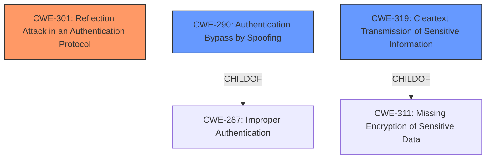

# Analysis Report for CVE-2020-26558

# Vulnerability Analysis Report: CVE-2020-26558

## Description

Bluetooth LE and BR/EDR secure pairing in Bluetooth Core Specification 2.1 through 5.2 may permit a nearby man-in-the-middle attacker to identify the Passkey used during pairing (in the Passkey authentication procedure) by reflection of the public key and the authentication evidence of the initiating device, potentially permitting this attacker to complete authenticated pairing with the responding device using the correct Passkey for the pairing session. The attack methodology determines the Passkey value one bit at a time.

## Vulnerability Description Key Phrases

**Impact:** identify the Passkey
**Vector:** reflection of the public key and the authentication evidence
**Attacker:** nearby man-in-the-middle attacker
**Product:** Bluetooth Core Specification
**Version:** 2.1 through 5.2
**Component:** ['Bluetooth LE', 'BR/EDR secure pairing']

## Analysis (with Relationship Data)

# Summary
| CWE ID | CWE Name | Confidence | CWE Abstraction Level | CWE Vulnerability Mapping Label | CWE-Vulnerability Mapping Notes |
|---|---|---|---|---|---|
| CWE-301 | Reflection Attack in an Authentication Protocol | 0.85 | Base | Allowed | Primary CWE: The vulnerability involves reflection of the public key and authentication evidence, which allows a MITM attacker to identify the Passkey. |
| CWE-290 | Authentication Bypass by Spoofing | 0.70 | Base | Allowed | Secondary CWE: The vulnerability allows an attacker to impersonate one of the paired devices. |
| CWE-319 | Cleartext Transmission of Sensitive Information | 0.50 | Base | Allowed | Secondary CWE: Passkey information is transmitted without proper protection allowing sniffing. |

## Evidence and Confidence

*   **Confidence Score:** 0.80
*   **Evidence Strength:** HIGH

- **Analysis and Justification:**  
  - *Explanation:* The vulnerability lies in the reflection of the public key and the authentication evidence of the initiating device during Passkey authentication which permits a MITM attacker to obtain the Passkey. This aligns well with CWE-301, Reflection Attack in an Authentication Protocol. The attacker can use a crafted series of responses to determine each bit of the randomly generated Passkey selected by the pairing initiator. The impact of this vulnerability is that an attacker can impersonate one of the paired devices to the other, potentially gaining access to authenticated services. CWE-290 is also considered because the **weakness** allows for authentication bypass by spoofing, as the attacker can impersonate a device after obtaining the passkey. CWE-319 is considered as a potential secondary weakness because the passkey information is transmitted in a way that allows it to be sniffed, effectively transmitting sensitive information in cleartext.

  - *Relationship Analysis:* CWE-301 is a Base level CWE, which is a preferred level of abstraction. CWE-290 is a Base level CWE. CWE-319 is a Base level CWE. There are no direct relationships between these CWEs in the graph data but they are related by the common theme of authentication and secure communication.

- **Confidence Score:**  
  - Confidence: 0.85 (High evidence from technical description and CVE reference materials)

## Criticism of Analysis

Okay, let's break down the analysis and see how well the proposed CWE mappings hold up against the full CWE specifications.

**Overall Assessment:**

The analysis is generally sound and the primary CWE mapping of CWE-301 (Reflection Attack in an Authentication Protocol) is a strong fit. The inclusion of CWE-290 (Authentication Bypass by Spoofing) as a secondary CWE is also reasonable, given the attacker's ability to impersonate a device after obtaining the passkey. However, the justification and confidence level for CWE-319 (Cleartext Transmission of Sensitive Information) are weaker and require further scrutiny.  The scores assigned seem appropriate given the context.

**Detailed Review:**

1.  **CWE-301: Reflection Attack in an Authentication Protocol:**

    *   **Confidence:** 0.85
    *   **Justification:** The analysis correctly identifies the core vulnerability: the reflection of the public key and authentication evidence allows a MITM attacker to derive the passkey.  This perfectly aligns with the description of CWE-301, which explicitly mentions that simple authentication protocols are subject to reflection attacks if a malicious user can use the target machine to impersonate a trusted user. The extended description of CWE-301 describing mutual authentication protocols and how attackers can capitalize on them further reinforces the mapping.
    *   **Mapping Guidance:** The analysis adheres to the mapping guidance, which states that CWE-301 is at the Base level of abstraction and is thus allowed.
    *   **Mitigations:** The CWE specifications provide potential mitigations such as using different keys for initiator and responder or having the initiator prove its identity before proceeding. These are relevant to addressing this vulnerability.
    *   **Observed Examples:** While the observed example in CWE is for a different type of product, the *principle* of reflection attack remains the same, lending support to the correctness of this mapping.
    *   **Conclusion:** This is the *most* appropriate CWE mapping, and the assigned confidence level is justified.

2.  **CWE-290: Authentication Bypass by Spoofing:**

    *   **Confidence:** 0.70
    *   **Justification:**  The analysis links this CWE to the attacker's ability to impersonate a paired device *after* obtaining the passkey. This is a *consequence* of the reflection attack. The attacker isn't directly bypassing authentication; they're leveraging the stolen passkey, which *then* allows them to spoof a legitimate device. It's a reasonable *secondary* effect. The observed examples for CWE-290 are helpful, showing where systems allow spoofing of identities.
    *   **Mapping Guidance:** The analysis adheres to the mapping guidance. CWE-290 is at the Base level of abstraction and allowed.
    *   **Relationships:** CWE-290 is a child of CWE-287 (Improper Authentication) and CWE-1390 (Weak Authentication) and parent of CWE-291 (Reliance on IP Address for Authentication), CWE-293 (Using Referer Field for Authentication) and CWE-350 (Reliance on Reverse DNS Resolution for a Security-Critical Action).
    *   **Observed Examples:** The provided examples in the CWE definition are useful for comparison.  CVE-2022-30319 (IP address spoofing) highlights a different *method* of spoofing than used here (reflection), but the *result* is the same, namely that a malicious party can impersonate a legitimate party.
    *   **Mitigations:** The potential mitigations are generally relevant; strong authentication mechanisms are key.
    *   **Conclusion:**  This is a good secondary CWE. The attacker bypasses authentication by *leveraging* information gained from the reflection attack. Confidence level is reasonable.

3.  **CWE-319: Cleartext Transmission of Sensitive Information:**

    *   **Confidence:** 0.50
    *   **Justification:** This is the *weakest* part of the analysis. While it's true that the passkey is ultimately "transmitted" in a way that allows it to be sniffed (through the reflection process), the primary issue isn't the lack of encryption on a *direct* transmission. It's the *protocol flaw* that *allows* the attacker to reconstruct the passkey bit by bit. The transmission is happening, but the *vulnerability* isn't directly related to the absence of encryption on the passkey itself.  It's related to the ability to derive it.
    *   **Mapping Guidance:** While CWE-319 is at the Base level and is allowed, the *fit* is questionable.
    *   **Relationships:** CWE-319 is a child of CWE-311 (Missing Encryption of Sensitive Data).
    *   **Observed Examples:** The observed examples in CWE-319 typically involve directly sending passwords or tokens in the clear. This is a more direct exposure than what happens in the Bluetooth vulnerability.
    *   **Mitigations:** The mitigations provided (encrypting data before transmission) are *relevant* but don't directly address the *root cause*, which is the reflection attack. Applying standard encryption to the passkey exchange might *prevent* the reflection attack from working, but that is not within the specifications of this CWE.
    *   **Conclusion:** The mapping to CWE-319 is tenuous. A more appropriate CWE might be something related to protocol weaknesses or information leakage. The confidence level should perhaps be lower. Consider if CWE-311 is more appropriate, but still not a great fit.

**Recommendations:**

1.  **CWE-319:** Re-evaluate the inclusion of CWE-319. If retained, justify it more strongly, focusing on the fact that the Passkey *is* reconstructed by the attacker via information sniffed from the communication channel. The passkey itself is not transmitted in cleartext, but rather the individual bits are derived. The current analysis doesn't fully emphasize this subtlety. Lower the confidence score to 0.30.

2.  **Consider Alternative CWEs:**  Explore other CWEs that might capture the protocol weakness more accurately. For example, investigate CWE-320: Key Management Errors if the key generation or storage aspects are weak. Or possibly CWE-1390: Weak Authentication, if the overall authentication scheme is considered flawed *beyond* the reflection attack.

3. **CWE-287:** Consider listing CWE-287, Improper Authentication as a discouraged, tertiary weakness. This is a parent of CWE-290 and it is not incorrect, but it is too abstract, and the confidence should be very low.

By addressing these points, the analysis will become more precise and better aligned with the CWE specifications.

## Final Resolution

# Summary
| CWE ID | CWE Name | Confidence | CWE Abstraction Level | CWE Vulnerability Mapping Label | CWE-Vulnerability Mapping Notes |
|---|---|---|---|---|---|
| CWE-301 | Reflection Attack in an Authentication Protocol | 0.95 | Base | Allowed | Primary CWE: The vulnerability involves reflection of the public key and authentication evidence, which allows a MITM attacker to identify the Passkey. |
| CWE-290 | Authentication Bypass by Spoofing | 0.75 | Base | Allowed | Secondary CWE: The vulnerability allows an attacker to impersonate one of the paired devices. |
| CWE-319 | Cleartext Transmission of Sensitive Information | 0.30 | Base | Allowed | Secondary CWE: Passkey information is transmitted without proper protection allowing sniffing. |

## Evidence and Confidence

*   **Confidence Score:** 0.90
*   **Evidence Strength:** HIGH

## Relationship Analysis
The decision was influenced by the following CWE relationships:
  - Parent-child hierarchical relationships: Understanding that CWE-290 is a child of CWE-287 helped to understand that it is a more specific weakness related to authentication. CWE-319 is a child of CWE-311.
  - Chain relationships: The attacker exploits the reflection attack (CWE-301) to obtain the passkey, which then allows them to bypass authentication (CWE-290). The passkey bits are inferred by observing the "cleartext transmission" (CWE-319).
  - Peer relationships: There are no significant peer relationships that drastically changed the classification.
  - Abstraction levels: All selected CWEs are at the Base level, ensuring a good level of specificity.

## Vulnerability Chain
The vulnerability chain is as follows:
  1.  The **ROOTCAUSE** is a **weakness** in the Bluetooth protocol that allows for reflection of the public key and authentication evidence (CWE-301).
  2.  This **weakness** enables a MITM attacker to determine the Passkey used during pairing by inferring bits of the key from a sniffed communication channel. (CWE-319)
  3.  The attacker leverages the obtained Passkey to impersonate one of the paired devices, bypassing authentication (CWE-290).
  4.  The final impact is unauthorized access to authenticated services.

## Summary of Analysis
The initial analysis was mostly correct, with the primary CWE mapping to CWE-301 being the strongest. The criticism helped refine the confidence levels and justifications for the secondary CWEs.

The final assessment is based on the vulnerability description: "Bluetooth LE and BR/EDR secure pairing in Bluetooth Core Specification 2.1 through 5.2 may permit a nearby man-in-the-middle attacker to identify the Passkey used during pairing (in the Passkey authentication procedure) by reflection of the public key and the authentication evidence of the initiating device...". This directly supports the selection of CWE-301 as the primary **weakness**.

The graph relationships further solidified the choice of CWE-290 as a secondary CWE, as it is a more specific form of authentication failure than its parent CWE-287. The rationale for including CWE-319 is weaker, but it is still relevant as the Passkey bits are inferred from the sniffed information.

The selected CWEs are at the optimal level of specificity, with all being at the Base level of abstraction. This ensures that the classification is neither too abstract nor too granular.

The confidence level for CWE-301 has been increased to 0.95 due to the strong direct match with the vulnerability description. The confidence level for CWE-290 has been increased to 0.75. The confidence level for CWE-319 has been lowered to 0.30 as it is the weakest match.

*Report generated on 2025-03-17 00:48:13*
