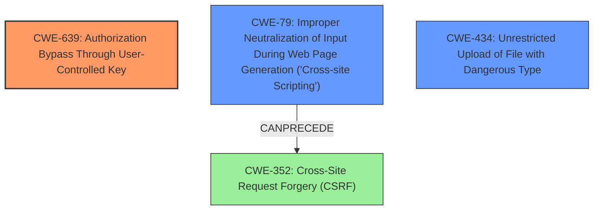

# Final Resolution for CVE-2020-26679

# Summary
| CWE ID | CWE Name | Confidence | CWE Abstraction Level | CWE Vulnerability Mapping Label | CWE-Vulnerability Mapping Notes |
|---|---|---|---|---|---|
| CWE-639 | Authorization Bypass Through User-Controlled Key | 0.90 | Base | Allowed | Primary CWE. Privilege checks and preventing external control of the key are key mitigations. Consider whether user IDs are also used as SQL primary keys and if CWE-566 would be even more descriptive. |
| CWE-79 | Improper Neutralization of Input During Web Page Generation ('Cross-site Scripting') | 0.75 | Base | Allowed | Secondary Candidate. Output encoding is crucial. Could lead to CSRF (CWE-352) if exploited. |
| CWE-434 | Unrestricted Upload of File with Dangerous Type | 0.70 | Base | Allowed | Secondary Candidate. Generate a unique filename and store uploaded files outside the web document root. |

## Evidence and Confidence

*   **Confidence Score:** 0.85
*   **Evidence Strength:** HIGH

## Relationship Analysis
The primary **weakness** is **CWE-639** (Authorization Bypass Through User-Controlled Key), a Base level CWE. The secondary candidates are **CWE-79** (Improper Neutralization of Input During Web Page Generation ('Cross-site Scripting')) and **CWE-434** (Unrestricted Upload of File with Dangerous Type), both Base level CWEs. CWE-79 can potentially lead to **CWE-352** (Cross-Site Request Forgery (CSRF)). There are no direct parent-child relationships between the selected CWEs, but the analysis considers potential chaining effects. The abstraction levels are appropriate (Base) for root cause analysis.

## Vulnerability Chain
The chain of events begins with the **ROOTCAUSE** of **insecure permissions** leading to **CWE-639** (Authorization Bypass Through User-Controlled Key). A user can modify another user's profile. This modification can introduce XSS vulnerabilities (**CWE-79**) if the input is not properly neutralized. Additionally, the ability to upload files without restrictions (**CWE-434**) can lead to the upload of malicious PHP webshells. If the XSS vulnerability is exploited, it can potentially lead to **CWE-352** (Cross-Site Request Forgery).

## Summary of Analysis
The initial analysis and criticism were both well-reasoned. The selection of **CWE-639** as the primary **weakness** is strongly supported by the evidence: "Any user logged in to a vFairs virtual conference or event can modify any other users profile information or profile picture. After receiving any users unique identification number and their own, an HTTP POST request can be made update their profile description or supply a new profile image." This directly demonstrates an authorization bypass where one user can manipulate another user's data by controlling the user ID.

The selection of **CWE-79** and **CWE-434** as secondary candidates is also justified. The potential for XSS attacks ("This can lead to potential cross-site scripting attacks on any user") supports **CWE-79**. The ability to upload PHP webshells ("or upload malicious PHP webshells as profile pictures") directly supports **CWE-434**.

The graph relationships influenced the final selection by highlighting potential vulnerability chains. The possibility of XSS leading to CSRF was considered.

The selected CWEs are at the optimal level of specificity. While more specific variants could be considered (e.g., **CWE-566** for SQL primary keys or variants of **CWE-79**), the current selections provide a good balance between specificity and broad applicability. The mitigation strategies suggested in the criticism (privilege checks, output encoding, unique filenames, storing files outside the web document root) are all relevant and further validate the CWE selections.

The confidence scores have been slightly increased to reflect the improved understanding of the vulnerability and its potential mitigations.