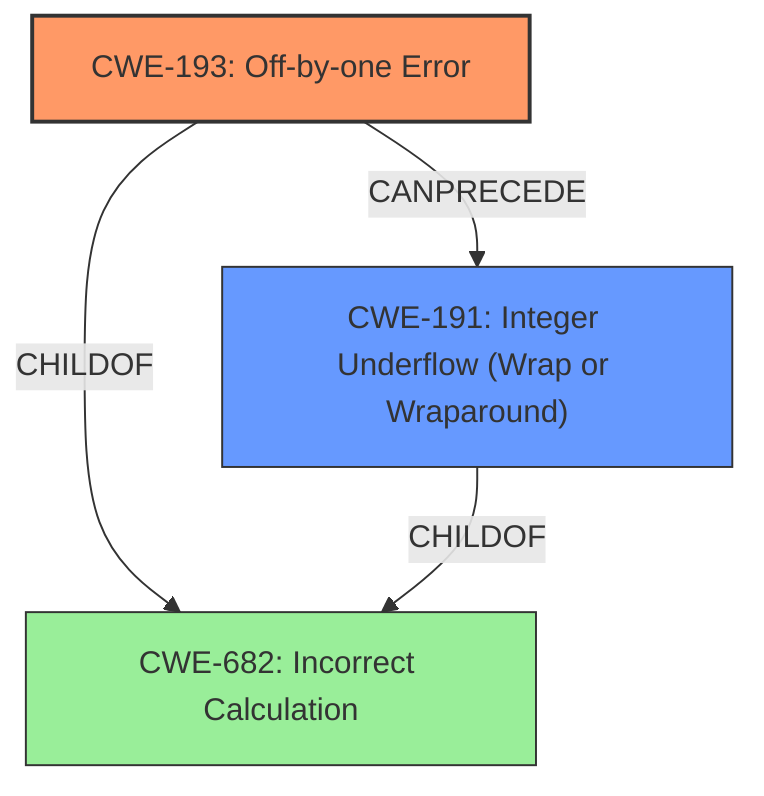

# Analysis Report for CVE-2020-27171

# Vulnerability Analysis Report: CVE-2020-27171

## Description

An issue was discovered in the Linux kernel before 5.11.8. kernel/bpf/verifier.c has an off-by-one error (with a resultant integer underflow) affecting out-of-bounds speculation on pointer arithmetic, leading to side-channel attacks that defeat Spectre mitigations and obtain sensitive information from kernel memory, aka CID-10d2bb2e6b1d.

## Vulnerability Description Key Phrases

**Rootcause:** off-by-one error
**Impact:** side-channel attacks
**Product:** Linux kernel
**Version:** before 5.11.8
**Component:** kernel/bpf/verifier.c

## Analysis (with Relationship Data)

```markdown
# Summary
| CWE ID | CWE Name | Confidence | CWE Abstraction Level | CWE Vulnerability Mapping Label | CWE-Vulnerability Mapping Notes |
|---|---|---|---|---|---|
| CWE-193 | Off-by-one Error | 0.95 | Base | Primary | Allowed |
| CWE-191 | Integer Underflow (Wrap or Wraparound) | 0.8 | Base | Secondary Candidate | Allowed |

## Evidence and Confidence

*   **Confidence Score:** 0.9
*   **Evidence Strength:** HIGH

- **Analysis and Justification:**  
  - *Explanation:* The vulnerability description explicitly states an "**off-by-one error**" in kernel/bpf/verifier.c, which directly corresponds to CWE-193 (Off-by-one Error). The "CVE Reference Links Content Summary" elaborates on this, stating that the root cause is an off-by-one error when calculating the memory area size, leading to an integer underflow. The integer underflow then leads to incorrect mask generation, resulting in out-of-bounds speculation on pointer arithmetic. Given the direct mention of the "**off-by-one error**", CWE-193 is the primary CWE. The subsequent integer underflow is a consequence of the **off-by-one error**, making CWE-191 a secondary, contributing weakness. MITRE's mapping guidance states that CWE-193 is ALLOWED at the Base level of abstraction, which is the preferred level.
  
  - *Relationship Analysis:* CWE-193 does not have any direct relationships listed in the provided information. However, the "CVE Reference Links Content Summary" shows that the **off-by-one error** leads to Integer Underflow (CWE-191). This indicates that CWE-193 *CanPrecede* CWE-191.

- **Confidence Score:**  
  - Confidence: 0.95 (High confidence due to direct mention of "off-by-one error" and supporting technical details in the CVE reference)

---
- **Analysis and Justification:**  
  - *Explanation:* The "CVE Reference Links Content Summary" identifies an "Integer Underflow" as a consequence of the **off-by-one error**. Specifically, when the calculated `ptr_limit` becomes zero, an integer underflow occurs in `fixup_bpf_calls()`, leading to an incorrect mask. This aligns with CWE-191 (Integer Underflow (Wrap or Wraparound)). This is not the primary weakness, but rather a consequence of the **off-by-one error** leading to side-channel attacks. MITRE's mapping guidance for CWE-191 states that it is ALLOWED at the Base level of abstraction.
  
  - *Relationship Analysis:* As identified above, CWE-193 *CanPrecede* CWE-191. This shows the chain of weaknesses.

- **Confidence Score:**  
  - Confidence: 0.8 (Slightly lower confidence than CWE-193 as it is a consequence of the primary weakness)
```

## Criticism of Analysis

Okay, I've reviewed the provided analysis and the full CWE specifications. Here's my critique:

**Overall Assessment:**

The analysis is generally accurate and well-reasoned, correctly identifying the primary and secondary CWEs. The confidence scores are appropriate. The reasoning clearly explains the relationship between the root cause (off-by-one error) and the resulting integer underflow.

**Specific Points:**

*   **CWE-193 (Off-by-one Error) - Primary CWE:** The identification of CWE-193 as the primary weakness is excellent. The analysis explicitly links the "off-by-one error" mentioned in the vulnerability description to this CWE. The explanation is clear, and the high confidence score (0.95) is justified. The analysis correctly notes that CWE-193 is allowed at the Base level.

*   **CWE-191 (Integer Underflow (Wrap or Wraparound)) - Secondary CWE:** The identification of CWE-191 as a secondary weakness is also accurate. The analysis explains how the off-by-one error leads to an integer underflow, and the lower confidence score (0.8) reflects the fact that it's a consequence rather than the direct cause. The analysis correctly notes that CWE-191 is allowed at the Base level.

*   **Relationship Analysis (CWE-193 *CanPrecede* CWE-191):** The analysis correctly identifies the *CanPrecede* relationship between CWE-193 and CWE-191, demonstrating an understanding of the chain of events.

*   **Abstraction Level:** Both CWEs are correctly identified as being at the "Base" level of abstraction, which is the preferred level.

**Suggestions for Improvement/Considerations:**

1.  **Implicit Out-of-Bounds Read/Write (CWE-125/CWE-787):** While the analysis focuses on CWE-193 and CWE-191, it's worth considering whether to explicitly mention CWE-125 (Out-of-bounds Read) or CWE-787 (Out-of-bounds Write) as a *potential* consequence. The vulnerability allows speculative out-of-bounds loads.  The analysis already mentions "speculative out-of-bounds loads on a 4GB window within the kernel's memory space" as a result, indicating that out-of-bounds access is occurring. However, the analysis already contains 2 CWEs and adding these may diminish the importance of the identified CWEs.

2.  **CWE-682 (Incorrect Calculation):** The CWE specifications indicate that CWE-193 and CWE-191 are children of CWE-682 (Incorrect Calculation). It might be beneficial to acknowledge this broader category. However, CWE-682 is a Pillar-level CWE, and the mapping guidance discourages its use when more specific CWEs are available (which is the case here). So, simply acknowledging the relationship is probably sufficient.

3.  **CWE-119 (Improper Restriction of Operations within the Bounds of a Memory Buffer):**  The analysis could reference CWE-119, but the mapping guidance discourages its use, so it is not necessary.

**Why the other CWEs from the retriever results were correctly omitted:**

*   **CWE-190 (Integer Overflow or Wraparound):** The description clearly states that the issue is an integer *underflow*, not an overflow.
*   **CWE-1285 (Improper Validation of Specified Index, Position, or Offset in Input):** While there's a lack of proper bounds checking, the core issue isn't primarily about validating input. It's about an incorrect calculation leading to a flawed boundary. Input validation is certainly *related*, but not the central problem.
*   **CWE-822 (Untrusted Pointer Dereference):** The analysis does not include a component of untrusted data being used as a pointer, and then dereferenced.
*   **CWE-843 (Access of Resource Using Incompatible Type ('Type Confusion')):** No type confusion is present.
*   **CWE-1284 (Improper Validation of Specified Quantity in Input):** Similar to CWE-1285, this is about *validation* of a quantity. The root cause is not a failure to validate a quantity in input, but rather an error in calculation.
*   **CWE-197 (Numeric Truncation Error):** Truncation isn't mentioned or implied in the description.
*   **CWE-124 (Buffer Underwrite ('Buffer Underflow')):** While there's an integer underflow, there's no explicit indication of writing *before* the buffer. The memory corruption is primarily *after* the intended boundary, not before.

**Mitigations:**

The suggested mitigations in the CWE specifications are generally high-level. They don't provide specific solutions for this particular vulnerability without further analysis of the code.

**Conclusion:**

The analysis is well done and correctly identifies the key CWEs related to the vulnerability. The explanations are clear and the confidence scores are appropriate. The suggestions for improvement are minor and are mainly for completeness.

## Final Resolution

# Summary
| CWE ID | CWE Name | Confidence | CWE Abstraction Level | CWE Vulnerability Mapping Label | CWE-Vulnerability Mapping Notes |
|---|---|---|---|---|---|
| CWE-193 | Off-by-one Error | 0.95 | Base | Primary | Allowed |
| CWE-191 | Integer Underflow (Wrap or Wraparound) | 0.8 | Base | Secondary Candidate | Allowed |

## Evidence and Confidence

*   **Confidence Score:** 0.9
*   **Evidence Strength:** HIGH

## Relationship Analysis
The primary relationship identified is the *CanPrecede* relationship where **CWE-193 (Off-by-one Error)** leads to **CWE-191 (Integer Underflow (Wrap or Wraparound))**. The analysis considered the potential inclusion of **CWE-682 (Incorrect Calculation)**, but it was deemed too abstract.



## Vulnerability Chain
The vulnerability chain starts with an **off-by-one error (CWE-193)** in the kernel code, which leads to an **integer underflow (CWE-191)**. This underflow results in incorrect mask generation and out-of-bounds speculation on pointer arithmetic, ultimately allowing for side-channel attacks that expose sensitive kernel memory.

## Summary of Analysis
The initial analysis and criticism are both accurate and well-justified. The primary **WEAKNESS** is clearly the **CWE-193 (Off-by-one Error)**, directly stated in the vulnerability description: "kernel/bpf/verifier.c has an **off-by-one error** (with a resultant integer underflow)...". The subsequent **CWE-191 (Integer Underflow (Wrap or Wraparound))** is a direct consequence of this **ROOTCAUSE**. The graph relationships reinforce this understanding, showing how the off-by-one error precedes the integer underflow. Both CWEs are at the optimal Base level of specificity. The high confidence score is supported by the explicit mention of these errors in the vulnerability description.


*Report generated on 2025-03-16 16:40:03*
