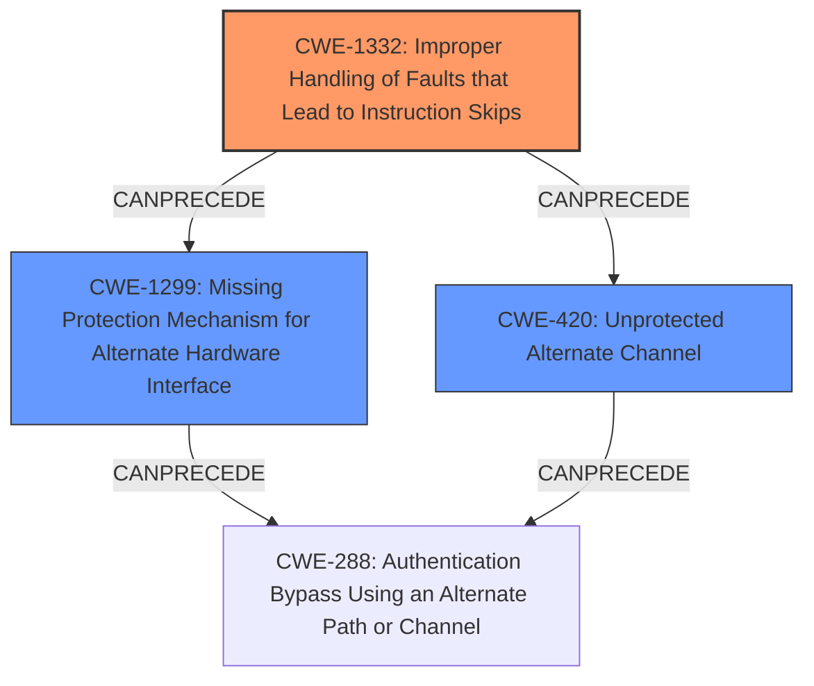

# Final Resolution for CVE-2020-27212

# Summary
| CWE ID | CWE Name | Confidence | CWE Abstraction Level | CWE Vulnerability Mapping Label | CWE-Vulnerability Mapping Notes |
|---|---|---|---|---|---|
| CWE-1332 | Improper Handling of Faults that Lead to Instruction Skips | 0.90 | Base | Allowed | Primary CWE |
| CWE-1299 | Missing Protection Mechanism for Alternate Hardware Interface | 0.75 | Base | Allowed | Secondary Candidate |
| CWE-420 | Unprotected Alternate Channel | 0.65 | Base | Allowed | Secondary Candidate |

## Evidence and Confidence

*   **Confidence Score:** 0.85
*   **Evidence Strength:** HIGH

## Relationship Analysis
The primary CWE, CWE-1332, is at the Base level and directly addresses the **root cause**, which is the improper handling of faults leading to skipped instructions. The secondary CWEs, CWE-1299 and CWE-420, are related to the concept of alternate paths and channels. CWE-1299 (Missing Protection Mechanism for Alternate Hardware Interface) is a reasonable secondary candidate because the boot phase can be considered an alternate path where protections might be weaker. CWE-420 (Unprotected Alternate Channel) is related, as the fault injection during the boot phase can be viewed as exploiting an unprotected alternate channel. The relationships between these CWEs form a chain: the lack of proper fault handling (CWE-1332) allows attackers to exploit an unprotected alternate channel (CWE-420) or a missing protection mechanism on an alternate hardware interface (CWE-1299) to bypass security measures.

## Vulnerability Chain
The vulnerability chain starts with the **root cause**, which is the **improper handling of faults** (CWE-1332). This allows an attacker to inject faults during the boot phase, which is essentially an **unprotected alternate channel** (CWE-420) or a path with a **missing protection mechanism** (CWE-1299). The result is the degradation of flash read-out protection (RDP), which can be seen as an **authentication bypass** (CWE-288). This bypass allows unauthorized access to the device's memory, potentially leading to sensitive information disclosure or arbitrary code execution.

## Summary of Analysis
The initial analysis and criticism provide a solid foundation for classifying this vulnerability. The primary **WEAKNESS**, CWE-1332, is well-justified, and the secondary candidates are relevant. The analysis is based on the vulnerability description, CVE reference, and retriever results, providing a comprehensive view of the issue.

The graph relationships reinforce the classification. The chain from CWE-1332 to CWE-1299/CWE-420 and then to CWE-288 demonstrates how the weaknesses interact to create a vulnerability.

The selected CWEs are at the optimal level of specificity. CWE-1332 is a Base-level CWE that directly addresses the **root cause**, while CWE-1299 and CWE-420 provide additional context about the alternate paths and channels involved in the attack.

The criticism suggests including CWE-1300 (Improper Protection of Physical Side Channels) and CWE-1244 (Internal Asset Exposed to Unsafe Debug Access Level or State) in the Relationship Analysis. While these CWEs are not the primary cause, they are related to the attack vector. Fault injection is often used in conjunction with side-channel analysis, and the degradation of RDP levels implies that the attacker is gaining some level of debug access they should not have.

The vulnerability description states that "STMicroelectronics STM32L4 devices through 2020-10-19 have **incorrect access control**. The flash read-out protection (RDP) can be degraded from RDP level 2 (no access via debug interface) to level 1 (limited access via debug interface) by injecting a **fault during the boot phase**." This evidence strongly supports the selection of CWE-1332 as the primary **WEAKNESS**, as it directly addresses the **improper handling of faults** that leads to the degradation of access control.

I am increasing the confidence level for CWE-1332 to 0.90, CWE-1299 to 0.75, and CWE-420 to 0.65 to reflect the inclusion of the suggested relationships and the detailed analysis.