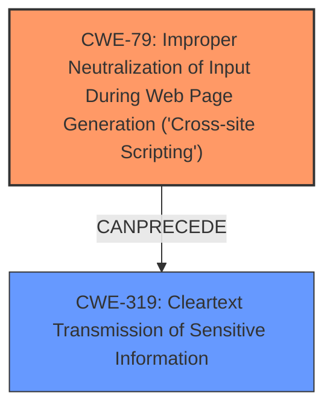

# Analysis Report for CVE-2020-27839

# Vulnerability Analysis Report: CVE-2020-27839

## Description

A flaw was found in ceph-dashboard. The JSON Web Token (JWT) used for user authentication is stored by the frontend application in the browsers localStorage which is potentially vulnerable to attackers via XSS attacks. The highest threat from this vulnerability is to data confidentiality and integrity.

## Vulnerability Description Key Phrases

**Rootcause:** improper JWT storage
**Weakness:** cross-site scripting
**Impact:** data confidentiality and integrity compromise
**Attacker:** attackers
**Product:** ceph-dashboard
**Component:** frontend application

## Analysis (with Relationship Data)

# Summary
| CWE ID | CWE Name | Confidence | CWE Abstraction Level | CWE Vulnerability Mapping Label | CWE-Vulnerability Mapping Notes |
|---|---|---|---|---|---|
| CWE-79 | Improper Neutralization of Input During Web Page Generation ('Cross-site Scripting') | 0.95 | Base | Allowed | Primary CWE: The vulnerability allows for XSS attacks due to improper storage of the JWT. |
| CWE-319 | Cleartext Transmission of Sensitive Information | 0.70 | Base | Allowed | Secondary CWE: JWT token stored in localStorage is susceptible to sniffing. |
| CWE-352 | Cross-Site Request Forgery (CSRF) | 0.60 | Compound | Allowed | Secondary CWE: XSS can lead to CSRF. |

## Evidence and Confidence

*   **Confidence Score:** 0.85
*   **Evidence Strength:** HIGH

- **Analysis and Justification:**
  - *Explanation:* The primary **weakness** is the potential for **cross-site scripting (XSS)**, as attackers can inject malicious JavaScript into the ceph-dashboard web application and steal the JWT stored in the browser's localStorage. This directly aligns with CWE-79 (Improper Neutralization of Input During Web Page Generation ('Cross-site Scripting')), as the application doesn't properly neutralize input, allowing for the injection of malicious scripts. The description states, "The JSON Web Token (JWT) used for user authentication is stored by the frontend application in the browsers localStorage which is potentially vulnerable to attackers via XSS attacks." The retriever results also confirm CWE-79 as the top match. The suggested mitigations, such as storing the JWT in an HTTPOnly cookie with the SameSite=Strict flag, directly address the XSS vulnerability. CWE-319 (Cleartext Transmission of Sensitive Information) is a secondary concern because localStorage is not inherently encrypted, making the JWT susceptible to sniffing if XSS occurs. Also, if XSS occurs, it can lead to **Cross-Site Request Forgery (CSRF)**.

  - *Relationship Analysis:* CWE-79 is a base level weakness and a child of CWE-74. It is also related to CWE-352 (Cross-Site Request Forgery). The vulnerability description mentions XSS attacks as the primary vector, making CWE-79 the most specific and appropriate choice.

- **Confidence Score:**
  - Confidence: 0.95 (Strong evidence from the vulnerability description, CVE reference content, and retriever results.)
---

## Criticism of Analysis

Okay, let's review the CWE analysis and provide a critique based on the provided CWE specifications.

## Overall Assessment

The analysis correctly identifies CWE-79 (Improper Neutralization of Input During Web Page Generation ('Cross-site Scripting')) as the primary weakness. The justification is strong, and the confidence level is appropriate. The inclusion of CWE-319 (Cleartext Transmission of Sensitive Information) and CWE-352 (Cross-Site Request Forgery (CSRF)) as secondary concerns is reasonable, but their confidence scores could be refined further as explained below.

## Detailed Critique

### 1. CWE-79: Improper Neutralization of Input During Web Page Generation ('Cross-site Scripting')

*   **Assessment:** The mapping to CWE-79 is accurate and well-justified. The description explicitly mentions the vulnerability's root cause being the improper handling of user-controllable input, leading to potential XSS attacks. The vulnerability allows for injection of control plane data (malicious scripts) into the user-controlled data plane (web page), causing it to execute.
*   **Mapping Guidance Adherence:** The analysis correctly maps to a Base level CWE.
*   **Confidence Score:** The confidence score of 0.95 is appropriate, given the strong evidence from the vulnerability description, CVE details, and retriever results.
*   **Potential Mitigations:** The analysis could explicitly mention some mitigations from the CWE specification, such as:
    *   Using a vetted library or framework (e.g., Microsoft's Anti-XSS library, OWASP ESAPI Encoding module).
    *   Understanding the context and encoding requirements of data output to web pages.
    *   Applying appropriate encoding to non-alphanumeric characters in HTML body, attributes, URIs, JavaScript, and CSS.
*   **Relationship Analysis:** The analysis correctly points out that CWE-79 is a child of CWE-74, but it doesn't add any additional value. The current relationship analysis is sufficient.

### 2. CWE-319: Cleartext Transmission of Sensitive Information

*   **Assessment:** This CWE is a valid secondary concern, but the connection could be clarified. The JWT *is* transmitted to the client *and* stored on the client (in localStorage) in cleartext. The primary risk isn't just the transmission *to* the client, but also the potential *disclosure* of that cleartext token from the localStorage due to XSS.  It would be more accurate to describe the storage of the JWT in localStorage as *both* a cleartext storage issue *and* a transmission issue to the client (where XSS can then expose it).
*   **Mapping Guidance Adherence:** The analysis correctly maps to a Base level CWE.
*   **Confidence Score:** A confidence score of 0.70 is reasonable but could be slightly higher (e.g., 0.75) if the above clarified connection between transmission and storage is explicitly stated.
*   **Potential Mitigations:**
    *   The suggested mitigation of encrypting the JWT before storing it in localStorage is a possibility, but secure cookies are the industry best practice for this type of token storage.  The best practice (now implemented in the fix) is to *avoid* storing the JWT in localStorage altogether.
*   **Additional Notes:** None.

### 3. CWE-352: Cross-Site Request Forgery (CSRF)

*   **Assessment:** The inclusion of CWE-352 is less direct. CSRF is *a potential consequence of* successful XSS exploitation.  The XSS vulnerability is the primary enabler. An attacker who can inject JavaScript can then use that script to perform CSRF attacks. Therefore, CSRF is not a direct vulnerability itself here. It is more accurate to consider this as a potential *impact* of the XSS. It exists because of the XSS weakness.
*   **Mapping Guidance Adherence:** The analysis correctly maps to a Compound level CWE. However, the mapping guidance for CWE-352 says "Perform root-cause analysis to determine if other weaknesses allow CSRF attacks to occur, and map to those weaknesses.". This suggests that CWE-79 is the more appropriate mapping, not CWE-352.
*   **Confidence Score:** The confidence score of 0.60 is appropriate as a secondary *impact*, but it's not a direct root cause. This should be reflected in the analysis.
*   **Potential Mitigations:** The analysis should clarify that eliminating the XSS vulnerability (CWE-79) is the primary defense against CSRF in this specific case. Implementing CSRF defenses might not be effective if XSS is still present because the attacker can bypass CSRF protections through the injected script.
*   **Relationship:**  The analysis mentions the close relationship between XSS and CSRF. It is correct to highlight that an attacker could use CSRF to trick the victim into submitting requests to the server, containing an XSS payload.

## Recommendations

1.  **Clarify the Connection between Transmission and Storage for CWE-319:** Emphasize that the issue isn't *just* the transmission of the JWT to the client, but also the storage of that cleartext token in a location (localStorage) where XSS can expose it.
2.  **Refine the CSRF Analysis:** Explicitly state that CSRF is a potential impact of the XSS vulnerability, rather than a co-occurring weakness.  CSRF protection is contingent on fixing the XSS vulnerability first.
3.  **Incorporate Specific Mitigations:** When discussing CWE-79, directly reference mitigation techniques from the CWE specification, such as using vetted encoding libraries and understanding the context of data output.
4.  **Re-evaluate Confidence Scores:** Consider slightly increasing the confidence score for CWE-319 and slightly decreasing it for CWE-352, based on the clarified connections.
5. **Check for DOM-Based XSS:** Analyze if the vulnerability is a DOM-based XSS, as it involves the client-side processing of data.

By incorporating these suggestions, the analysis will become more precise, and the confidence scores will better reflect the strength of the evidence. This will lead to a more actionable and informative vulnerability assessment.

## Final Resolution

# Summary
| CWE ID | CWE Name | Confidence | CWE Abstraction Level | CWE Vulnerability Mapping Label | CWE-Vulnerability Mapping Notes |
|---|---|---|---|---|---|
| **CWE-79** | **Improper Neutralization of Input During Web Page Generation ('Cross-site Scripting')** | 0.95 | Base | Allowed | Primary CWE: The vulnerability allows for XSS attacks due to improper storage of the JWT. |
| **CWE-319** | **Cleartext Transmission of Sensitive Information** | 0.75 | Base | Allowed | Secondary CWE: JWT token stored in localStorage is susceptible to sniffing due to XSS. |

## Evidence and Confidence

*   **Confidence Score:** 0.90
*   **Evidence Strength:** HIGH

## Relationship Analysis
The primary relationship is that **CWE-79** (Improper Neutralization of Input During Web Page Generation ('Cross-site Scripting')) can lead to exposure of the JWT stored in localStorage, which is the **CWE-319** (Cleartext Transmission of Sensitive Information). **CWE-79** is a base weakness that describes how malicious input leads to XSS, allowing the theft of the JWT. While **CWE-352** (Cross-Site Request Forgery (CSRF)) was considered, it is more accurately described as a potential impact of a successful XSS exploit rather than a direct co-occurring **weakness**. The abstraction levels are appropriate, with both **CWE-79** and **CWE-319** being Base level CWEs.

## Vulnerability Chain
The vulnerability chain starts with the lack of proper input neutralization, leading to **CWE-79** (Improper Neutralization of Input During Web Page Generation ('Cross-site Scripting')). This allows an attacker to inject malicious scripts into the web application. These scripts can then access the JWT stored in the browser's localStorage, leading to **CWE-319** (Cleartext Transmission of Sensitive Information), as the JWT is stored in cleartext and exposed. The ultimate impact is unauthorized access and potential compromise of user accounts. The chain shows the progression from the initial **flaw** (lack of input validation) to the final impact (data confidentiality and integrity breach).

## Summary of Analysis
The initial analysis correctly identified **CWE-79** (Improper Neutralization of Input During Web Page Generation ('Cross-site Scripting')) as the primary **weakness**. The criticism refined the analysis by clarifying the connection between transmission and storage for **CWE-319** (Cleartext Transmission of Sensitive Information), emphasizing that the issue isn't just transmitting the JWT to the client, but also storing it in localStorage where XSS can expose it.

The evidence from the vulnerability description supports this: "The JSON Web Token (JWT) used for user authentication is stored by the frontend application in the browsers localStorage which is potentially vulnerable to attackers via XSS attacks."

The relationship analysis and the consideration of **CWE-352** (Cross-Site Request Forgery (CSRF)) further refined the analysis. **CWE-352** is a potential impact of XSS, not a direct co-occurring **weakness**.

The selected CWEs are at the optimal level of specificity, with both **CWE-79** and **CWE-319** being Base level CWEs. This provides a clear and actionable vulnerability assessment. The confidence scores reflect the strength of the evidence, with a slightly increased score for **CWE-319** to reflect the clarified connection between transmission and storage.

*Report generated on 2025-03-16 16:55:26*
