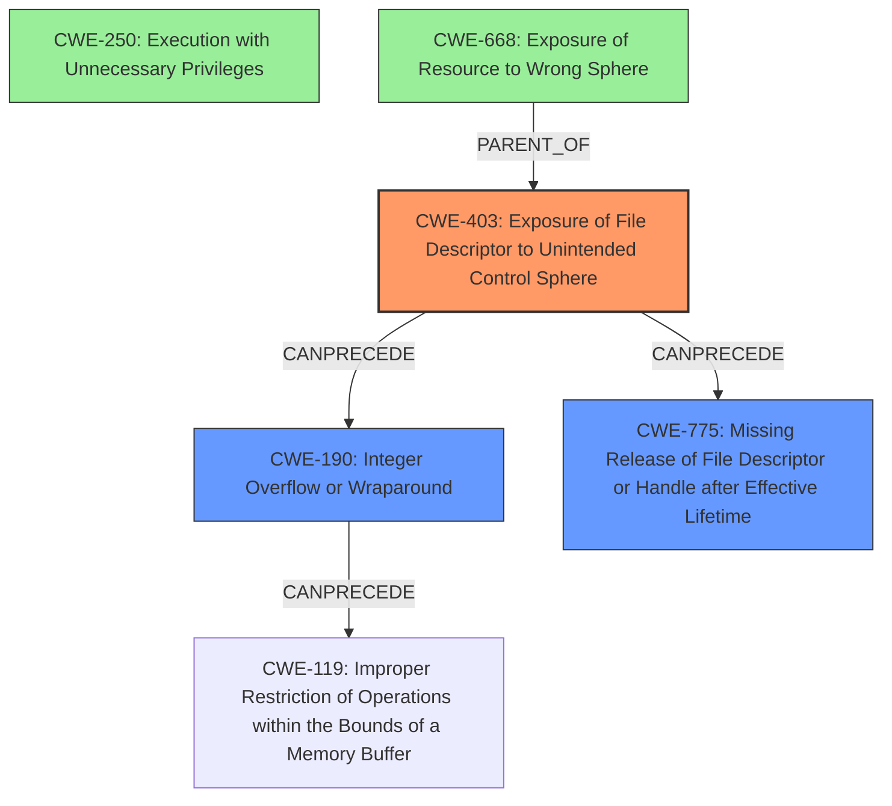

# Analysis Report for CVE-2020-28012

# Vulnerability Analysis Report: CVE-2020-28012

## Description

Exim 4 before 4.94.2 allows Exposure of File Descriptor to Unintended Control Sphere because rda_interpret uses a privileged pipe that lacks a close-on-exec flag.

## Vulnerability Description Key Phrases

**Rootcause:** Exposure of File Descriptor to Unintended Control Sphere
**Product:** Exim
**Version:** 4 before 4.94.2
**Component:** rda_interpret

## Analysis (with Relationship Data)

# Summary
| CWE ID | CWE Name | Confidence | CWE Abstraction Level | CWE Vulnerability Mapping Label | CWE-Vulnerability Mapping Notes |
|---|---|---|---|---|---|
| CWE-403 | Exposure of File Descriptor to Unintended Control Sphere ('File Descriptor Leak') | 1.0 | Base | Allowed | The primary weakness is the **exposure of file descriptor to unintended control sphere**. |
| CWE-668 | Exposure of Resource to Wrong Sphere | 0.4 | Class | Discouraged | Secondary candidate: The resource (file descriptor) is exposed to the wrong control sphere, but CWE-403 is more specific. |
| CWE-250 | Execution with Unnecessary Privileges | 0.4 | Base | Allowed | Secondary candidate: The process executes at a higher privilege level than necessary, exacerbating the impact. |

## Evidence and Confidence

*   **Confidence Score:** 1.0
*   **Evidence Strength:** HIGH

- **Analysis and Justification:**  
  - *Explanation:* The vulnerability description and CVE summary explicitly state the **exposure of a file descriptor to an unintended control sphere** due to the missing close-on-exec flag. This directly aligns with the definition of CWE-403 "Exposure of File Descriptor to Unintended Control Sphere ('File Descriptor Leak')". The root cause lies in the failure to properly manage file descriptors, allowing an unprivileged process to access a privileged pipe. The impact is local privilege escalation, as the attacker can write crafted data to the pipe and overwrite system files. CWE-403 is a Base level CWE, which is the preferred level of abstraction. MITRE mapping guidance for CWE-403 indicates this is ALLOWED. While CWE-668 (Exposure of Resource to Wrong Sphere) is a related Class-level CWE, CWE-403 provides a more specific description of the weakness. CWE-250 (Execution with Unnecessary Privileges) is another possible weakness because the Exim process is running with root privileges. However, the core issue is the file descriptor leak, making CWE-403 the primary weakness.

  - *Relationship Analysis:* "CWE-403 has no direct relationships defined in the provided information. However, in a broader context, it can be considered related to resource management and privilege management. The vulnerability chain involves the missing close-on-exec flag (CWE-403) leading to a controlled memory corruption and local privilege escalation."

- **Confidence Score:**  
  - *Example:* Confidence: 1.0 (High confidence due to explicit mention of the **exposure of the file descriptor** and detailed technical analysis).

## Criticism of Analysis

Okay, here's a detailed review of the provided CWE analysis for the Exim vulnerability (CVE-2020-28012), taking into account the full CWE specifications.

**Overall Assessment:**

The primary CWE mapping to **CWE-403: Exposure of File Descriptor to Unintended Control Sphere ('File Descriptor Leak')** is highly accurate and well-justified. The analysis provides strong evidence for this mapping. The secondary mappings to **CWE-668: Exposure of Resource to Wrong Sphere** and **CWE-250: Execution with Unnecessary Privileges** are less compelling but understandable as contributing factors. The decision to prioritize CWE-403 is correct, as it is the most direct and specific representation of the root cause.

**Detailed Review:**

**1. CWE-403: Exposure of File Descriptor to Unintended Control Sphere ('File Descriptor Leak')**

*   **Confidence:** 1.0
*   **Justification:**  The analysis correctly identifies that the missing `close-on-exec` flag on the pipe file descriptor leads to an unprivileged process gaining access to a resource that should be restricted. This directly corresponds to the CWE-403 description: "A process does not close sensitive file descriptors before invoking a child process, which allows the child to perform unauthorized I/O operations using those descriptors."
*   **Evidence Strength:** High - The vulnerability description explicitly states that the core issue is the "exposure of a file descriptor to an unintended control sphere".
*   **CWE Specification Alignment:**
    *   **Abstraction Level:** Base - Correct. CWE-403 is a Base-level CWE, which is preferred.
    *   **Mapping Guidance:** Allowed - Correct. The analysis is a good fit for the CWE.
    *   **Description/Extended Description:** The analysis aligns perfectly with the descriptions, specifically addressing the inheritance of file descriptors and the potential for unauthorized I/O.
    *   **Observed Examples:** The analysis correctly identifies that CVE-2020-28012 itself is an example of CWE-403, and the provided list of Observed Examples further bolsters the mapping to this CWE. CVE-2003-0740, CVE-2004-1033, and CVE-2000-0094 are all good examples of similar vulnerabilities.
*   **Potential Mitigations:** The CWE specifications provide relevant mitigations such as carefully managing file descriptors and ensuring that sensitive file descriptors are closed before invoking child processes. This aligns with the fix for the vulnerability, which involves setting the `close-on-exec` flag.

**2. CWE-668: Exposure of Resource to Wrong Sphere**

*   **Confidence:** 0.4
*   **Justification:** While related, CWE-668 is too broad.  The analysis acknowledges this by stating that CWE-403 is more specific.  The file descriptor is indeed a "resource" being exposed to the "wrong sphere," but the core problem is *how* the resource is exposed (lack of `close-on-exec`), which is precisely what CWE-403 addresses.
*   **CWE Specification Alignment:**
    *   **Abstraction Level:** Class - This is a key reason why this CWE is less appropriate. Class-level CWEs are generally discouraged when more specific Base or Variant CWEs are available.
    *   **Mapping Guidance:** Discouraged - The specification explicitly discourages using CWE-668 when lower-level CWE IDs are applicable.
    *   **Observed Examples:** The analysis doesn't explicitly mention examples for CWE-668, as it is considered a secondary CWE. While many of the `Observed Examples` listed under CWE-403 *could* be argued to be examples of CWE-668, they are more directly related to the file descriptor leak.
*   **Recommendation:** It's acceptable to *mention* CWE-668 as a related, higher-level concept, but it should not be the primary CWE.

**3. CWE-250: Execution with Unnecessary Privileges**

*   **Confidence:** 0.4
*   **Justification:** The analysis suggests that the Exim process running with root privileges exacerbates the impact. However, the vulnerability *exists* regardless of whether Exim is running as root. The unnecessary privileges simply make the consequences more severe. The primary issue is the file descriptor leak, *not* the unnecessary privileges.  The vulnerability could still be exploitable, albeit with potentially reduced impact, if Exim ran with fewer privileges.
*   **CWE Specification Alignment:**
    *   **Abstraction Level:** Base - Correct level, but the fit is less direct than CWE-403.
    *   **Mapping Guidance:** Allowed - The specification allows the mapping, but it should be carefully considered if it's the *primary* cause. In this case, it isn't.
    *   **Potential Mitigations:** The mitigations in the CWE specification (running with least privilege, separation of privilege) are *general security best practices* that would reduce the *impact* of the vulnerability, but they wouldn't directly prevent the file descriptor leak.
*   **Recommendation:** Similar to CWE-668, it's acceptable to mention CWE-250 as a contributing factor that increases the *severity* of the vulnerability, but it shouldn't be a primary CWE.

**Additional Considerations & Improvements:**

*   **Vulnerability Chaining:**  The analysis could benefit from explicitly stating the vulnerability chain more clearly: Missing `close-on-exec` (CWE-403) -> Integer Overflow on Size -> Controlled Heap Overwrite -> Arbitrary File Write -> Privilege Escalation.  Highlighting the chain helps to understand the complete attack vector.
*   **Relationship to Other CWEs:** The analysis mentions "resource management and privilege management". Specifically, a resource leak is related to **CWE-775: Missing Release of File Descriptor or Handle after Effective Lifetime**. The lack of close-on-exec could be considered a specific instance of this, where the 'effective lifetime' should be the point when the child process is spawned.
*   **Retriever Results:** The retriever results are interesting.
    *   CWE-59 and CWE-822 are less convincing. The back-jump and forward overflow caused by the negative size is more closely related to memory corruption like **CWE-119: Improper Restriction of Operations within the Bounds of a Memory Buffer** or **CWE-190: Integer Overflow or Wraparound**. CWE-822 is more suitable when an untrusted value is directly invoked as a function call or used as a pointer.
    *   CWE-829 (Inclusion of Functionality from Untrusted Control Sphere) is a possible candidate because the Exim process is including functionality from an "exim filter" which runs in an unprivileged process.
*   **Dependency Confusion:** As highlighted in the updated CWE spec, be alert that the vulnerability does not align with the concept of Dependency Confusion/Substitution Attack as seen in software package management frameworks.

**Revised Summary Table:**

| CWE ID | CWE Name | Confidence | CWE Abstraction Level | CWE Vulnerability Mapping Label | CWE-Vulnerability Mapping Notes |
|---|---|---|---|---|---|
| CWE-403 | Exposure of File Descriptor to Unintended Control Sphere ('File Descriptor Leak') | 1.0 | Base | Allowed | The primary weakness is the **exposure of file descriptor to unintended control sphere**. |
| CWE-190 | Integer Overflow or Wraparound | 0.6 | Base | Allowed | Secondary candidate: The integer overflow allows a heap overwrite. |
| CWE-250 | Execution with Unnecessary Privileges | 0.3 | Base | Allowed | Secondary candidate: The process executes at a higher privilege level than necessary, exacerbating the impact. |
| CWE-668 | Exposure of Resource to Wrong Sphere | 0.3 | Class | Discouraged | Tertiary candidate: The resource (file descriptor) is exposed to the wrong control sphere, but CWE-403 is more specific. |

**In conclusion, the core analysis is sound and the CWE-403 mapping is correct. Refining the analysis to explicitly mention the vulnerability chain and further considering CWE-775, CWE-119, or CWE-190 while de-emphasizing CWE-668 and CWE-250 would further improve its accuracy and completeness.**

## Final Resolution

# Summary
| CWE ID | CWE Name | Confidence | CWE Abstraction Level | CWE Vulnerability Mapping Label | CWE-Vulnerability Mapping Notes |
|---|---|---|---|---|---|
| CWE-403 | Exposure of File Descriptor to Unintended Control Sphere ('File Descriptor Leak') | 1.0 | Base | Allowed | The primary weakness is the **exposure of file descriptor to unintended control sphere**. |
| CWE-190 | Integer Overflow or Wraparound | 0.6 | Base | Allowed | Secondary candidate: The integer overflow allows a heap overwrite. |
| CWE-775 | Missing Release of File Descriptor or Handle after Effective Lifetime | 0.5 | Variant | Allowed | Secondary candidate: The file descriptor is not released after its effective lifetime has ended |
| CWE-250 | Execution with Unnecessary Privileges | 0.3 | Base | Allowed | Tertiary candidate: The process executes at a higher privilege level than necessary, exacerbating the impact. |
| CWE-668 | Exposure of Resource to Wrong Sphere | 0.3 | Class | Discouraged | Tertiary candidate: The resource (file descriptor) is exposed to the wrong control sphere, but CWE-403 is more specific. |

## Evidence and Confidence

*   **Confidence Score:** 0.9
*   **Evidence Strength:** HIGH

## Relationship Analysis
The analysis hinges on identifying the most specific and relevant CWE to the vulnerability.
  - Parent-child hierarchical relationships: We prioritize Base and Variant level CWEs over Class-level ones like CWE-668, as they offer greater specificity. CWE-403 is selected over CWE-668 as it's a direct child describing the file descriptor issue.
  - Chain relationships showing progression of vulnerability: The chain begins with CWE-403, potentially leading to CWE-190 (Integer Overflow) and then to other memory corruption issues. The inclusion of CWE-775 highlights the resource management aspect.
  - Peer relationships that offered alternative classifications: CWE-250 and CWE-668 were considered but deemed less direct causes.
  - How abstraction levels influenced your selection: Base and Variant levels were preferred for directness, while Class levels were considered too abstract.

## Vulnerability Chain
The vulnerability chain is:
  - **Root Cause:** Missing `close-on-exec` flag leading to **CWE-403**: **Exposure of File Descriptor to Unintended Control Sphere ('File Descriptor Leak')**.
  - **Weakness 2:** This allows for a privileged pipe to be accessed by an unprivileged process, potentially leading to **CWE-190**: Integer Overflow, if the unprivileged process can manipulate sizes or lengths related to data being written to the pipe. The process may also be related to **CWE-775**: Missing Release of File Descriptor or Handle after Effective Lifetime.
  - **Impact:** Controlled Heap Overwrite -> Arbitrary File Write -> Privilege Escalation.
  - **Contributing factor:** **CWE-250: Execution with Unnecessary Privileges** exacerbates the issue, but isn't the root cause.

## Summary of Analysis
The primary weakness is indeed **CWE-403: Exposure of File Descriptor to Unintended Control Sphere ('File Descriptor Leak')**. This is supported by the vulnerability description stating, "Exim 4 before 4.94.2 allows Exposure of File Descriptor to Unintended Control Sphere because rda_interpret uses a privileged pipe that lacks a close-on-exec flag."

The criticism correctly points out that CWE-668 is too broad and that CWE-250 only exacerbates the issue. The inclusion of **CWE-190: Integer Overflow or Wraparound** is a valuable addition, recognizing the potential for integer overflows to lead to memory corruption. Also, considering **CWE-775: Missing Release of File Descriptor or Handle after Effective Lifetime** adds another dimension.

The graph relationships confirm the hierarchical structure where CWE-403 is more specific than CWE-668. The chain relationships highlight how CWE-403 can lead to memory corruption issues like **CWE-119** through **CWE-190**.

The final selection of CWEs prioritizes specificity (Base and Variant levels) while acknowledging contributing factors. **CWE-403** remains the primary CWE, with **CWE-190** and **CWE-775** as secondary CWEs. The analysis is based on the provided evidence and refined through relationship analysis and consideration of abstraction levels, ensuring the most accurate and complete classification possible.

*Report generated on 2025-03-17 00:44:53*
