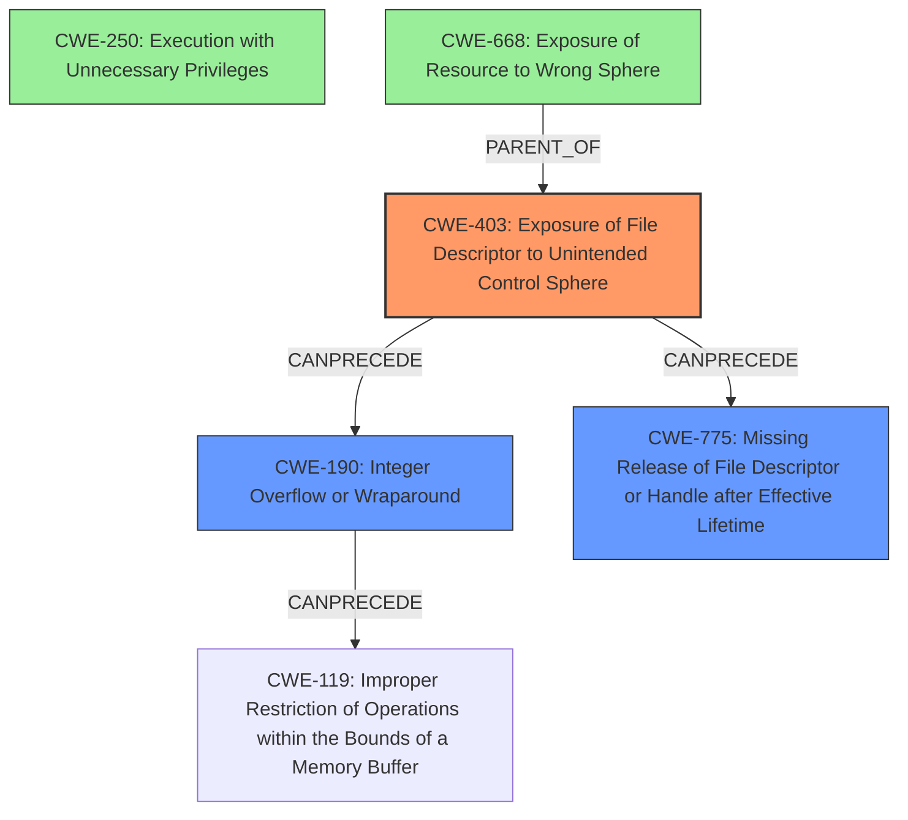

# Final Resolution for CVE-2020-28012

# Summary
| CWE ID | CWE Name | Confidence | CWE Abstraction Level | CWE Vulnerability Mapping Label | CWE-Vulnerability Mapping Notes |
|---|---|---|---|---|---|
| CWE-403 | Exposure of File Descriptor to Unintended Control Sphere ('File Descriptor Leak') | 1.0 | Base | Allowed | The primary weakness is the **exposure of file descriptor to unintended control sphere**. |
| CWE-190 | Integer Overflow or Wraparound | 0.6 | Base | Allowed | Secondary candidate: The integer overflow allows a heap overwrite. |
| CWE-775 | Missing Release of File Descriptor or Handle after Effective Lifetime | 0.5 | Variant | Allowed | Secondary candidate: The file descriptor is not released after its effective lifetime has ended |
| CWE-250 | Execution with Unnecessary Privileges | 0.3 | Base | Allowed | Tertiary candidate: The process executes at a higher privilege level than necessary, exacerbating the impact. |
| CWE-668 | Exposure of Resource to Wrong Sphere | 0.3 | Class | Discouraged | Tertiary candidate: The resource (file descriptor) is exposed to the wrong control sphere, but CWE-403 is more specific. |

## Evidence and Confidence

*   **Confidence Score:** 0.9
*   **Evidence Strength:** HIGH

## Relationship Analysis
The analysis hinges on identifying the most specific and relevant CWE to the vulnerability.
  - Parent-child hierarchical relationships: We prioritize Base and Variant level CWEs over Class-level ones like CWE-668, as they offer greater specificity. CWE-403 is selected over CWE-668 as it's a direct child describing the file descriptor issue.
  - Chain relationships showing progression of vulnerability: The chain begins with CWE-403, potentially leading to CWE-190 (Integer Overflow) and then to other memory corruption issues. The inclusion of CWE-775 highlights the resource management aspect.
  - Peer relationships that offered alternative classifications: CWE-250 and CWE-668 were considered but deemed less direct causes.
  - How abstraction levels influenced your selection: Base and Variant levels were preferred for directness, while Class levels were considered too abstract.

## Vulnerability Chain
The vulnerability chain is:
  - **Root Cause:** Missing `close-on-exec` flag leading to **CWE-403**: **Exposure of File Descriptor to Unintended Control Sphere ('File Descriptor Leak')**.
  - **Weakness 2:** This allows for a privileged pipe to be accessed by an unprivileged process, potentially leading to **CWE-190**: Integer Overflow, if the unprivileged process can manipulate sizes or lengths related to data being written to the pipe. The process may also be related to **CWE-775**: Missing Release of File Descriptor or Handle after Effective Lifetime.
  - **Impact:** Controlled Heap Overwrite -> Arbitrary File Write -> Privilege Escalation.
  - **Contributing factor:** **CWE-250: Execution with Unnecessary Privileges** exacerbates the issue, but isn't the root cause.

## Summary of Analysis
The primary weakness is indeed **CWE-403: Exposure of File Descriptor to Unintended Control Sphere ('File Descriptor Leak')**. This is supported by the vulnerability description stating, "Exim 4 before 4.94.2 allows Exposure of File Descriptor to Unintended Control Sphere because rda_interpret uses a privileged pipe that lacks a close-on-exec flag."

The criticism correctly points out that CWE-668 is too broad and that CWE-250 only exacerbates the issue. The inclusion of **CWE-190: Integer Overflow or Wraparound** is a valuable addition, recognizing the potential for integer overflows to lead to memory corruption. Also, considering **CWE-775: Missing Release of File Descriptor or Handle after Effective Lifetime** adds another dimension.

The graph relationships confirm the hierarchical structure where CWE-403 is more specific than CWE-668. The chain relationships highlight how CWE-403 can lead to memory corruption issues like **CWE-119** through **CWE-190**.

The final selection of CWEs prioritizes specificity (Base and Variant levels) while acknowledging contributing factors. **CWE-403** remains the primary CWE, with **CWE-190** and **CWE-775** as secondary CWEs. The analysis is based on the provided evidence and refined through relationship analysis and consideration of abstraction levels, ensuring the most accurate and complete classification possible.